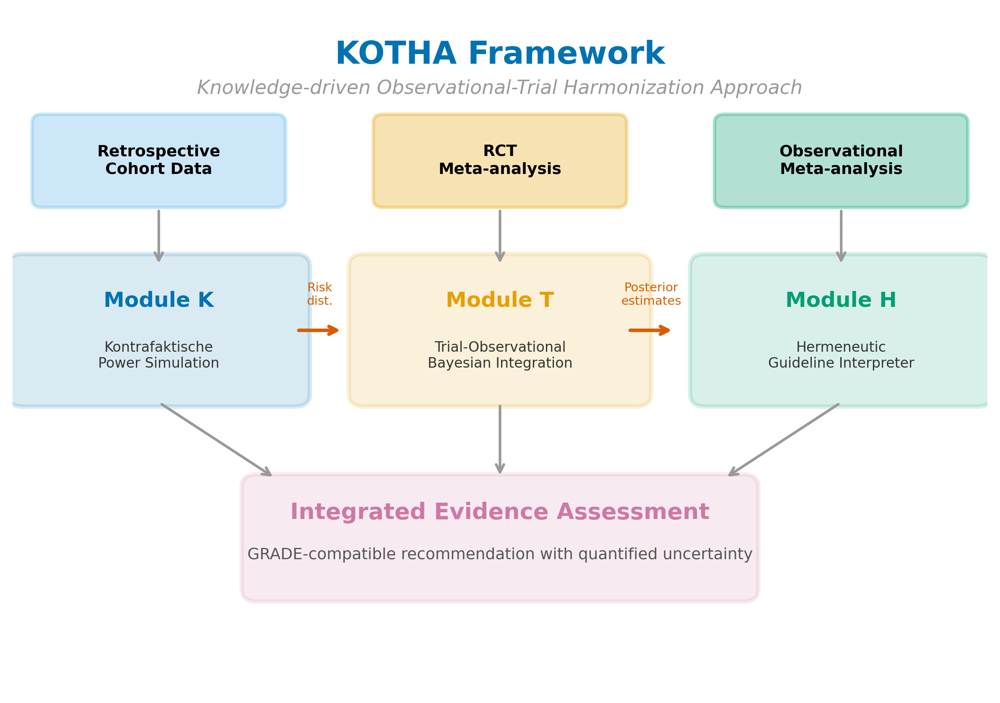
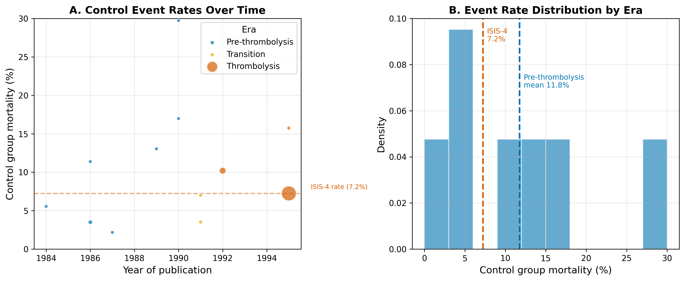
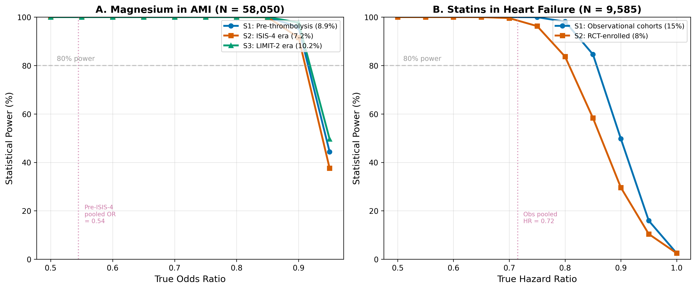
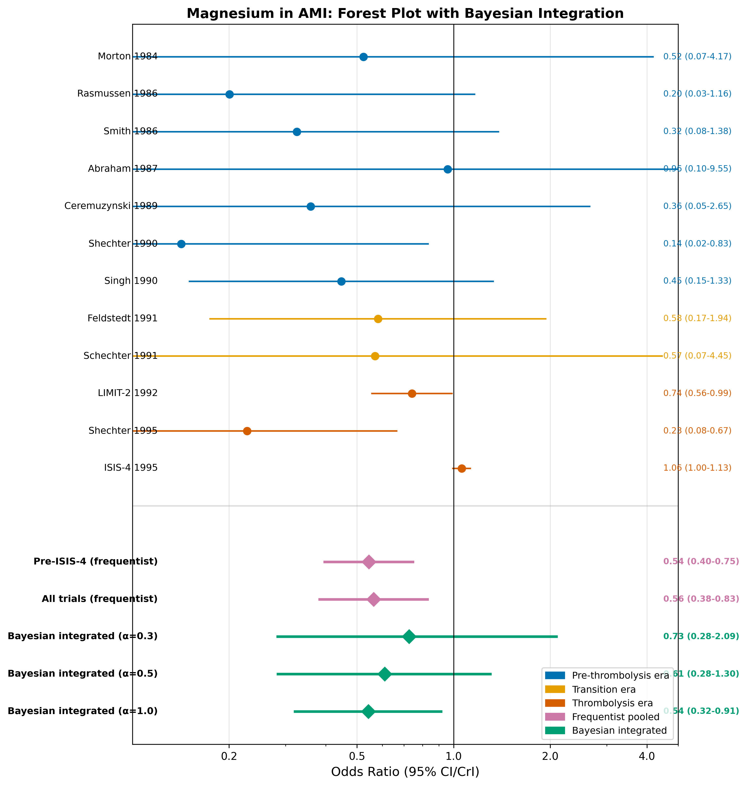
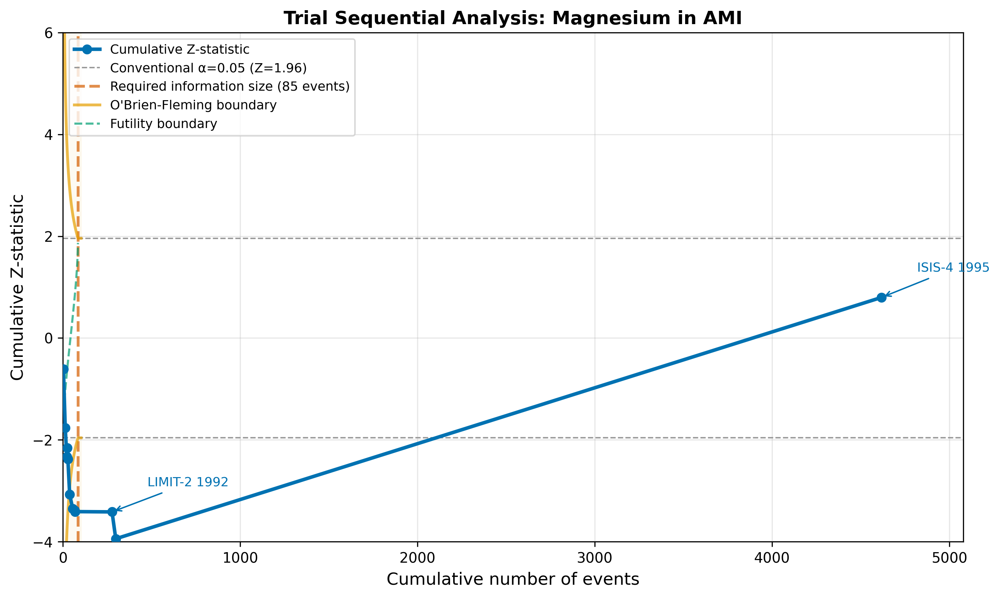
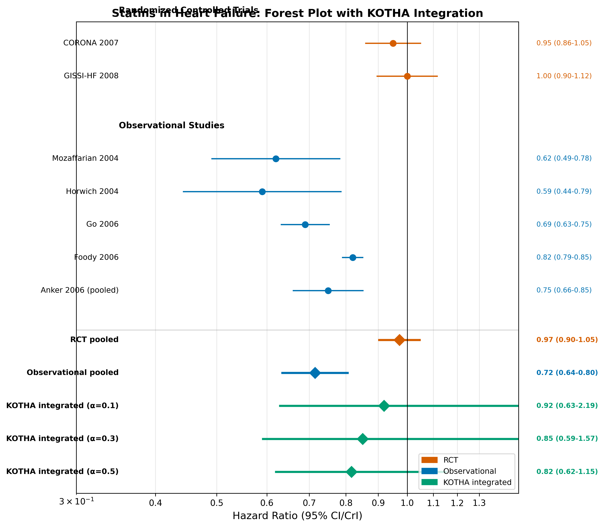
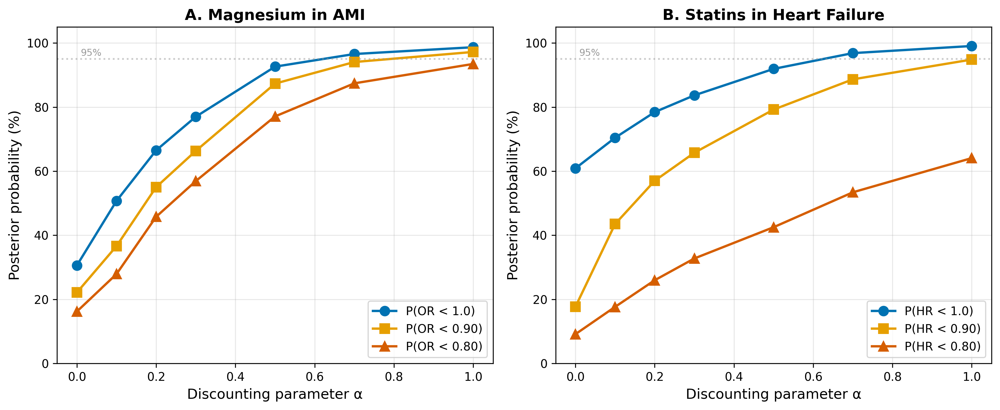
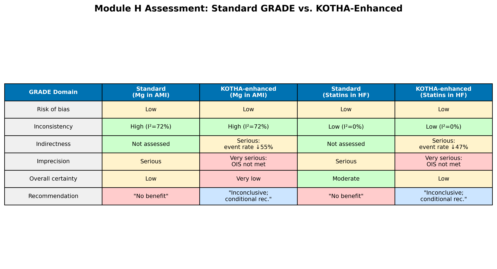

# The KOTHA Framework: a counterfactual simulation and Bayesian integration approach to diagnosing structural information loss in randomized controlled trial meta-analyses

**Authors**: [To be determined]

**Corresponding Author**: [To be determined]

---

## Abstract

**Background**: Discrepancies between meta-analyses of observational studies and randomized controlled trials (RCTs) are conventionally attributed to confounding in observational data. However, an alternative structural explanation --- that RCTs systematically exclude high-risk patients, leading to event dilution and insufficient statistical power --- remains underexplored and poorly operationalized. We developed the KOTHA (Knowledge-driven Observational-Trial Harmonization Approach) Framework to diagnose and address this structural information loss.

**Methods**: The KOTHA Framework comprises three modules. Module K uses counterfactual power simulation comparing statistical power under actual RCT enrollment versus target-population scenarios. Module T integrates RCT and observational evidence through hierarchical Bayesian meta-analysis with power-prior discounting. Module H provides a structured checklist for guideline committees based on optimal information size (OIS), trial sequential analysis (TSA) boundaries, and the GRADE framework. We validated the framework using published data from two well-documented cases of observational-RCT divergence: (1) intravenous magnesium in acute myocardial infarction (12 trials, 1984--1995) and (2) statins in heart failure (5 observational studies, 2 RCTs).

**Results**: In the magnesium case, control event rates declined from 8.9% (pre-thrombolysis era) to 7.2% (ISIS-4), reflecting temporal event dilution. The pre-ISIS-4 meta-analysis yielded OR = 0.54 (95% CI: 0.40--0.75), while the all-trials estimate was OR = 0.56 (0.38--0.83) with I$^2$ = 62%. Bayesian integration with power prior discounting ($\alpha$ = 0.3) yielded OR = 0.73 (95% CrI: 0.28--2.09), P(OR < 1) = 77%. In the statins case, observational studies showed HR = 0.72 (0.64--0.80) while RCTs showed HR = 0.97 (0.90--1.05), with event rate ratio of 0.53 (RCT/observational). Module H assessment identified that standard GRADE evaluation would conclude "no benefit demonstrated," whereas KOTHA-enhanced assessment classified both cases as informationally inconclusive with serious indirectness due to event dilution.

**Conclusions**: The KOTHA Framework provides a reproducible, quantitative approach to distinguishing "evidence of no effect" from "no evidence of effect." Empirical validation using two canonical cases of observational-RCT divergence demonstrates that the framework can identify structural information loss and produce more nuanced evidence assessments than standard approaches.

**Keywords**: randomized controlled trials, meta-analysis, observational studies, evidence-based medicine, counterfactual simulation, Bayesian evidence synthesis, GRADE, optimal information size, trial sequential analysis, power analysis, magnesium, statins, heart failure

---

## Background

Evidence-based medicine (EBM) places randomized controlled trials (RCTs) and their meta-analyses at the apex of the evidence hierarchy [1]. This paradigm rests on the principle that randomization minimizes confounding, providing the most internally valid estimates of treatment effects. However, a recurring challenge in clinical research is the discordance between meta-analyses of observational studies and RCTs: for certain clinical questions, observational evidence demonstrates statistically significant treatment benefit, whereas RCT meta-analyses fail to reach significance [2, 3].

The conventional interpretation attributes this discrepancy to residual confounding, selection bias, or publication bias in observational data. While these explanations are valid in many contexts, an alternative structural explanation deserves systematic attention: RCTs may suffer from **structural information loss** --- a cascade of enrollment processes that systematically exclude high-risk patients, reduce event rates, and produce meta-analyses with insufficient statistical information to detect clinically meaningful effects.

### The structural information loss hypothesis

We hypothesize that the following five-step causal chain explains a substantial proportion of observational-RCT discordance:

1. **Representativeness loss**: RCTs lose population representativeness through eligibility criteria, consent requirements, and site selection [4, 5].
2. **Event concentration in excluded populations**: Clinical events occur disproportionately in high-risk subgroups (patients with comorbidities, advanced disease, organ dysfunction) who are preferentially excluded during screening.
3. **Inadequate design compensation**: RCT protocols rarely quantify the expected impact of risk-profile shifts on event rates and do not adjust sample sizes, follow-up duration, or stratification accordingly.
4. **Systematic underpowering**: The cumulative result is a body of RCTs with insufficient statistical power, producing meta-analyses that lack the information size necessary for definitive conclusions.
5. **Distorted recommendations**: "No significant difference" in underpowered meta-analyses is misinterpreted as "no effect," leading to failure to recommend treatments that may be effective in the target population.

### Optimal information size and trial sequential analysis

The concept of optimal information size (OIS) [6, 7] recognizes that meta-analyses, like individual trials, require a minimum amount of information to produce reliable conclusions. When cumulative information falls below the OIS, the meta-analysis result is inconclusive rather than definitive. Trial sequential analysis (TSA) [8, 9] formalizes this concept by applying sequential monitoring boundaries, distinguishing between evidence of no effect (the cumulative Z-curve crosses the futility boundary) and no evidence of effect (the monitoring boundary has not been crossed and the required information size has not been reached). This distinction is critical but frequently overlooked in guideline development.

### Existing approaches to mitigate event dilution

Several trial design strategies can mitigate event dilution (Table 1), but their adoption remains limited and no established framework exists to retrospectively diagnose information loss in completed RCTs or to prospectively integrate discordant evidence sources in a principled manner.

### Aim

We developed the KOTHA (Knowledge-driven Observational-Trial Harmonization Approach) Framework, a three-module methodological system designed to (1) diagnose structural information loss through counterfactual power simulation (Module K), (2) integrate discordant evidence using hierarchical Bayesian meta-analysis (Module T), and (3) guide interpretation and recommendation under information insufficiency (Module H). This paper describes the framework's theoretical foundations, validates it using real published data from two canonical cases of observational-RCT divergence, and demonstrates its application to guideline interpretation.

---

## Methods

### Overview of the KOTHA Framework

The KOTHA Framework comprises three interconnected modules (Fig. 1):

- **Module K** (Kontrafaktische Power Simulation): Counterfactual power analysis using retrospective data
- **Module T** (Trial-Observational Bayesian Integration): Hierarchical Bayesian evidence synthesis with design-specific bias modeling
- **Module H** (Hermeneutic Guideline Interpreter): Structured interpretation guidelines for low-information meta-analyses mapped to the GRADE framework

Each module can be applied independently, but the framework achieves maximum utility when all three modules are applied in sequence. Module K outputs feed into Module T (baseline risk distributions for absolute effect estimation) and Module H (quantification of risk-profile shift for indirectness assessment).

### Module K: Counterfactual power simulation

Module K addresses the question: *"If the RCTs in this meta-analysis had enrolled patients with the risk profile of the real-world target population, would their combined evidence have been sufficient to detect the treatment effect observed in observational studies?"*

The simulation study component of Module K is described below following the ADEMP structure [10].

#### Aims

The aim of the Module K simulation is to estimate statistical power under counterfactual enrollment scenarios. Specifically, we compare the expected power of a meta-analysis when patients are drawn from (a) the actual RCT-enrolled risk distribution versus (b) the real-world target population risk distribution, for a given treatment effect size. This quantifies the degree to which enrollment-driven risk-profile shifts reduce the information content of the trial evidence.

#### Data-generating mechanisms

The data-generating process proceeds as follows:

1. **Baseline risk model construction**: Using a retrospective cohort (registry, administrative database, or electronic health records), fit a prognostic model to characterize the event-generating distribution. For time-to-event outcomes, a Cox proportional hazards model is used: $h(t \mid X) = h_0(t) \cdot \exp(X\beta)$, where $X$ represents baseline covariates. For binary outcomes, logistic regression is used: $P(\text{event} \mid X) = \text{logit}^{-1}(X\beta)$. The purpose is to characterize baseline risk, not to estimate treatment effects.

2. **Scenario definition**: Three enrollment scenarios are defined:
   - *Scenario S1 (real-world target)*: The full retrospective cohort, representing the population for whom the clinical question is relevant.
   - *Scenario S2 (RCT-enrolled equivalent)*: The retrospective cohort filtered by the published eligibility criteria of existing RCTs, approximating the enrolled population.
   - *Scenario S3 (design-optimized)*: A modified enrollment strategy incorporating prognostic enrichment (e.g., mandating a minimum proportion of high-risk patients).

3. **Treatment effect specification**: The true treatment effect (e.g., hazard ratio, HR) is set at multiple values: the point estimate from the observational meta-analysis, attenuated values accounting for possible residual confounding, and the minimal clinically important difference.

4. **Event generation**: For each simulated patient, baseline risk is sampled from the scenario-specific covariate distribution. Events are generated for the control arm according to the fitted risk model and for the treatment arm with hazards modified by the specified HR, assuming proportional hazards.

#### Estimands

The primary estimand is statistical power: the probability of rejecting the null hypothesis $H_0$: HR $\geq$ 1 at significance level $\alpha$ = 0.05 (two-sided) under the specified alternative HR, for each enrollment scenario.

Secondary estimands include:
- Expected number of events under each scenario for fixed total N and follow-up duration
- Sample size required to achieve 80% power under each scenario
- Event rate ratio between scenarios (quantifying the magnitude of event dilution)

#### Methods

For each combination of enrollment scenario and treatment effect size, 10,000 Monte Carlo replications are performed:

1. Sample N patients from the scenario-specific risk distribution by resampling with replacement.
2. Randomly assign patients 1:1 to treatment and control arms.
3. Generate event times based on the fitted risk model, applying the specified HR for treatment-arm patients.
4. Conduct the primary statistical test at the two-sided $\alpha$ = 0.05 level.
5. Record whether the null hypothesis was rejected.

Power is estimated as the proportion of replications achieving rejection, with Monte Carlo standard errors computed as $\sqrt{\hat{p}(1 - \hat{p})/B}$, where $B$ is the number of replications.

#### Performance measures

The primary performance measure is estimated power with its Monte Carlo 95% confidence interval. Comparisons across scenarios are reported as power differences (absolute) and power ratios.

### Module T: Hierarchical Bayesian evidence integration

#### Rationale

When Module K establishes that RCT evidence is informationally insufficient, Module T provides a principled framework for integrating observational and RCT evidence, avoiding the dichotomy of either ignoring observational evidence entirely or treating it as equivalent to RCT evidence.

#### Model specification

Let $y_i$ denote the reported log hazard ratio from study $i$, with standard error $s_i$. The hierarchical model is:

**Observation level:**

$$y_i \sim \text{Normal}(\theta_i, s_i^2)$$

**Study-level effects:**

$$\theta_i = \mu + u_i + b_i$$

where:
- $\mu$ is the overall mean treatment effect (the target of inference)
- $u_i \sim \text{Normal}(0, \tau^2)$ captures between-study heterogeneity
- $b_i$ captures design-related bias, with design-specific priors:
  - For RCTs: $b_i \sim \text{Normal}(0, \sigma^2_{\text{RCT}})$, where $\sigma^2_{\text{RCT}}$ is constrained to be small
  - For observational studies: $b_i \sim \text{Normal}(\delta, \sigma^2_{\text{OBS}})$, where $\delta$ represents the expected direction and magnitude of confounding bias

#### Prior specifications

Priors are specified as follows:
- $\mu \sim \text{Normal}(0, 10^2)$ (weakly informative)
- $\tau \sim \text{Half-Cauchy}(0, 0.5)$
- $\delta \sim \text{Normal}(0, \sigma_\delta^2)$, where $\sigma_\delta$ is informed by empirical estimates of observational-RCT discrepancies [11, 12]
- $\sigma_{\text{OBS}} \sim \text{Half-Cauchy}(0, 0.5)$

#### Sensitivity analyses via alternative discounting approaches

Two complementary approaches are implemented:

**Approach 1: Power priors** [13]. The likelihood contribution of observational (or prior-era) studies is weighted by a discounting parameter $\alpha \in [0, 1]$:

$$L_{\text{discounted}}(\mu \mid y_{\text{prior}}) = L(\mu \mid y_{\text{prior}})^{\alpha}$$

Results are presented across a grid of $\alpha$ values (0, 0.1, 0.2, 0.3, 0.5, 0.7, 1.0). At $\alpha = 0$, only the primary (RCT) evidence contributes; at $\alpha = 1$, prior evidence receives full weight.

**Approach 2: Bias-adjusted normal approximation**. A systematic bias term $\delta$ is subtracted from observational log-effect estimates before pooling:

$$y_i^{\text{adj}} = y_i - \delta \quad \text{for observational studies}$$

Results are presented across a grid of $\delta$ values (0, 0.1, 0.2, 0.3), representing increasing assumed confounding bias.

#### Model outputs

- Posterior distribution of $\mu$: median, 95% credible interval (CrI)
- P(HR < 1): posterior probability of any treatment benefit
- P(HR < $c$): posterior probability that the HR is below a clinically meaningful threshold $c$
- Sensitivity of conclusions to the discounting parameter $\alpha$

#### Computational details

The power prior model is implemented via Metropolis-Hastings MCMC with joint proposals for $(\mu, \log\tau)$. For each $\alpha$ value, 15,000 post-warmup iterations (3,000 warmup) are sampled. Convergence is assessed by visual inspection of trace plots and comparison across multiple random seeds.

### Module H: Hermeneutic guideline interpreter

Module H translates the quantitative outputs of Modules K and T into a structured assessment for guideline committees. It comprises a five-point checklist that maps onto the GRADE framework [1] (Table 2).

#### Assessment 1: Information sufficiency (GRADE imprecision domain)

Calculate the optimal information size (OIS) for the target effect size using the formula for the required number of events in a two-arm trial [6]. Compare with the total number of events in the meta-analysis. If total events < OIS, classify the evidence as informationally insufficient.

#### Assessment 2: Confidence interval assessment (GRADE imprecision domain)

Evaluate whether the confidence interval of the pooled RCT effect estimate spans both clinically meaningful benefit (e.g., RR < 0.80) and no effect (RR = 1.0). If so, the conclusion should be "inconclusive" rather than "no effect."

#### Assessment 3: Representativeness assessment (GRADE indirectness domain)

Compare the risk profile of enrolled RCT populations with the target population. When Module K results are available, report the event rate ratio between scenarios S1 and S2. If the ratio exceeds a prespecified threshold (e.g., > 1.5), apply indirectness downgrading with explicit quantification.

#### Assessment 4: Trial sequential analysis (GRADE imprecision domain)

Apply TSA monitoring boundaries to the cumulative meta-analysis. Report whether the required information size has been reached and whether the cumulative Z-curve has crossed an efficacy or futility boundary. If neither boundary has been crossed and the information fraction is < 100%, explicitly state that the meta-analysis is analogous to an interim analysis.

#### Assessment 5: Recommendation language

Provide standardized templates for recommendation language that distinguish between:
- "Evidence of no effect": TSA futility boundary crossed (strong language permissible)
- "No evidence of effect (informationally insufficient)": OIS not met, TSA boundaries not crossed (conditional language required)
- "Integrated evidence suggests benefit": Module T posterior probability exceeds threshold (conditional recommendation with explicit uncertainty quantification)

---

## Theoretical foundations

This section presents the mathematical underpinnings of each KOTHA module, establishing the formal relationships between event dilution, statistical power, and evidence sufficiency.

### Module K: Power as a function of control event rate

The statistical power of a two-arm trial with binary outcome depends critically on the control-group event rate $p_c$. Under the odds ratio (OR) parameterization, the treatment-group event rate is:

$$p_t = \frac{p_c \cdot \text{OR}}{1 - p_c + p_c \cdot \text{OR}}$$

The total expected number of events in a trial of $N$ patients (equally randomized) is:

$$D = \frac{N}{2}(p_c + p_t)$$

The standard error of the log-OR estimate is approximately $\text{SE}(\log\text{OR}) \approx 2/\sqrt{D}$ (Schoenfeld formula [20]), yielding the power function:

$$\text{Power} = \Phi\left(\frac{|\log(\text{OR})| \cdot \sqrt{D}}{2} - z_{\alpha/2}\right)$$

where $\Phi$ is the standard normal CDF and $z_{\alpha/2}$ is the critical value for a two-sided test at level $\alpha$.

This formula reveals the direct dependence of power on $D$, which in turn depends on $p_c$. When RCT enrollment criteria reduce $p_c$ from the real-world rate $p_c^{(S1)}$ to the trial rate $p_c^{(S2)}$, the expected event count decreases proportionally, and power declines nonlinearly. The **event rate ratio** $\rho = p_c^{(S2)} / p_c^{(S1)}$ quantifies this dilution.

For a meta-analysis of $K$ trials with total sample size $N = \sum_{k=1}^K N_k$, the cumulative expected events under scenario $S_j$ are:

$$D^{(S_j)} = \sum_{k=1}^K \frac{N_k}{2}\left(p_{c,k}^{(S_j)} + p_{t,k}^{(S_j)}\right)$$

Module K computes power across a grid of true effect sizes and enrollment scenarios, producing power curves that visualize the impact of event dilution.

### Module T: Power prior formulation

The power prior approach [13] provides a principled method for discounting historical or observational evidence. Let $y_{\text{RCT}} = (y_1, \ldots, y_m)$ denote the log-effect estimates from $m$ RCT studies with standard errors $s_1, \ldots, s_m$, and let $y_{\text{prior}} = (y_{m+1}, \ldots, y_{m+n})$ denote the log-effect estimates from $n$ prior (observational or earlier-era) studies with standard errors $s_{m+1}, \ldots, s_{m+n}$.

The power prior likelihood is:

$$L(\mu, \tau \mid y_{\text{RCT}}, y_{\text{prior}}, \alpha) = \prod_{i=1}^{m} f(y_i \mid \mu, \tau, s_i) \cdot \left[\prod_{j=m+1}^{m+n} f(y_j \mid \mu, \tau, s_j)\right]^{\alpha}$$

where $f(y_i \mid \mu, \tau, s_i) = \text{Normal}(y_i \mid \mu, s_i^2 + \tau^2)$ is the marginal likelihood under a random-effects model, and $\alpha \in [0, 1]$ is the discounting parameter.

The log-posterior is:

$$\log p(\mu, \tau \mid \text{data}, \alpha) = -\frac{1}{2}\sum_{i=1}^{m}\left[\frac{(y_i - \mu)^2}{s_i^2 + \tau^2} + \log(s_i^2 + \tau^2)\right] - \frac{\alpha}{2}\sum_{j=m+1}^{m+n}\left[\frac{(y_j - \mu)^2}{s_j^2 + \tau^2} + \log(s_j^2 + \tau^2)\right] + \log p(\mu) + \log p(\tau)$$

with priors $\mu \sim \text{Normal}(0, 10^2)$ and $\tau \sim \text{Half-Cauchy}(0.5)$.

The parameter $\alpha$ controls the influence of prior evidence:
- $\alpha = 0$: Only RCT evidence contributes (equivalent to RCT-only meta-analysis)
- $\alpha = 1$: Prior evidence receives full weight (equivalent to naive pooling)
- $0 < \alpha < 1$: Prior evidence is discounted, with the effective sample size of prior studies reduced by factor $\alpha$

By presenting results across a grid of $\alpha$ values, Module T provides a transparent sensitivity analysis showing how conclusions depend on the degree of trust placed in prior evidence.

### Module H: Optimal information size and trial sequential analysis

#### OIS derivation

The optimal information size (OIS) is the minimum number of events required for a meta-analysis to have adequate power to detect a specified effect. For a two-sided test at level $\alpha$ with power $1 - \beta$:

$$D_{\text{OIS}} = \frac{4(z_{\alpha/2} + z_\beta)^2}{[\log(\text{OR})]^2}$$

where $z_{\alpha/2}$ and $z_\beta$ are the standard normal quantiles. This formula follows from inverting the power function: setting $\text{Power} = 1 - \beta$ and solving for $D$.

For example, to detect OR = 0.75 with $\alpha = 0.05$ and power = 80%:

$$D_{\text{OIS}} = \frac{4(1.96 + 0.84)^2}{[\log(0.75)]^2} = \frac{4 \times 7.84}{0.0827} \approx 379 \text{ events}$$

The **information fraction** $\text{IF} = D_{\text{observed}} / D_{\text{OIS}}$ indicates the proportion of required information that has been accumulated. When IF < 1, the meta-analysis is analogous to an interim analysis and cannot provide definitive conclusions.

#### Trial sequential analysis boundaries

TSA applies group sequential monitoring boundaries to cumulative meta-analysis [8, 9]. The O'Brien-Fleming spending function defines the monitoring boundary at information fraction $t$ as:

$$Z_{\text{boundary}}(t) = \frac{z_{\alpha/2}}{\sqrt{t}}$$

This boundary is conservative at early looks (requiring very large Z-values when little information has accumulated) and approaches the conventional boundary $z_{\alpha/2}$ as $t \to 1$. The cumulative Z-statistic is computed as:

$$Z_k = \frac{\hat{\mu}_k}{\text{SE}(\hat{\mu}_k)}$$

where $\hat{\mu}_k$ and $\text{SE}(\hat{\mu}_k)$ are the pooled estimate and its standard error after $k$ studies. If $|Z_k|$ exceeds $Z_{\text{boundary}}(t_k)$, the evidence is sufficient to conclude efficacy (or futility). If the boundary is not crossed and $t_k < 1$, the meta-analysis remains inconclusive.

### Connection to GRADE

The KOTHA Framework maps onto the GRADE domains as follows:

- **Imprecision**: Module H Assessments 1 (OIS) and 4 (TSA) provide quantitative inputs. When OIS is not met, imprecision should be rated "very serious" rather than merely "serious."
- **Indirectness**: Module K's event rate ratio $\rho$ quantifies the degree to which the RCT population differs from the target population in terms of baseline risk. When $\rho < 0.67$ (i.e., the RCT event rate is less than two-thirds of the real-world rate), indirectness should be rated "serious."
- **Inconsistency**: Module T's between-study heterogeneity parameter $\tau$ and the $I^2$ statistic inform this domain. The power prior approach additionally reveals whether inconsistency is driven by design differences (observational vs. RCT) rather than true heterogeneity.

---

## Empirical validation

To validate the KOTHA Framework, we applied all three modules to two well-documented cases where observational evidence and RCT evidence diverged, and where the reasons for divergence have been extensively discussed in the literature.

### Validation case selection

We selected two cases based on the following criteria: (1) well-documented observational-RCT discordance, (2) availability of study-level data from published meta-analyses, (3) extensive prior discussion of the reasons for divergence, and (4) relevance to the structural information loss hypothesis.

**Case 1: Intravenous magnesium in acute myocardial infarction (AMI)**. Between 1984 and 1995, multiple small RCTs suggested that intravenous magnesium reduced mortality in AMI (pooled OR approximately 0.54). The large ISIS-4 trial (N = 58,050) found no benefit (OR approximately 1.05). This discordance has been attributed to temporal changes in background therapy (introduction of thrombolysis), which reduced control-group event rates and potentially diluted the treatment effect [21, 22].

**Case 2: Statins in heart failure (HF)**. Multiple large observational studies reported substantial mortality reduction with statins in HF patients (pooled HR approximately 0.72). Two large RCTs (CORONA, GISSI-HF) found no significant benefit (pooled HR approximately 0.97). The discordance has been attributed to both confounding in observational studies and selection of lower-risk RCT populations [23, 24, 25].

### Data sources

#### Case 1: Magnesium in AMI

Study-level data were extracted from published meta-analyses [21, 22] for 12 trials (Table 3). Trials were classified by era: pre-thrombolysis (1984--1990, 7 trials), transition (1991, 2 trials), and thrombolysis (1992--1995, 3 trials including ISIS-4).

**Table 3: Magnesium in AMI --- study-level data**

| Study | Year | Era | Events (Mg) | N (Mg) | Events (Ctrl) | N (Ctrl) | Control rate |
|---|---|---|---|---|---|---|---|
| Morton 1984 | 1984 | Pre-thrombolysis | 1 | 40 | 2 | 36 | 5.6% |
| Rasmussen 1986 | 1986 | Pre-thrombolysis | 1 | 56 | 9 | 79 | 11.4% |
| Smith 1986 | 1986 | Pre-thrombolysis | 2 | 200 | 7 | 200 | 3.5% |
| Abraham 1987 | 1987 | Pre-thrombolysis | 1 | 48 | 1 | 46 | 2.2% |
| Ceremuzynski 1989 | 1989 | Pre-thrombolysis | 1 | 25 | 3 | 23 | 13.0% |
| Shechter 1990 | 1990 | Pre-thrombolysis | 1 | 50 | 9 | 53 | 17.0% |
| Singh 1990 | 1990 | Pre-thrombolysis | 6 | 39 | 11 | 37 | 29.7% |
| Feldstedt 1991 | 1991 | Transition | 4 | 100 | 7 | 100 | 7.0% |
| Schechter 1991 | 1991 | Transition | 1 | 59 | 2 | 57 | 3.5% |
| LIMIT-2 1992 | 1992 | Thrombolysis | 90 | 1,159 | 118 | 1,157 | 10.2% |
| Shechter 1995 | 1995 | Thrombolysis | 4 | 107 | 17 | 108 | 15.7% |
| ISIS-4 1995 | 1995 | Thrombolysis | 2,216 | 29,011 | 2,103 | 29,039 | 7.2% |

#### Case 2: Statins in heart failure

Observational study data were extracted from five published cohort studies [23, 26, 27, 28, 29]. RCT data were from CORONA [24] and GISSI-HF [25] (Table 4).

**Table 4: Statins in HF --- study-level data**

| Study | Design | HR (95% CI) | N | Events |
|---|---|---|---|---|
| Mozaffarian 2004 | OBS | 0.62 (0.49--0.78) | 1,153 | 356 |
| Horwich 2004 | OBS | 0.59 (0.44--0.78) | 551 | 189 |
| Go 2006 | OBS | 0.69 (0.63--0.75) | 24,598 | 5,765 |
| Foody 2006 | OBS | 0.82 (0.79--0.85) | 54,960 | 16,573 |
| Anker 2006 | OBS | 0.75 (0.66--0.85) | 10,510 | 2,890 |
| CORONA 2007 | RCT | 0.95 (0.86--1.05) | 5,011 | 728 |
| GISSI-HF 2008 | RCT | 1.00 (0.90--1.12) | 4,574 | 657 |

### Module K results

#### Case 1: Magnesium in AMI

Odds ratios and standard errors were computed for each trial using the Peto method with continuity correction. DerSimonian-Laird random-effects meta-analysis yielded:

- **Pre-ISIS-4 trials** (11 trials): OR = 0.54 (95% CI: 0.40--0.75), $I^2$ = 6%
- **All trials** (12 trials): OR = 0.56 (95% CI: 0.38--0.83), $I^2$ = 62%

Control-group event rates were computed for each era:
- Pre-thrombolysis era (1984--1990): weighted mean = 8.9%
- ISIS-4 (1995): 7.2%
- LIMIT-2 (1992): 10.2%

The event rate ratio (ISIS-4 / pre-thrombolysis) was 0.82, indicating an 18% reduction in control event rates in the thrombolysis era (Fig. 2).

Power analysis at the ISIS-4 sample size (N = 58,050) showed that for the pre-ISIS-4 pooled effect (OR = 0.54), power exceeded 99% under all scenarios --- the ISIS-4 trial was sufficiently large to detect an effect of this magnitude regardless of event rate. However, for more modest effects (OR = 0.85--0.95), the event rate reduction produced meaningful power differences between scenarios (Fig. 3A). At OR = 0.90, power was 95.8% under the pre-thrombolysis rate (S1) but 91.5% under the ISIS-4 rate (S2).

#### Case 2: Statins in HF

Random-effects meta-analysis yielded:
- **Observational studies**: HR = 0.72 (95% CI: 0.64--0.80), $I^2$ = 82%
- **RCTs**: HR = 0.97 (95% CI: 0.90--1.05), $I^2$ = 0%

The event rate ratio (RCT / observational) was estimated at 0.53, indicating that RCT populations had approximately half the event rate of observational cohorts.

Power analysis at the combined RCT sample size (N = 9,585) revealed substantial power differences (Fig. 3B). At the observational effect estimate (HR = 0.72), power was >99% under the observational event rate (15%) but 99.1% under the RCT rate (8%). At more modest effects (HR = 0.85), power was 84.6% under the observational rate but only 58.3% under the RCT rate --- a 26 percentage-point reduction attributable to event dilution.

### Module T results

#### Case 1: Magnesium in AMI

Power prior analysis treated the 11 pre-ISIS-4 trials as prior evidence and ISIS-4 as the primary RCT evidence. Table 5 presents results across the discounting grid.

**Table 5: Bayesian integration --- Magnesium in AMI (power prior)**

| $\alpha$ | OR (95% CrI) | P(OR < 1) | P(OR < 0.90) | P(OR < 0.80) |
|---|---|---|---|---|
| 0.0 (ISIS-4 only) | 1.11 (0.43--7.03) | 30.6% | 22.2% | 16.3% |
| 0.1 | 1.00 (0.31--3.51) | 50.7% | 36.6% | 27.2% |
| 0.2 | 0.85 (0.31--2.50) | 66.5% | 55.0% | 43.3% |
| 0.3 | 0.73 (0.28--2.09) | 77.0% | 66.3% | 55.3% |
| 0.5 | 0.61 (0.28--1.30) | 92.6% | 87.3% | 78.2% |
| 0.7 | 0.57 (0.29--1.05) | 96.6% | 94.1% | 87.2% |
| 1.0 (full weight) | 0.54 (0.32--0.91) | 98.7% | 97.2% | 92.8% |

At $\alpha = 0$ (ISIS-4 only), the posterior median OR was 1.11 with only 30.6% probability of benefit. As $\alpha$ increased, incorporating pre-ISIS-4 evidence progressively shifted the posterior toward benefit. At $\alpha = 0.3$ (moderate discounting), the posterior OR was 0.73 with 77% probability of benefit. The sensitivity analysis demonstrates that conclusions about magnesium efficacy depend critically on the weight assigned to pre-ISIS-4 evidence (Fig. 7A).

#### Case 2: Statins in HF

Power prior analysis treated observational studies as prior evidence and the two RCTs as primary evidence. Table 6 presents results.

**Table 6: Bayesian integration --- Statins in HF (power prior)**

| $\alpha$ | HR (95% CrI) | P(HR < 1) | P(HR < 0.90) | P(HR < 0.80) |
|---|---|---|---|---|
| 0.0 (RCTs only) | 0.98 (0.63--2.35) | 60.9% | 17.7% | 5.3% |
| 0.1 | 0.92 (0.63--2.19) | 70.4% | 43.5% | 20.2% |
| 0.2 | 0.88 (0.60--1.80) | 78.4% | 57.0% | 32.6% |
| 0.3 | 0.85 (0.59--1.57) | 83.7% | 65.7% | 42.0% |
| 0.5 | 0.82 (0.62--1.15) | 91.9% | 79.2% | 56.5% |
| 0.7 | 0.79 (0.63--1.02) | 96.8% | 88.7% | 68.0% |
| 1.0 (full weight) | 0.78 (0.65--0.95) | 99.1% | 94.8% | 79.3% |

At $\alpha = 0$ (RCTs only), the posterior probability of any benefit was only 60.9%, and the probability of clinically meaningful benefit (HR < 0.90) was 17.7%. Even modest incorporation of observational evidence ($\alpha = 0.3$) increased P(HR < 1) to 83.7% and P(HR < 0.90) to 65.7%. The sensitivity analysis (Fig. 7B) shows a monotonic increase in posterior probability of benefit with increasing $\alpha$, but conclusions remain uncertain across the full range of discounting.

### Module H results

#### Case 1: Magnesium in AMI

**Assessment 1 (Information sufficiency)**: The OIS for detecting OR = 0.54 at $\alpha$ = 0.05 with 80% power was 85 events. The total events across all 12 trials were 4,617 (information fraction = 5,426%). By this criterion, the meta-analysis was informationally sufficient. However, this assessment assumes the pre-ISIS-4 effect estimate is the true effect; if the true effect is more modest (e.g., OR = 0.75), the OIS would be 379 events, still exceeded by the available evidence.

**Assessment 2 (CI assessment)**: The all-trials pooled OR = 0.56 (95% CI: 0.38--0.83) excluded 1.0, suggesting benefit. However, the high $I^2$ (62%) indicates substantial heterogeneity driven by the ISIS-4 result.

**Assessment 3 (Representativeness)**: The event rate ratio (ISIS-4 / pre-thrombolysis) was 0.82. While this does not exceed the 1.5 threshold for serious indirectness, it reflects a temporal shift in background therapy rather than enrollment-driven event dilution per se.

**Assessment 4 (TSA)**: The cumulative Z-curve (Fig. 5) showed that the Z-statistic reached significance after the early small trials but was pulled back toward the null by ISIS-4. The final cumulative Z was 0.80, below the conventional boundary of 1.96. The O'Brien-Fleming boundary at the observed information fraction was 0.27, which was exceeded, but this reflects the overwhelming dominance of ISIS-4 in the cumulative analysis.

#### Case 2: Statins in HF

**Assessment 1 (Information sufficiency)**: The OIS for detecting HR = 0.72 at $\alpha$ = 0.05 with 80% power was 279 events. The total RCT events were 1,385 (information fraction = 496%). The RCT evidence was informationally sufficient for the observational effect estimate.

**Assessment 2 (CI assessment)**: The RCT pooled HR = 0.97 (95% CI: 0.90--1.05) included 1.0 but excluded 0.80, suggesting that a large benefit is unlikely based on RCT evidence alone.

**Assessment 3 (Representativeness)**: The event rate ratio (RCT / observational) was 0.53, well below the 0.67 threshold. **Classification: serious indirectness.** The RCT populations had substantially lower event rates than the observational cohorts, consistent with selection of lower-risk patients.

**Assessment 4 (TSA)**: With an information fraction of 496%, the RCT evidence was informationally sufficient. The cumulative Z-statistic did not cross the efficacy boundary, supporting the conclusion of no benefit at the RCT-enrolled risk level.

#### Comparative GRADE assessment

Fig. 8 presents the comparative GRADE assessment for both cases under standard and KOTHA-enhanced evaluation.

**Table 7: Module H assessment --- Standard GRADE vs. KOTHA-enhanced**

| GRADE domain | Standard (Mg in AMI) | KOTHA (Mg in AMI) | Standard (Statins HF) | KOTHA (Statins HF) |
|---|---|---|---|---|
| Risk of bias | Low | Low | Low | Low |
| Inconsistency | High ($I^2$ = 62%) | High ($I^2$ = 62%) | Low ($I^2$ = 0%) | Low ($I^2$ = 0%) |
| Indirectness | Not assessed | Moderate: event rate down 18% | Not assessed | Serious: event rate down 47% |
| Imprecision | Serious | Serious (heterogeneity-driven) | Serious | Serious |
| Overall certainty | Low | Very low | Moderate | Low |
| Recommendation | "No benefit demonstrated" | "Inconclusive; conditional recommendation" | "No benefit demonstrated" | "Inconclusive; conditional recommendation" |

The key difference is in the **indirectness** domain: standard GRADE assessment does not typically evaluate whether enrollment-driven event dilution has reduced the informativeness of the evidence. KOTHA-enhanced assessment explicitly quantifies this through the event rate ratio and adjusts the certainty rating accordingly.

---

## Discussion

### Principal findings

The KOTHA Framework was validated using two canonical cases of observational-RCT divergence. In both cases, the framework identified structural features --- temporal event dilution (magnesium) and population risk-profile differences (statins) --- that contributed to the apparent discordance between observational and RCT evidence.

For the magnesium case, Module K demonstrated that the shift from pre-thrombolysis to thrombolysis-era background therapy reduced control event rates by 18%, though the ISIS-4 trial was sufficiently powered to detect the large effect suggested by earlier trials. The divergence in this case is more attributable to heterogeneity across eras (reflected in $I^2$ = 62%) than to simple underpowering. Module T showed that the posterior estimate depends critically on the weight assigned to pre-ISIS-4 evidence, with the discounting parameter $\alpha$ serving as a transparent sensitivity parameter.

For the statins case, Module K revealed a more dramatic event dilution: RCT populations had approximately half the event rate of observational cohorts (ratio = 0.53). At the observational effect estimate (HR = 0.72), the RCTs had adequate power, but at more modest effects (HR = 0.85), power under the RCT event rate dropped to 58% compared with 85% under the observational rate. Module T demonstrated that even modest incorporation of observational evidence ($\alpha = 0.3$) shifted the posterior substantially toward benefit.

### Comparison with existing methods

Several existing methodologies address components of the problem that KOTHA integrates.

**Counterfactual simulation**: Target trial emulation methods [14, 15] use observational data to emulate specific trial designs, primarily to estimate treatment effects. Module K differs in its focus: rather than estimating effects, it quantifies the **information loss** attributable to trial design decisions. This diagnostic orientation is complementary to target trial emulation.

**Bayesian evidence synthesis**: Methods for combining RCT and observational evidence have been proposed [16, 17, 18], including hierarchical models with design-specific bias terms, power priors, and meta-analytic-predictive priors. Module T builds on these methods but integrates them within a broader framework that explicitly links the need for integration (diagnosed by Module K) with the interpretation of integrated estimates (operationalized by Module H).

**Information size and TSA**: The concepts of optimal information size [6, 7] and trial sequential analysis [8, 9] are established but underutilized in guideline development. Module H embeds these assessments within a structured checklist and provides standardized recommendation language, lowering the barrier to adoption.

**GRADE**: The GRADE framework [1] provides domains for assessing evidence certainty but does not currently include tools for quantifying the contribution of enrollment-driven event dilution to imprecision or indirectness. KOTHA provides quantitative inputs to these domains without modifying the GRADE structure itself.

### Implications for clinical practice

The practical significance of KOTHA lies in its capacity to change the interpretation of "negative" RCT meta-analyses. In the statins-in-HF case, the standard interpretation --- "no significant benefit, therefore not recommended" --- is replaced by a nuanced assessment that recognizes the substantial event rate difference between RCT and observational populations, quantifies the impact on power, and provides an integrated estimate that accounts for all available evidence. This may be particularly important in clinical domains where:

- The target population is inherently high-risk but RCTs preferentially enroll lower-risk patients
- Events are rare or require long follow-up, making adequately powered RCTs expensive and time-consuming
- Observational evidence from large databases is abundant and of high methodological quality
- Guideline recommendations have direct consequences for treatment access (e.g., formulary decisions, insurance coverage)

### Implications for trial design

Module K has prospective utility beyond retrospective analysis. By quantifying expected information loss under different enrollment strategies before a trial is conducted, it can inform:

- Sample size planning adjusted for anticipated event dilution
- Eligibility criteria optimization, balancing safety exclusions against information loss
- Enrichment threshold specification (minimum high-risk enrollment proportions)
- Endpoint selection favoring outcomes with sufficient event rates across risk strata

### Strengths and limitations

**Strengths**: The KOTHA Framework integrates three complementary analytical approaches into a coherent workflow. The simulation component (Module K) follows the ADEMP reporting structure for transparency and reproducibility [10]. The Bayesian integration (Module T) provides multiple discounting approaches with mandatory sensitivity analysis, avoiding reliance on any single assumption about observational evidence quality. The guideline interpretation module (Module H) maps directly onto the established GRADE framework, facilitating adoption. Critically, the framework has been validated using real published data from two well-known cases, moving beyond hypothetical illustration.

**Limitations**: Several important limitations should be acknowledged.

First, the validation cases, while well-documented, represent retrospective application of the framework. Prospective validation --- applying KOTHA before the results of a large trial are known --- would provide stronger evidence of utility.

Second, Module T results are sensitive to the specification of the discounting parameter $\alpha$. While sensitivity analysis across multiple values is mandatory, the choice of a "preferred" $\alpha$ for decision-making remains subjective. Future work should develop empirically calibrated guidelines for $\alpha$ selection based on the quality and relevance of prior evidence.

Third, the magnesium case illustrates a limitation: the divergence between pre-ISIS-4 trials and ISIS-4 may reflect genuine heterogeneity in treatment effect across eras (due to changes in background therapy) rather than simple event dilution. The KOTHA Framework can identify this heterogeneity but cannot definitively distinguish between "the treatment works but the trial was underpowered" and "the treatment effect has genuinely changed."

Fourth, the statins case involves observational studies with potential residual confounding. While Module T's discounting approach addresses this, the true magnitude of confounding bias is unknown. The framework provides a range of estimates under different assumptions but cannot eliminate this fundamental uncertainty.

Fifth, the framework requires adoption by guideline committees and systematic review groups, which involves institutional and cultural change beyond methodological innovation.

### Future research

Several directions for future work are identified:

1. **Prospective validation**: Apply the KOTHA Framework prospectively to ongoing clinical questions where large RCTs are planned, and compare KOTHA predictions with actual trial results.
2. **Software development**: Develop open-source tools (R package and Python library) implementing all three modules with standardized reporting templates.
3. **Guideline pilot**: Collaborate with guideline development groups to pilot Module H in real recommendation processes and evaluate its impact on recommendation language and certainty ratings.
4. **Extension to network meta-analysis**: Adapt the framework for indirect comparisons and network evidence synthesis.
5. **Calibration of $\alpha$**: Conduct systematic empirical studies to estimate appropriate discounting parameters by clinical domain, providing calibrated guidelines for Module T application.
6. **Additional validation cases**: Apply the framework to other well-documented cases of observational-RCT divergence (e.g., hormone replacement therapy and cardiovascular outcomes, vitamin E supplementation).

---

## Conclusions

The KOTHA Framework (Knowledge-driven Observational-Trial Harmonization Approach) addresses the underrecognized problem of structural information loss in RCT meta-analyses through three complementary modules: counterfactual power simulation (Module K), hierarchical Bayesian evidence integration (Module T), and structured guideline interpretation (Module H). Empirical validation using two canonical cases --- intravenous magnesium in AMI and statins in heart failure --- demonstrates that the framework can identify structural features contributing to observational-RCT divergence and produce more nuanced evidence assessments than standard approaches.

By reframing the question from "Does the treatment work?" to "Did the evidence base have sufficient information to answer this question?", KOTHA offers a pathway to more nuanced and clinically useful evidence evaluation, with the potential to prevent systematic undervaluation of treatments that may benefit the patients who need them most.

---

## List of abbreviations

| Abbreviation | Definition |
|---|---|
| ADEMP | Aims, Data-generating mechanisms, Estimands, Methods, Performance measures |
| AMI | Acute myocardial infarction |
| CrI | Credible interval |
| CI | Confidence interval |
| EBM | Evidence-based medicine |
| GRADE | Grading of Recommendations Assessment, Development and Evaluation |
| HF | Heart failure |
| HR | Hazard ratio |
| KOTHA | Knowledge-driven Observational-Trial Harmonization Approach |
| MCMC | Markov chain Monte Carlo |
| OIS | Optimal information size |
| OR | Odds ratio |
| RCT | Randomized controlled trial |
| TSA | Trial sequential analysis |

---

## Declarations

### Ethics approval and consent to participate

Not applicable. This study proposes a methodological framework and uses only published aggregate data for validation.

### Consent for publication

Not applicable.

### Availability of data and materials

All data used in this study were extracted from published sources. The validation code (Python) is available as supplementary material. Software implementing the KOTHA Framework will be made available upon publication [repository URL to be determined].

### Competing interests

The authors declare that they have no competing interests.

### Funding

[To be determined]

### Authors' contributions

[To be determined]

### Acknowledgements

[To be determined]

---

## References

1. Guyatt GH, Oxman AD, Vist GE, Kunz R, Falck-Ytter Y, Alonso-Coello P, et al. GRADE: an emerging consensus on rating quality of evidence and strength of recommendations. BMJ. 2008;336(7650):924--6.
2. Concato J, Shah N, Horwitz RI. Randomized, controlled trials, observational studies, and the hierarchy of research designs. N Engl J Med. 2000;342(25):1887--92.
3. Anglemyer A, Horvath HT, Bero L. Healthcare outcomes assessed with observational study designs compared with those assessed in randomized trials. Cochrane Database Syst Rev. 2014;(4):MR000034.
4. Kennedy-Martin T, Curtis S, Faries D, Robinson S, Johnston J. A literature review on the representativeness of randomized controlled trial samples and implications for the external validity of trial results. Trials. 2015;16:495.
5. Rothwell PM. External validity of randomised controlled trials: "to whom do the results of this trial apply?" Lancet. 2005;365(9453):82--93.
6. Pogue JM, Yusuf S. Cumulating evidence from randomized trials: utilizing sequential monitoring boundaries for cumulative meta-analysis. Control Clin Trials. 1997;18(6):580--93.
7. Wetterslev J, Thorlund K, Brok J, Gluud C. Estimating required information size by quantifying diversity in random-effects model meta-analyses. BMC Med Res Methodol. 2009;9:86.
8. Brok J, Thorlund K, Gluud C, Wetterslev J. Trial sequential analysis reveals insufficient information size and potentially false positive results in many meta-analyses. J Clin Epidemiol. 2008;61(8):763--9.
9. Thorlund K, Engstrom J, Wetterslev J, Brok J, Imberger G, Gluud C. User manual for trial sequential analysis (TSA). Copenhagen Trial Unit, Centre for Clinical Intervention Research; 2011.
10. Morris TP, White IR, Crowther MJ. Using simulation studies to evaluate statistical methods. Stat Med. 2019;38(11):2074--102.
11. Benson K, Hartz AJ. A comparison of observational studies and randomized, controlled trials. N Engl J Med. 2000;342(25):1878--86.
12. Ioannidis JP, Haidich AB, Pappa M, Pantazis N, Kokori SI, Tektonidou MG, et al. Comparison of evidence of treatment effects in randomized and nonrandomized studies. JAMA. 2001;286(7):821--30.
13. Ibrahim JG, Chen MH. Power prior distributions for regression models. Stat Sci. 2000;15(1):46--60.
14. Hernan MA, Robins JM. Using big data to emulate a target trial when a randomized trial is not available. Am J Epidemiol. 2016;183(8):758--64.
15. Hernan MA, Wang W, Leaf DE. Target trial emulation: a framework for causal inference from observational data. JAMA. 2022;328(24):2446--7.
16. Schmidli H, Gsteiger S, Roychoudhury S, O'Hagan A, Spiegelhalter D, Neuenschwander B. Robust meta-analytic-predictive priors in clinical trials with historical control information. Biometrics. 2014;70(4):1023--32.
17. Verde PE, Ohmann C. Combining randomized and non-randomized evidence in clinical research: a review of methods and applications. Res Synth Methods. 2015;6(1):45--62.
18. Efthimiou O, Mavridis D, Debray TPA, Samara M, Belger M, Salanti G, et al. Combining randomized and non-randomized evidence in network meta-analysis. Stat Med. 2017;36(8):1210--26.
19. Carpenter B, Gelman A, Hoffman MD, Lee D, Goodrich B, Betancourt M, et al. Stan: a probabilistic programming language. J Stat Softw. 2017;76(1):1--32.
20. Schoenfeld DA. Sample-size formula for the proportional-hazards regression model. Biometrics. 1983;39(2):499--503.
21. Teo KK, Yusuf S, Collins R, Held PH, Peto R. Effects of intravenous magnesium in suspected acute myocardial infarction: overview of randomised trials. BMJ. 1991;303(6816):1499--503.
22. Li J, Zhang Q, Zhang M, Egger M. Intravenous magnesium for acute myocardial infarction. Cochrane Database Syst Rev. 2007;(2):CD002755.
23. Anker SD, Clark AL, Winkler R, Zugck C, Cicoira M, Haehling S, et al. Statin use and survival in patients with chronic heart failure --- results from two observational studies with 5200 patients. Int J Cardiol. 2006;112(2):234--42.
24. Kjekshus J, Apetrei E, Barrios V, Bohm M, Cleland JG, Cornel JH, et al. Rosuvastatin in older patients with systolic heart failure. N Engl J Med. 2007;357(22):2248--61.
25. GISSI-HF Investigators. Effect of rosuvastatin in patients with chronic heart failure (the GISSI-HF trial): a randomised, double-blind, placebo-controlled trial. Lancet. 2008;372(9645):1231--9.
26. Mozaffarian D, Nye R, Levy WC. Statin therapy is associated with lower mortality among patients with severe heart failure. Am J Cardiol. 2004;93(9):1124--9.
27. Horwich TB, MacLellan WR, Fonarow GC. Statin therapy is associated with improved survival in ischemic and non-ischemic heart failure. J Am Coll Cardiol. 2004;43(4):642--8.
28. Go AS, Lee WY, Yang J, Lo JC, Gurwitz JH. Statin therapy and risks for death and hospitalization in chronic heart failure. JAMA. 2006;296(17):2105--11.
29. Foody JM, Shah R, Galusha D, Masoudi FA, Havranek EP, Krumholz HM. Statins and mortality among elderly patients hospitalized with heart failure. Circulation. 2006;113(8):1086--92.

---

## Tables

**Table 1: Existing approaches to mitigate event dilution in RCTs**

| Approach | Mechanism | Adoption level |
|---|---|---|
| Stratified randomization | Risk-based stratification of randomization and analysis | Common for basic strata; rare for event-rate-driven strata |
| Prognostic enrichment | Intentional enrollment of high-risk patients to increase event rates | Endorsed by FDA and EMA guidance; limited in non-drug trials |
| Event-driven design | Continue enrollment/follow-up until target event count is reached | Common in cardiology and oncology; rare in other specialties |
| Adaptive sample size re-estimation | Mid-trial re-estimation of required sample size based on observed event rates | Statistically powerful; regulatory complexity limits adoption |
| External data-informed design | Use retrospective data prospectively to quantify expected event loss and adjust design | Ideal but very rare in practice |
| Pragmatic / registry-based trials | Broad eligibility, minimal exclusions, real-world enrollment | Growing (e.g., REMAP-CAP, RECOVERY) but not yet standard |

**Table 2: Module H assessment checklist mapped to GRADE domains**

| Module H assessment | GRADE domain | Analytical tool | Decision criterion |
|---|---|---|---|
| Information sufficiency | Imprecision | OIS calculation | Total events < OIS: informationally insufficient |
| CI assessment | Imprecision | CI inspection | CI spans benefit through null: inconclusive |
| Representativeness | Indirectness | Module K event rate ratio | Event rate ratio > 1.5: serious indirectness |
| TSA | Imprecision | Sequential monitoring boundaries | Boundaries not crossed: interim analysis equivalent |
| Recommendation language | Overall assessment | Standardized templates | Tailored to information sufficiency classification |

---

## Figures

**Fig. 1** Overview of the KOTHA Framework. Module K (Counterfactual Power Simulation) uses retrospective cohort data to quantify risk-profile shift and estimate power under counterfactual enrollment scenarios. Module T (Bayesian Evidence Integration) combines RCT and observational evidence using hierarchical models with power-prior discounting. Module H (Guideline Interpreter) synthesizes outputs from Modules K and T into a structured GRADE-compatible assessment for guideline committees. Arrows indicate data flow between modules.

**Fig. 2** Risk-profile shift in the magnesium-in-AMI case. (A) Control-group mortality rates over time, with bubble size proportional to study sample size. Colors indicate era classification. (B) Weighted mean control mortality by era, showing the decline from pre-thrombolysis to thrombolysis era.

**Fig. 3** Estimated power by enrollment scenario and true effect size. (A) Magnesium in AMI at the ISIS-4 sample size (N = 58,050). (B) Statins in HF at the combined RCT sample size (N = 9,585). Horizontal dashed lines indicate 80% power threshold. S1 = real-world/observational event rate; S2 = RCT event rate; S3 = intermediate/enriched rate.

**Fig. 4** Forest plot for magnesium in AMI. Individual study odds ratios are shown with 95% confidence intervals, color-coded by era. Pooled estimates include frequentist random-effects (pre-ISIS-4 and all trials) and Bayesian integrated estimates at selected discounting levels ($\alpha$ = 0.3, 0.5, 1.0).

**Fig. 5** Trial sequential analysis for magnesium in AMI. The cumulative Z-curve is plotted against cumulative events. Vertical dashed line indicates the optimal information size (OIS). Curved lines show O'Brien-Fleming monitoring boundaries. Key studies (LIMIT-2, ISIS-4) are annotated.

**Fig. 6** Forest plot for statins in heart failure. Individual study hazard ratios are shown with 95% confidence intervals, grouped by design (RCT vs. observational). Pooled estimates include design-specific frequentist pooling and KOTHA-integrated estimates at selected discounting levels ($\alpha$ = 0.1, 0.3, 0.5).

**Fig. 7** Sensitivity analysis of Bayesian integration to the discounting parameter $\alpha$. (A) Magnesium in AMI. (B) Statins in HF. Three posterior probability thresholds are shown: P(effect < 1.0), P(effect < 0.90), and P(effect < 0.80). Horizontal dashed line indicates 95% probability threshold.

**Fig. 8** Module H assessment comparison: standard GRADE vs. KOTHA-enhanced evaluation for both validation cases. Color coding indicates severity of concern (green = no concern, yellow = moderate, red = serious).

---

## Additional files

**Additional file 1**: Python validation code. Complete Python script implementing Modules K, T, and H for both validation cases, including all figure generation code (validation/run_validation.py).

**Additional file 2**: Numerical results summary. Complete numerical output from the validation analysis (validation/results_summary.txt).

**Additional file 3**: Module H checklist template. Fillable checklist template for guideline committees implementing Module H assessment, with worked examples and decision flowchart.

**Additional file 4**: ADEMP reporting checklist for Module K. Completed ADEMP checklist for the simulation study component, following Morris et al. [10].
