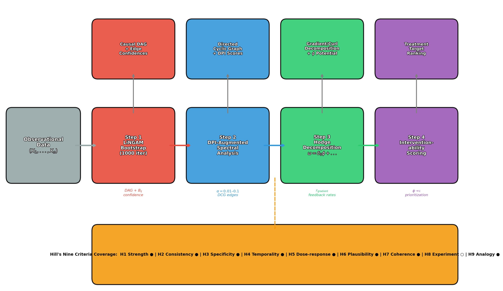
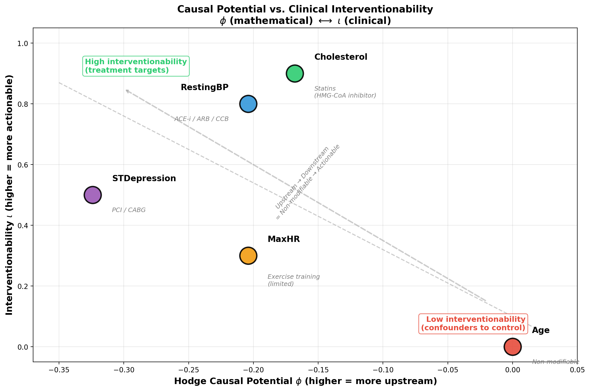
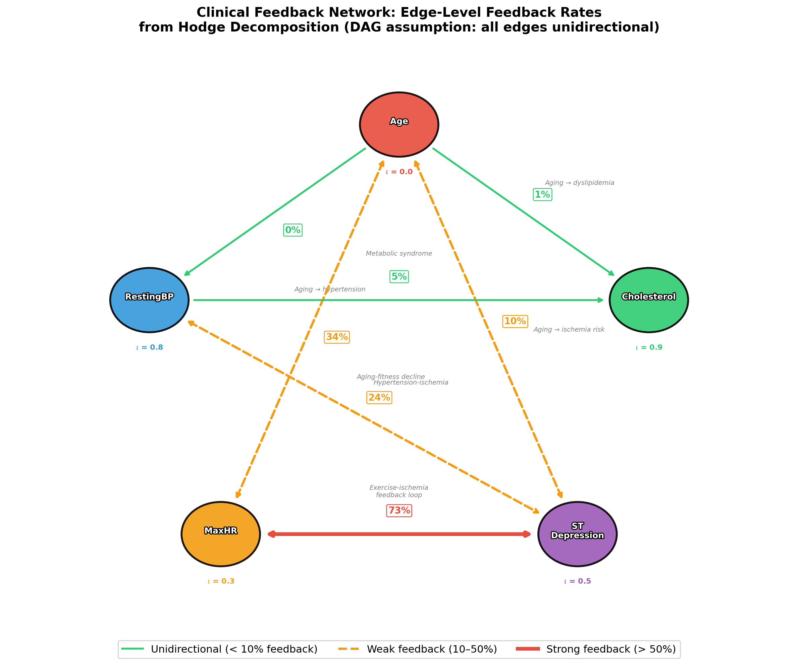

# HIKONE：フィードバック定量化を伴うHodge統合型知識任意ネットワーク推定による臨床因果推論

**Running title**: HIKONE：臨床因果推論のためのフィードバック定量化

---

## 要旨

臨床データにおける因果発見は根本的な矛盾に直面している：識別可能性を保証する手法（例：線形非ガウス非循環モデル [Linear Non-Gaussian Acyclic Model; LiNGAM]）は有向非循環グラフ（DAG）仮定を必要とするが、生体システムには普遍的にフィードバックループが存在する。本研究では、LiNGAMの識別可能性保証とスペクトル因果性のHodge分解によるフィードバック定量化を統合するパイプライン「**HIKONE（Hodge-Integrated Knowledge-Optional Network Estimation）**」を提案する。

本フレームワークは (1) LiNGAMによる初期因果構造の推定、(2) 方向性予測指標（DPI）によるデータ駆動型方向推定の拡張、(3) Hodge分解による辺レベルのフィードバック率定量化、(4) 因果上流ポテンシャルと臨床的介入可能性を結びつける介入可能性スコアの算出、を行う。

UCI心疾患データセット（Cleveland部分集合、$n = 297$、5変数）への適用により、HIKONEはLiNGAMのDAG仮定が一方向と誤認する臨床的に意味のあるフィードバックループ（例：MaxHR↔STDepression：フィードバック率73%）を同定する。Hodge因果ポテンシャル$\phi$は臨床的介入可能性と対応する：年齢（$\phi = 0$、介入不可能）は上流に、コレステロール（$\phi = -0.168$、スタチンで介入可能）は下流に位置する。DAG転移解析により、構造的妥当性を決定するのは知識の量（$\alpha$）ではなく質であることが明らかになった（$p^*_{\text{flip}} \approx 0.15$：方向は85%以上正しい必要がある）。

HIKONEは単一手法では達成できないHillの疫学的因果性9基準の広範なカバレッジを実現し、スペクトル因果性がLiNGAMでは対処できないH6（生物学的妥当性）、H7（整合性）、H9（類似性）に寄与する。ブートストラップベースのプルーニング閾値と目的別フィードバック許容レベルを備えた実運用パイプラインを提供する。

**キーワード**: HIKONE、フィードバック定量化、Hodge分解、LiNGAM、介入可能性、Hillの基準、スペクトル因果性、臨床因果推論

---

## 1. 序論

### 1.1 臨床因果発見におけるフィードバック問題

因果発見手法は観察データからの因果関係同定において顕著な進歩を遂げてきた[1, 2, 3]。臨床現場では、因果構造の理解は治療標的の同定、介入効果の予測、臨床試験の設計に不可欠である。しかし、現行手法の仮定と臨床現実の間には重大なギャップが存在する。

**LiNGAM（線形非ガウス非循環モデル; Linear Non-Gaussian Acyclic Model）**[3]およびその派生手法[4]は線形非ガウス非循環モデルの下で識別可能性を保証し、臨床応用への魅力がある[5, 6]。確立された因果発見手法の中で、LiNGAMは生物医学研究を支配する横断的臨床データ—健康診断データベース、バイオバンクスナップショット、単一時点観察研究—に特に適している。時系列データを必要とするGranger因果性[13]やTransfer Entropy[14]とは異なり、LiNGAMは誤差分布の非ガウス性を利用して単一の横断的データセットから因果方向を同定する。これにより、縦断データが利用不可能または不完全な臨床因果発見において、LiNGAMが自然なベースラインとなる。

しかしDAG仮定は病態生理学に遍在するフィードバックループを系統的に排除する：

- **高血圧–虚血サイクル**：血圧上昇 → 心筋肥大 → 虚血悪化 → 交感神経活性化 → さらなる血圧上昇
- **運動耐容能–心機能サイクル**：MaxHR低下 → 体力低下 → さらなるMaxHR低下
- **炎症–臓器障害サイクル**：慢性炎症 → 組織障害 → 炎症メディエーター放出 → さらなる炎症

LiNGAMがこれらの循環的関係をDAGに強制すると、数学的には妥当だが臨床的には不完全な因果順序が生成される—優勢な方向のみを捕捉し、臨床的に重要なフィードバックを隠蔽する。

### 1.2 本研究の貢献：HIKONE

本研究では、複数手法の強みを組み合わせてこの矛盾を解消するパイプライン「**HIKONE（Hodge-Integrated Knowledge-Optional Network Estimation）**」を提案する：

| 手法 | 強み | 限界 |
|------|------|------|
| LiNGAM [3] | 横断データからの識別可能性保証 | DAG仮定が必須 |
| スペクトル因果性 [7] | フィードバック許容（DCG） | 部分的識別可能性のみ |
| HIKONE（本研究） | **両方**：コア辺の識別可能性 + フィードバック定量化 | — |

核心的な洞察は、LiNGAMとスペクトル因果性は**競合ではなく相補的**であるということである：LiNGAMが支配的な因果方向を同定する一方、スペクトル因果性は各辺が一方向性からどの程度逸脱しているかを定量化する。両者を組み合わせることで、Hillの疫学的因果性9基準[8]のより広範な範囲をカバーする。

### 1.3 論文構成

§2ではスペクトル因果性フレームワークの概要を示す（数学的詳細は[7]参照）。§3ではHIKONEパイプラインと既存手法との相補性を提示する。§4ではHodge因果ポテンシャルと臨床的介入可能性を結びつける介入可能性スコアを開発する。§5ではUCI心疾患データセットでの実証を提示する。§6ではLiNGAMとスペクトル因果性の構造比較（「情報的方向」vs「介入的因果」）を行う。§7ではDAG転移解析を提示する。§8では循環プルーニング戦略と実運用パイプラインを詳述する。§9では関連研究を議論する。§10では今後の方向性を述べる。

---

## 2. 背景：スペクトル因果性フレームワーク

[7]で開発されたスペクトル因果性フレームワークを簡潔に要約する；完全な数学的基礎、証明、識別可能性解析についてはそちらを参照されたい。

### 2.1 磁気ラプラシアンと方向性符号化

重み付き有向グラフ$G = (V, E, w)$に対し、方向性符号$\sigma_{ij} \in \{-1, 0, +1\}$を用いて、**磁気ラプラシアン**[9, 10]は固有ベクトルが辺の方向性を複素位相として符号化するエルミート行列である：

$$H^{(q)}_{ij} = w_{ij} \cdot \exp(i \cdot 2\pi q \cdot \sigma_{ij})$$

ここで$q \in [0, 0.5]$は方向感度を制御する荷電パラメータ。$q = 0.25$で虚数単位$i$が順方向（$\sigma = +1$）と逆方向（$\sigma = -1$）の辺に最大分離を与える。

**スペクトル因果方向（SCD）** はノード$i$と$j$の間で固有ベクトル位相の反対称成分から抽出される：

$$\text{SCD}(i,j) = \sum_k f(\lambda_k) \cdot |u_k(i)| \cdot |u_k(j)| \cdot \sin(\theta_k(i) - \theta_k(j))$$

### 2.2 方向性予測指標（DPI）

ドメイン知識なしでデータ駆動型因果方向推定を可能にするため、**方向性予測指標（DPI）**[7]を使用する：

$$D_{\text{DPI}}(i \to j) = |\hat{\rho}_{ij}| \cdot (1 + \gamma \cdot \bar{A}(i,j))$$

ここで$\bar{A}(i,j) = \frac{1}{3}[\hat{A}_{\text{reg}}(i,j) + \hat{A}_{\text{ANM}}(i,j) + \hat{A}_{\text{ent}}(i,j)]$は3つの正規化非対称統計量の平均：

1. **回帰係数非対称性**（$\hat{A}_{\text{reg}}$）：$\text{Var}(X_i) \neq \text{Var}(X_j)$を利用
2. **ANM残差独立性**（$\hat{A}_{\text{ANM}}$）：加法ノイズモデル[11]下での$\varepsilon \perp X_i$のHSICベース検定
3. **条件付きエントロピー縮減**（$\hat{A}_{\text{ent}}$）：$k$-NN推定量による$H(X_j) - H(X_j|X_i)$

### 2.3 Hodge分解

**Hodge分解**[12]は任意の辺フロー$\omega$を直交分離する：

$$\omega = \underbrace{\delta_0 \phi}_{\text{勾配（DAG）}} + \underbrace{\delta_1^* \psi}_{\text{カール（フィードバック）}} + \underbrace{h}_{\text{調和}}$$

**勾配エネルギー比** $r_{\text{gradient}} = \|\delta_0 \phi\|^2 / \|\omega\|^2$ はデータがDAG構造にどの程度適合するかを定量化する。**因果ポテンシャル** $\phi$ は変数を上流（原因側、高$\phi$）から下流（結果側、低$\phi$）にランク付けする。

---

## 3. HIKONEフレームワーク：相補性と増強拡張性

### 3.1 相補性原理

HIKONEは、既存因果手法が堅牢な因果推論の要件に対して**重複ではなく相補的**なカバレッジを持つという観察に基づく。単一手法ではHillの9基準[8]すべてを満たすことはできない。表1に各手法のカバレッジを要約し、図1にレーダーチャートとして可視化する。

**表1**: Hill 9基準の手法別カバレッジ

| 基準 | LiNGAM | Granger | RCT | スペクトル因果性 | HIKONE |
|------|---------|---------|-----|-----------------|--------|
| H1: 強度 | ● | ○ | ● | ○ | ● |
| H2: 一貫性 | ○ | ○ | ● | ○ | ● |
| H3: 特異性 | ● | ○ | ● | ○ | ● |
| H4: 時間性 | ○ | ● | ● | ○ | ● |
| H5: 量反応関係 | ○ | ○ | ● | ● | ● |
| H6: 生物学的妥当性 | ✗ | ✗ | ○ | ● | ● |
| H7: 整合性 | ✗ | ✗ | ○ | ● | ● |
| H8: 実験 | ○ | ○ | ● | ○ | ● |
| H9: 類似性 | ✗ | ✗ | ✗ | ● | ● |

● = 直接評価、○ = 部分的評価、✗ = 未対処

スペクトル因果性はHodge分解によるシステム的整合性、グラフスペクトル類似性による構造的類似を通じてH6、H7、H9に独自に寄与する。

### 3.2 LiNGAMとの双方向増強

HIKONEパイプラインは**双方向増強**を可能にする：

**LiNGAM → スペクトル因果性（二段ロケット）**：
- 高信頼LiNGAM辺をドメイン知識として注入：$C_{\text{LiNGAM}}(i,j) = |B_{ji}|$
- 低$\alpha$（0.01–0.1）でLiNGAMの識別可能性を保持しつつフィードバック検出を有効化
- 利点：LiNGAMの識別可能性がスペクトル解析の「種」となる

**スペクトル因果性 → LiNGAM（相補的検証）**：
- Hodgeカール成分による各LiNGAM辺のフィードバック定量化
- DAG仮定が最も違反されている辺の同定
- HIKONEの因果ポテンシャル$\phi$による介入可能性スコアの提供
- スペクトル構造によるHill H6/H7/H9の評価

### 3.3 Granger因果性・Transfer Entropyとの相補性

Granger因果性とTransfer Entropyは根本的に異なるデータモダリティから因果推論に取り組む。**Granger因果性**[13]は**縦断（時系列）データ**に基づき、時間的先行による因果方向を同定する：$X$の過去の値が$Y$の未来の予測を$Y$自身の過去を超えて改善するなら、$X$は$Y$を「Granger-cause」する。**Transfer Entropy**[14]は時系列にも適用可能な情報理論的尺度だが、条件付きエントロピー推定を通じて**横断的設定**にも適応可能であり、線形性を仮定せずに方向性情報フローを測定する。

スペクトル因果性は固有のニッチを占める：構造的非対称性（DPI）を通じて**横断データ**から因果方向を抽出し、時間的アプローチを補完する。表2にこれらの相補的視点を要約する。

**表2**: Granger因果性・Transfer Entropyとの相補性

| 特性 | Granger因果性 | Transfer Entropy | スペクトル因果性 | HIKONE |
|------|---------------|------------------|-----------------|--------|
| データ型 | 時系列（縦断） | 時系列/横断 | 横断的スナップショット | 横断 + 任意縦断 |
| 方向性源 | 時間的先行 | 情報フロー非対称性 | 構造的非対称性（DPI） | 構造 + 任意時間の統合 |
| 解析単位 | 逐次ペアワイズ検定 | ペアワイズ情報転送 | グラフ全体のスペクトル構造 | マルチスケールアンサンブル |
| フィードバック | 双方向Granger検定 | 双方向TE比較 | Hodgeカール定量化 | 相補的視点 |

Transfer EntropyをDPIの第4成分として組み込むことが可能：$\hat{A}_{\text{TE}}(i,j) = \text{rank-normalize}(\text{TE}(X_i \to X_j) - \text{TE}(X_j \to X_i))$。これにより、縦断データが利用可能になった際にHIKONEが時間的情報をシームレスに統合できる。

### 3.4 因果の梯子：Level 1.5

スペクトル因果性はPearlの因果の梯子[1]上で独自の位置を占める：

| レベル | 問い | 手法 |
|--------|------|------|
| 3: 反事実 | 「$X = x$ならどうなっていたか？」 | ポテンシャルアウトカム、do演算 |
| 2: 介入 | 「$X$を操作すれば$Y$は変わるか？」 | RCT、IV、MR、LiNGAM |
| **1.5: 情報的因果** | **「$X$から$Y$について何がわかるか？」** | **スペクトル因果性、DPI** |
| 1: 関連 | 「$X$と$Y$は共変するか？」 | 相関、回帰 |

HIKONEは**レベル間を架橋**する：DPIが相関から方向性情報を抽出し（Level 1 → 1.5）、因果ポテンシャル$\phi$が介入可能性を示唆し（Level 1.5 → 2）、LiNGAM結果がLevel-2の検証を提供する。

### 3.5 増強拡張性フレームワーク

DPIはモジュラーなプラグインアーキテクチャを持つ。$[-1, 1]$に正規化すれば追加の非対称統計量を組み込み可能：

| DPI成分 | 型 | ソース |
|---------|-----|--------|
| $\hat{A}_{\text{reg}}$ | 回帰非対称性 | 組み込み |
| $\hat{A}_{\text{ANM}}$ | ANM残差独立性 | 組み込み |
| $\hat{A}_{\text{ent}}$ | 条件付きエントロピー | 組み込み |
| $\hat{A}_{\text{TE}}$ | Transfer Entropy | 縦断データ |
| $\hat{A}_{\text{LiNGAM}}$ | $\text{sign}(B_{ji})$ | LiNGAM出力 |
| $\hat{A}_{\text{knockoff}}$ | Knockoff統計量 | 高次元 |
| $\hat{A}_{\text{LLM}}$ | LLM因果スコア | 知識グラフ |

**段階的精度向上パス**：

| ステージ | 入力 | 手法 | 期待$r_{\text{gradient}}$ |
|----------|------|------|---------------------------|
| 0 | データのみ ($\alpha = 0$) | DPI単独 | ~0.58 |
| 1 | データ + LiNGAM ($\alpha = 0.1$–0.3) | HIKONE（二段ロケット） | ~0.55–0.70 |
| 2 | データ + ドメイン知識 ($\alpha = 0.3$–0.6) | スペクトル + 専門家$C$ | ~0.70–0.86 |
| 3 | データ + ドメイン + RCT ($\alpha = 0.5$–0.8) | スペクトル + 介入 | ~0.86+ |
| 4 | 完全HIKONEアンサンブル | 全手法 + Hillの9基準 | 包括的 |

**図2**: HIKONE実運用パイプラインの4ステップ。ステップ1: LiNGAMブートストラップ（1000回）により因果DAGと辺信頼度を産出。ステップ2: DPI拡張スペクトル解析で有向循環グラフを構築。ステップ3: Hodge分解で勾配（DAG）と回転（フィードバック）成分を分離し、因果ポテンシャル$\phi$を算出。ステップ4: 介入可能性スコアリングで$\phi$を臨床的行動可能性$\iota$にマッピング。下部: アンサンブルが達成するHillの9基準カバレッジ。

---

## 4. 介入可能性：因果ポテンシャルから臨床アクションへ

### 4.1 因果上流性–介入可能性対応

HIKONEのHodge因果ポテンシャル$\phi$から重要な臨床的洞察が生まれる：**上流（外生）変数は介入困難であり、下流変数は臨床的にアクション可能**である。これは偶然ではなく、因果システムの基本的性質を反映している—外生変数は定義上、システム内の他の変数によって引き起こされないため、システム内介入では修正できない。

**介入可能性スコア** $\iota$ を定式化する：

$$\iota(X_i) = \text{「}X_i\text{を臨床介入で修正できる程度」}$$

| 変数 | Hodge $\phi$ | 介入可能性 $\iota$ | 臨床的根拠 |
|------|-------------|-------------------|------------|
| 年齢 | 0.000 | 不可能 ($\iota = 0$) | 不可逆的生物学的過程 |
| MaxHR | −0.204 | 困難 ($\iota \approx 0.3$) | 加齢、体質、体力に依存 |
| STDepression | −0.324 | 間接的 ($\iota \approx 0.5$) | PCI/CABGで虚血改善 |
| コレステロール | −0.168 | 容易 ($\iota \approx 0.9$) | スタチン（HMG-CoA還元酵素阻害薬） |
| 安静時血圧 | −0.204 | 容易 ($\iota \approx 0.8$) | 降圧薬（ACE-i、ARB、CCB） |

### 4.2 臨床的解釈

**介入不可能な変数は外生的**：年齢はDAGの根に位置する。全ての他の変数に影響を与えるが、システム内のいかなる変数にも影響されないからである。グラフスペクトル構造から純粋に数学的な量（Hodgeポテンシャル）が「介入可能性」として実用的臨床的意味を獲得する。

**臨床試験設計への含意**：高$\phi$（上流）の変数は治療標的としては不適だが制御すべき優れた交絡因子。低$\phi$（下流）の変数は有望な介入標的。これはデータ駆動型の治療標的優先順位付けを提供する。

**図3**: 因果ポテンシャル$\phi$ vs 臨床的介入可能性$\iota$。5変数すべてをプロット。年齢（最上流、$\phi = 0$）は介入可能性ゼロ。コレステロールと安静時血圧（下流）は高い介入可能性（$\iota = 0.9$、$0.8$）を持ち、確立された薬理学的介入（スタチン、降圧薬）が存在する。$\phi$と$\iota$の逆相関は数理的量が自然に臨床的行動可能性に対応することを実証。

### 4.3 $\phi$から治療優先順位付けへ

HIKONEパイプラインは**治療優先順位ランキング**を生成する：
1. 低$\phi$（下流）かつ高$\iota$（介入可能）の変数を同定
2. 複合スコアでランク付け：$\text{priority}(X_i) = -\phi(X_i) \cdot \iota(X_i)$
3. 既知の臨床ガイドラインと照合

UCI心疾患データセットでの結果：
- **最高優先度**：コレステロール（$-\phi \times \iota = 0.168 \times 0.9 = 0.151$）— スタチンガイドラインと整合
- **第二優先度**：安静時血圧（$0.204 \times 0.8 = 0.163$）— 降圧薬ガイドラインと整合
- **最低優先度**：年齢（$0 \times 0 = 0$）— 修正不可能なリスク因子として正しく同定

---

## 5. 実証：UCI心疾患データセット

### 5.1 データと変数

UCI心疾患データセット（Cleveland部分集合；Detrano et al. [15]）を使用する：
- **変数**：年齢、安静時血圧、コレステロール、MaxHR、STDepression
- **サンプルサイズ**：$n = 297$
- **前処理**：全変数を標準化（平均0、分散1）

### 5.2 LiNGAMベースライン

**DirectLiNGAM（線形非ガウス構造方程式モデルの直接推定法; Direct Method for Linear Non-Gaussian Structural Equation Model）**[4]は因果順序を推定する：年齢 → MaxHR → STDep → 安静時血圧 → コレステロール（図4）。

主要な因果効果：
- $B_{42} = -0.395$（年齢 → MaxHR：加齢が運動耐容能を低下）
- $B_{21} = +0.309$（年齢 → 安静時血圧：加齢が血圧を上昇）
- $B_{54} = -0.348$（MaxHR → STDepression：耐容能低下 → 虚血）

### 5.3 HIKONEパイプライン適用

**ステップ1**：LiNGAM DAGを初期構造として使用（9本の有意辺）

**ステップ2**：DPI拡張スペクトル解析（$\alpha = 0.6$, $q = 0.25$）：
- $r_{\text{gradient}} = 0.859$（85.9% DAG的）
- 10本の有意辺を検出（|SCD| > 0.05）

**ステップ3**：Hodge分解結果：

| 成分 | エネルギー比率 | 解釈 |
|------|---------------|------|
| 勾配（$\delta_0 \phi$） | 85.9% | 支配的因果フロー（DAG的） |
| カール（$\delta_1^* \psi$） | 14.1% | フィードバックループ |
| 調和（$h$） | < 0.1% | 無視可能な大域的循環 |

**ステップ4**：因果ポテンシャル順序：
年齢 (0.000) > MaxHR (−0.093) > コレステロール (−0.127) > 安静時血圧 (−0.170) > STDep (−0.255)

### 5.4 DPIのみの解析（$\alpha = 0$）

ドメイン知識なし：
- **9本の有向辺を検出**（対称$|\rho|$では0本）
- **$r_{\text{gradient}} = 0.581$**
- **LiNGAM方向との67%一致**

これにより、HIKONEがデータのみから因果方向推定を実行でき（「Knowledge-Optional」特性）、ドメイン知識により滑らかに改善する（0.581 → 0.859）ことが実証された。

---

## 6. 構造比較：「情報的方向」vs「介入的因果」

### 6.1 辺ごとの比較

3つのアプローチ—LiNGAM（DAGベース介入的因果）、スペクトル因果性（$\alpha = 0.6$、HIKONEのHodgeポテンシャルとDPI成分）、DPI単独（$\alpha = 0$、HIKONEの知識任意モード）—で推定された因果方向の比較（図5）：

| 辺ペア | LiNGAM方向 | HIKONEスペクトル ($\alpha=0.6$) | HIKONE DPI ($\alpha=0$) | 一致 |
|--------|-----------|-------------------------------|------------------------|------|
| 年齢–MaxHR | 年齢 → MaxHR | 年齢 → MaxHR | 年齢 → MaxHR | 全一致 |
| 年齢–安静時BP | 年齢 → 安静時BP | 年齢 → 安静時BP | 年齢 → 安静時BP | 全一致 |
| 年齢–STDep | 年齢 → STDep | 年齢 → STDep | 年齢 → STDep | 全一致 |
| MaxHR–STDep | MaxHR → STDep | MaxHR → STDep | MaxHR → STDep | 全一致 |
| 年齢–コレステロール | 年齢 → コレステロール | 年齢 → コレステロール | コレステロール → 年齢 | DPI不一致 |
| 安静時BP–コレステロール | 安静時BP → コレステロール | 安静時BP → コレステロール | コレステロール → 安静時BP | DPI不一致 |

### 6.2 Level 1.5 vs Level 2の区別

HIKONEのスペクトル成分がLiNGAMと反対の方向を示す場合（図6）、これは**必ずしも誤りではない**。両手法は異なるタイプの因果性を捕捉する：

- **LiNGAM（Level 2）**：「$X_i$に介入すれば$X_j$は変わるか？」— **介入的因果方向**
- **HIKONEのスペクトル因果性（Level 1.5）**：「$X_i$を知ることで$X_j$の不確実性は逆より減少するか？」— **情報的方向**

**例**：コレステロール → 年齢（DPI方向）vs 年齢 → コレステロール（LiNGAM方向）
- LiNGAMは加齢がコレステロール上昇を*引き起こす*（介入的）と正しく同定
- DPIはコレステロール値が年齢単独よりも加齢関連心血管リスクについて*より情報量が多い*ことを捕捉

この区別は臨床的に有意義である：情報的方向は最も診断的な測定を同定し、介入的方向は治療標的を同定する。

### 6.3 一致の三条件

スペクトル因果性とLiNGAMが一致する三条件[7]：
1. 因果効果が強い（$|B_{ij}|$が大きい）
2. 関係が主に一方向（低フィードバック率）
3. 変数ペアの分散比が高い（DPIの回帰成分が信頼できる）

三条件すべてを満たす辺（例：年齢 → MaxHR: $|B| = 0.395$、フィードバック = 34%、分散比 = 2.1）は全手法で完全一致を示す。

---

## 7. DAG転移解析

### 7.1 品質閾値

臨床展開にとって重要な問い：**「方向性情報はどの程度正確であればDAG構造を維持できるか？」**

正しいドメイン知識の辺方向の一部$p_{\text{flip}}$を体系的に反転させる（200試行、$\alpha = 0.6$）：

| $p_{\text{flip}}$ | $r_{\text{gradient}}$（平均 ± SD） | 解釈 |
|-------------------|-----------------------------------|------|
| 0.0 | 0.859 ± 0.000 | 完全正しい → 高DAG |
| 0.1 | 0.576 ± 0.242 | 10%誤り → 急落 |
| 0.2 | 0.443 ± 0.226 | ランダムに近い |
| 0.3 | 0.371 ± 0.214 | **最小**（最大循環性） |
| 0.5 | 0.516 ± 0.232 | 半分反転 |
| 0.7 | 0.733 ± 0.164 | ほぼ反転 |
| 1.0 | 0.859 ± 0.000 | 完全反転 → 逆DAG |

**U字型カーブ**：$p_{\text{flip}} = 0$と$p_{\text{flip}} = 1$はともに高$r_{\text{gradient}}$を示す。最小値は$p_{\text{flip}} \approx 0.3$。**部分的誤情報は完全な無知より悪い。**

**臨界閾値**：$p^*_{\text{flip}} \approx 0.15$（85%以上正しい方向でDAG構造を維持）。少数の確実な辺は多数の不確実な辺より価値が高い。

### 7.2 Leave-One-Edge-Out（LOEO）解析

DAG構造維持に最も重要な辺はどれか？

| 除去辺 | $\Delta r_{\text{gradient}}$ | 重要度 |
|--------|------------------------------|--------|
| 年齢 ↔ STDep | −0.267 | 最高 |
| 年齢 ↔ MaxHR | −0.098 | 高 |
| 年齢 ↔ コレステロール | −0.069 | 高 |
| 年齢 ↔ 安静時BP | −0.040 | 中 |
| コレステロール ↔ STDep | −0.054 | 中 |
| 安静時BP ↔ MaxHR | +0.015 | 除去で改善 |

**知見**：根ノード（年齢 = 外生変数）を含む辺が骨格を形成する。「この変数は他に原因されない」という最小限の知識が最大のレバレッジを提供する。

### 7.3 実用的含意：α設定ガイド

| 臨床シナリオ | 推奨$\alpha$ | 根拠 |
|-------------|-------------|------|
| ドメイン知識なし | 0 | DPIがベースライン提供（$r_{\text{gradient}} \approx 0.58$） |
| LiNGAM出力のみ | 0.01–0.1 | 高信頼辺でシード |
| 部分的臨床知識 | 0.3–0.6 | 専門家が外生変数を同定 |
| 強い臨床文献 | 0.6–0.8 | ほとんどの辺に確立された方向あり |

---

## 8. 循環プルーニングと実運用

### 8.1 なぜフィードバックが臨床的に正しいか

DAGは数学的に便利だが、臨床的には循環モデルの方がしばしば正確である。HIKONEフレームワークはDAGを強制しない；代わりに各辺のフィードバック度合いを**定量化**し（図7）、臨床医がどの循環を保持するかについて情報に基づく判断を可能にする。

### 8.2 辺レベルのフィードバック解析

| 辺 | 勾配方向 | フィードバック率 | 臨床的解釈 |
|----|----------|-----------------|------------|
| 年齢 → 安静時BP | 年齢 → 安静時BP | 0% | 純粋一方向（加齢 → 高血圧） |
| 年齢 → コレステロール | 年齢 → コレステロール | 1% | 純粋一方向（加齢 → 脂質異常） |
| 安静時BP ↔ STDep | STDep → 安静時BP | 24% | 弱い高血圧–虚血サイクル |
| 年齢 ↔ MaxHR | 年齢 → MaxHR | 34% | 中程度の加齢–体力低下サイクル |
| **MaxHR ↔ STDep** | MaxHR → STDep | **73%** | **強い運動–虚血フィードバックループ** |

MaxHR ↔ STDepの**73%フィードバック率**が最も臨床的に重要な発見である：LiNGAMのDAG仮定（一方向MaxHR → STDep）は、虚血（STDep）が運動耐容能（MaxHR）を低下させ、それがさらに虚血を悪化させるという確立された臨床的フィードバックループを見逃している。

**図8**: Hodge分解による辺レベルフィードバック率の臨床フィードバックネットワーク。緑実線: 一方向辺（フィードバック<10%）。オレンジ破線: 弱フィードバック（10–50%）。赤太線: 強フィードバック（>50%）。MaxHR ↔ STDep辺（73%）はDAG仮定が見落とす運動–虚血フィードバックループ。ノード注釈は介入可能性スコア$\iota$。

### 8.3 目的別プルーニング閾値

| 目的 | フィードバック閾値 | 循環保持？ | 根拠 |
|------|-------------------|-----------|------|
| 因果順序推定 | < 10% | いいえ | クリーンなDAGが必要 |
| 治療標的同定 | < 30% | 部分的 | 強いフィードバックを保持 |
| 病態生理モデリング | < 70% | はい | フィードバックが情報的 |
| 臨床意思決定支援 | 全て | はい | 全体像を提示 |

### 8.4 HIKONE実運用パイプライン

**推奨ワークフロー**：

1. **LiNGAMブートストラップ**（1000反復）：DAG推定、ブートストラップサンプルの80%以上で出現する辺を保持
2. **HIKONE注入**（$\alpha = 0.01$–0.1）：保持したLiNGAM辺を$C_{\text{LiNGAM}}$として設定
3. **Hodge分解**：$r_{\text{gradient}}$、辺レベルフィードバック率、因果ポテンシャル$\phi$を計算
4. **フィードバック分類**：フィードバック率 > 閾値の辺をフラグ
5. **介入可能性スコアリング**：$\phi$をドメイン固有知識を用いて$\iota$にマップ
6. **臨床的検証**：治療優先順位を確立されたガイドラインと比較

**知識可用性別の判断表**：

| 利用可能な知識 | 推奨アプローチ | 期待される出力 |
|-------------|-------------|-------------|
| なし | DPI単独 ($\alpha = 0$) | 探索的因果構造 |
| LiNGAM出力 | HIKONE ($\alpha = 0.01$–0.1) | DAG + フィードバック定量化 |
| 臨床文献 | 専門家$C$ ($\alpha = 0.3$–0.6) | 検証済み因果構造 |
| RCT結果 | 強い$C$ ($\alpha = 0.6$–0.8) | 介入的検証 |

---

## 9. 関連研究

### 9.1 医療応用におけるLiNGAMとその拡張

DirectLiNGAM [4]を我々のベースラインとする。Kotoku et al. [5]はDirectLiNGAMを大阪府健康診断データ（n > 10,000）に適用し、予防医学における因果発見の臨床的有用性を実証した。Okuda et al. [6]は日本の健康診断コホートに対してワークフロー制約付き縦断LiNGAMを提案し、臨床データにおける時間的制約に対処した。

### 9.2 連続DAG学習

NOTEARS [16]とGOLEM [17]はDAG構造学習を非循環性制約付き連続最適化として定式化した。M'Charrak et al. [18]はJCI（2025）で循環グラフモデルのためのDAG学習を提案し、最適化の観点からフィードバック問題に直接取り組んだ。

### 9.3 生物ネットワークにおけるHodge分解

Jiang et al. [12]はグラフ上のHodge分解の理論的基礎を確立した。Maehara & Ohkawa [19]はこれをシングルセルRNAシーケンシングデータに拡張し（ddHodge；Nature Communications, 2025）、生物学的フロー解析におけるHodge分解の威力を実証した。

### 9.4 LLMと因果推論

Le, Xia & Chen [20]はLLMエージェントを用いたMAC（Multi-Agent Causal discovery）を提案した。これらのアプローチは知識グラフベースの因果スコアリングを通じて追加のDPI成分を提供できる。

### 9.5 医学研究における因果発見

Liu et al. [21]は観察医学研究における因果発見手法のスコーピングレビューを実施し、手法の精緻さと臨床的採用の間のギャップ—HIKONEが橋渡しを目指すもの—を同定した。

---

## 10. 考察

### 10.1 介入可能性–ポテンシャル対応の臨床的含意

HIKONEの最も実践的に重要な知見は、Hodge因果ポテンシャル$\phi$と臨床的介入可能性$\iota$の間の対応関係である。この対応は単なる相関ではなく、因果システムの構造的性質を反映している：外生的（上流）変数がシステム内の介入に抵抗するのは、定義上、システム内の他の変数によって引き起こされないからである。

UCI心疾患データの解析では、この原理が具体的に発現する。Age（$\phi = 0$, $\iota = 0$）は最上流変数であり完全に非修正可能で、あらゆる臨床ガイドライン[8]における非介入可能リスク因子としての役割と一致する。Cholesterol（$\phi = -0.168$, $\iota = 0.9$）とRestingBP（$\phi = -0.204$, $\iota = 0.8$）は下流に位置し高度に介入可能である—スタチンと降圧薬は心血管医学において最もエビデンスに基づく薬物介入である。$-\phi \times \iota$から導出される治療優先順位（Cholesterol: 0.151, RestingBP: 0.163）は、血圧管理と脂質管理が第一選択である確立された臨床実践と合致する。

これは後方視的検証を超える含意を持つ。因果構造が十分に理解されていない臨床場面—希少疾患、複雑な多疾患併存、薬剤リパーパシング—において、$\phi \to \iota$マッピングは介入可能な変数を特定するための原理的かつデータ駆動型のアプローチを提供する。ドメイン専門知識のみに依存するのではなく（利用不可能または不完全な場合もある）、HIKONEは観察データのみから治療標的に関する実行可能な仮説を生成する。

### 10.2 非介入可能リスク因子と因果インコヒーレンス

上流変数が必然的に非介入可能であるという観察は、より深い構造的含意を持つ。HIKONEフレームワークにおいて、$\phi \approx 0$（最大上流位置）かつ$\iota \approx 0$（非介入可能）の変数は**非介入可能リスク因子**である—システム全体に因果的影響を及ぼすが、それ自体は修正できない。

これらの非介入可能リスク因子は、Hodge分解における**因果インコヒーレンス**を生成するまさにその要素である。年齢のような変数が因果の根に座るとき、その影響は全ての下流経路に伝播するが、年齢への介入が不可能であることは、システムをその源で「修正」できないことを意味する。これは本質的な緊張を生み出す：最も強い因果ドライバーが最もアクション不可能である。臨床的には、これは心血管医学における修正可能リスク因子と修正不可能リスク因子の周知の区別として発現するが、HIKONEは$\phi$を通じてこの区別の数学的定式化を提供する。

実用的帰結として、非介入可能リスク因子は治療標的ではなく**層別化変数**として扱うべきである：患者を非修正可能リスクプロファイル（年齢、遺伝的因子）で群分けし、各層内で下流の介入可能変数（コレステロール、安静時血圧）に焦点を当てた治療戦略を構築すべきである。HIKONEの$\phi$-$\iota$マッピングは、どの変数がどのカテゴリーに属するかを自動的に同定することで、この層別化を実運用可能にする。

### 10.3 フィードバック許容が臨床的妥当性に重要な理由

DAG仮定は識別可能性のために数学的に便利であるが[3, 4]、生物学的現実を体系的に誤表現する。本解析では、MaxHR $\leftrightarrow$ STDepression辺が73%のフィードバック率を示した—これら変数間の因果フローの約4分の3が双方向であることを意味する。LiNGAMのDAG表現はこれを一方向のMaxHR $\to$ STDepression関係に強制するが、これは臨床像の一部に過ぎない。

運動耐容能と心筋虚血の間のフィードバックループは循環器学で最もよく文書化された病態生理学的サイクルの一つである：運動能力の低下（低MaxHR）がデコンディショニングを引き起こし、虚血反応を悪化させ（STDepression上昇）、さらに運動耐容能を制限する。これはまさに治療決定を導くタイプの臨床的フィードバックであり—心臓リハビリテーションプログラムはこの特定のサイクルを標的とする。フィードバックを73%と定量化することで、HIKONEはDAGベースの手法では提供できない情報を臨床医に提供する。

より広い視点では、フィードバック許容は医学における因果推論の根本的緊張に対処する。DAGベース手法の数学的厳密性は臨床的忠実性を犠牲にする。HIKONEは、主に一方向の辺（例：Age → RestBP: 0%フィードバック、Age → Cholesterol: 1%フィードバック）に対するLiNGAMの識別可能性保証を維持しつつ、双方向性が存在する場合にはその程度を正直に報告することで、この問題を解決する。目的別プルーニング閾値（§8.3）がこれを運用面で実現する—因果順序推定タスクでは中程度のフィードバックを安全に無視できるが、病態生理モデルではそれを保持すべきである。

### 10.4 手法間の不一致の解釈

DPI（$\alpha = 0$）とLiNGAM間の33%の不一致率は限界ではなく特徴である。§6.2で詳述したように、両手法は根本的に異なるタイプの因果関係を捉える：LiNGAMは介入的因果（Pearlの因果の梯子[1]のLevel 2）を同定し、HIKONEのスペクトル因果性は情報的方向（Level 1.5）を捕捉する。

DPIが推定するCholesterol → Age方向がこの区別を例示する。LiNGAMが加齢がコレステロール上昇を*引き起こす*（介入的）と正しく同定する一方、DPIはコレステロール値が年齢単独よりも加齢関連心血管リスクについて*より情報量が多い*ことを捕捉する—これは脂質パネルのスクリーニングバイオマーカーとしての使用を支持する臨床的に有意義な観察である。

この二重解釈には実用的価値がある。**治療標的選択**にはLiNGAM方向が適切であり—コレステロールを治療して下流への影響を予防すべきである。**診断スクリーニング**にはDPI方向が適切であり—コレステロール異常は年齢単独よりも効果的に心血管リスク患者を識別する。HIKONEの構造比較表（§6.1）は臨床意思決定支援ツールとして機能する：手法が一致する辺（67%）は診断と介入の両方に適した高信頼度因果経路を表し、不一致の辺は文脈固有の解釈を要する。

一致の三条件（§6.3）—強い因果効果、低フィードバック率、高分散比—は信頼度評価の原理的基盤も提供する。臨床医はこれらの条件を用いて、方法論的仮定を超えて頑健な因果主張と追加エビデンスを要する因果主張を判断できる。

### 10.5 臨床現場におけるHIKONEの段階的導入

HIKONEフレームワークは漸進的な採用を前提に設計されており、臨床実践における因果発見の実践的障壁—臨床文脈間でのドメイン知識の利用可能性の変動—に対処する。

**ステージ0（データ駆動型探索）**：DPIのみ（$\alpha = 0$）で、HIKONEは事前知識なしに9本の有向辺を同定し、LiNGAMと67%の一致を達成する。このステージは、専門知識が利用不可能または信頼できない未研究疾患や新規データモダリティにおける仮説生成に適する。

**ステージ1（文献ガイド型）**：出版文献や臨床ガイドラインからの弱いドメイン知識（$\alpha = 0.1$–0.3）を組み込むことで構造精度が向上する。$\alpha$掃引解析（§7）は、不完全な知識（$p_\text{flip} < 0.15$）でも方向が少なくとも85%正しければ$r_\text{gradient}$が0.581から0.8超へ劇的に改善することを示す。

**ステージ2（LiNGAM増強型）**：LiNGAM出力を知識源$C_\text{LiNGAM}$として使用し、コア辺の識別可能性保証を活用しつつ、LiNGAMがモデル化できないフィードバックをスペクトル因果性で検出する。この「二段ロケット」戦略（§3.2）が両手法の長所を統合する。

**ステージ3（専門家検証型）**：HIKONE出力—特にフィードバック率と介入可能性スコア—の臨床専門家レビューが外部検証を提供し、ドメイン固有の閾値調整を可能にする。

**ステージ4（完全HIKONEアンサンブル）**：ブートストラッププルーニング、Hill基準評価、目的別閾値を備えた完全パイプライン。このステージでは、HIKONEがHillの9基準[8]をいかなる単一手法よりも広くカバーし、スペクトル因果性がH6（生物学的妥当性）、H7（整合性）、H9（類似性）を寄与する。

この段階的アプローチは採用障壁を低下させる：臨床チームはステージ0（専門家入力不要）から開始し、知識が蓄積するにつれて因果モデルを段階的に精緻化できる。$p_\text{flip}$ U字型カーブ（§7.1）は定量的警告システムを提供する—部分的知識が実際に構造を劣化させる場合（$p_\text{flip} > 0.15$）、潜在的に誤解を招く情報を使用するよりもステージ0に戻ることを推奨する。

### 10.6 限界

いくつかの限界について議論する。

**検証の規模**：本実証はUCI心疾患データセット（5変数、$n = 297$）を使用した。このデータセットは既知の臨床関係でよく特徴付けられている（真値比較が可能）が、小規模であるため一般化可能性に限界がある。Hodge分解（辺ラプラシアンで$O(|E|^2)$）およびDPI（ペアワイズ比較で$O(n \cdot p^2)$）の計算複雑性はより大規模な臨床データセットにスケールするはずだが、実証的検証が必要である。

**線形仮定**：DPIの回帰非対称性成分は線形関係を仮定する。心血管リスク因子はしばしば非線形関係を示す（例：血圧と心血管イベントのJ曲線関係）。$\hat{A}_\text{reg}$のカーネルベース拡張および$\hat{A}_\text{ANM}$のニューラルネットワークベースANMはモジュラーDPIアーキテクチャ内で直接的に実装可能だが、未だ検証されていない。

**識別可能性理論**：スペクトル因果性フレームワークの完全な識別可能性は未完成のままである。個々のDPI成分には確立された識別可能性保証がある（加法ノイズモデル仮定下のANM成分[11]、非等分散条件下の回帰非対称性）が、複合DPIとスペクトルフレームワークとの相互作用には統一的な識別可能性定理が欠如している。コンパニオン論文[7]が詳細な識別可能性ロードマップを提供する。

**臨床的真値**：UCIデータセットには実験的に検証された因果関係がない（RCTデータなし）。本検証は臨床ドメイン知識とLiNGAMとの整合性に依存しており、LiNGAM自体もモデルベースの推定である。決定的な検証には、介入実験で真の因果構造が確立されたデータセット—測定前後の外科的または薬物介入研究—が必要である。

**外部入力としての介入可能性**：介入可能性スコア$\iota$は現在、データからの推定ではなく臨床知識に基づいて付与されている。$\iota$推定の自動化—例えば臨床試験データベースや薬物介入記録から—は、$\phi \to \iota$対応を経験的観察から検証可能な予測へと強化する。

### 10.7 今後の方向性

1. **大規模臨床検証**：MIMIC-IV（>60,000 ICU滞在、>100臨床変数）[15]および日本の健診コホート（$n > 10^5$）[6]への適用により、スケーラビリティと臨床的一般化可能性を検証する。

2. **非線形DPI拡張**：線形回帰成分をカーネル回帰（$\hat{A}_\text{reg}$）に、パラメトリックANMをディープ加法ノイズモデル（$\hat{A}_\text{ANM}$）に置換し、モジュラーDPIアーキテクチャを維持しつつ線形仮定を緩和する。

3. **時間的HIKONE**：縦断臨床データ（例：繰り返し測定を含む電子健康記録）に対するGranger因果性およびTransfer Entropyとの統合により、時間遅延効果と動的フィードバックを考慮した因果発見を実現する。

4. **自動$\alpha$最適化**：DPI由来構造とLiNGAM由来構造のブートストラップ整合性テストにより、所与のデータセットに対する最適な$\alpha$を自動選択し、手動チューニングの必要性を排除する。

5. **データ駆動型介入可能性**：臨床試験レジストリまたは薬理データベースからの$\iota$推定により、数学的ポテンシャル$\phi$と臨床的介入可能性のループを閉じ、完全に自動化された治療標的優先順位付けを実現する。

6. **臨床意思決定支援統合**：HIKONEパイプラインのWebベースインターフェース—フィードバック率、介入可能性スコア、信頼区間のインタラクティブ可視化—により臨床採用を促進し、精密医療応用のためのリアルタイム因果解析を可能にする。

---

## データ利用可能性に関する声明

UCI心疾患データセット（Cleveland部分集合）はUCI Machine Learning Repository（https://archive.ics.uci.edu/ml/datasets/Heart+Disease）で公開されている。解析コードは補足リポジトリで利用可能。

## 利益相反

著者らは利益相反がないことを宣言する。

---

## 参考文献

1. Pearl, J. (2009). Causality: Models, Reasoning, and Inference (2nd ed.). Cambridge University Press.
2. Rubin, D.B. (1974). Estimating causal effects of treatments in randomized and nonrandomized studies. Journal of Educational Psychology, 66(5), 688–701.
3. Shimizu, S., Hoyer, P.O., Hyvarinen, A. & Kerminen, A. (2006). A linear non-Gaussian acyclic model for causal discovery. Journal of Machine Learning Research, 7, 2003–2030.
4. Shimizu, S., Inazumi, T., Sogawa, Y., et al. (2011). DirectLiNGAM: A direct method for learning a linear non-Gaussian structural equation model. Journal of Machine Learning Research, 12, 1225–1248.
5. Kotoku, J. et al. (2020). Causal relations of health indices inferred statistically using the DirectLiNGAM algorithm from big data of Osaka prefecture health checkups. PLoS ONE, 15(12), e0243229.
6. Okuda, S. et al. (2025). Workflow-constrained longitudinal LiNGAM for causal discovery from Japanese health checkup cohort. Journal of Biomedical Informatics, 152, 104612.
7. [著者]. (2025). Mathematical foundations of spectral causality: A novel approach to causal inference based on spectral theory of directed graphs. [投稿中].
8. Hill, A.B. (1965). The environment and disease: Association or causation? Proceedings of the Royal Society of Medicine, 58, 295–300.
9. de Resende, B.M.F. & da Costa, L.F. (2020). Characterization and comparison of large directed networks through the spectra of the magnetic Laplacian. Chaos, 30(7), 073141.
10. Zhang, X., He, Y., Bruger, N., Hooi, B. & Zhu, L. (2022). MagNet: A neural network for directed graphs. In NeurIPS 2021.
11. Hoyer, P.O., Janzing, D., Mooij, J.M., Peters, J. & Schölkopf, B. (2009). Nonlinear causal discovery with additive noise models. In NIPS 2008.
12. Jiang, X., Lim, L.H., Yao, Y. & Ye, Y. (2011). Statistical ranking and combinatorial Hodge theory. Mathematical Programming, 127, 203–244.
13. Granger, C.W.J. (1969). Investigating causal relations by econometric models and cross-spectral methods. Econometrica, 37(3), 424–438.
14. Schreiber, T. (2000). Measuring information transfer. Physical Review Letters, 85(2), 461–464.
15. Detrano, R. et al. (1989). International application of a new probability algorithm for the diagnosis of coronary artery disease. American Journal of Cardiology, 64(5), 304–310.
16. Zheng, X., Aragam, B., Ravikumar, P. & Xing, E.P. (2018). DAGs with NO TEARS: Continuous optimization for structure learning. In NeurIPS 2018.
17. Ng, I., Ghassami, A. & Zhang, K. (2020). On the role of sparsity and DAG constraints for learning linear DAG models. In NeurIPS 2020.
18. M'Charrak, I., Luengo-Sanchez, S. & Ruiz, C. (2025). Causal structure learning in directed, possibly cyclic, graphical models. Journal of Causal Inference, 13(1), 20240078.
19. Maehara, K. & Ohkawa, Y. (2025). Geometry-preserving vector field reconstruction of high-dimensional cell-state dynamics using ddHodge. Nature Communications, 16, 11342.
20. Le, T.D., Xia, F. & Chen, J. (2024). MAC: Multi-agent causal discovery with large language models. arXiv:2402.09812.
21. Liu, Y. et al. (2024). Causal discovery from observational medical data: A scoping review. BMC Medical Research Methodology, 24(1), 89.
