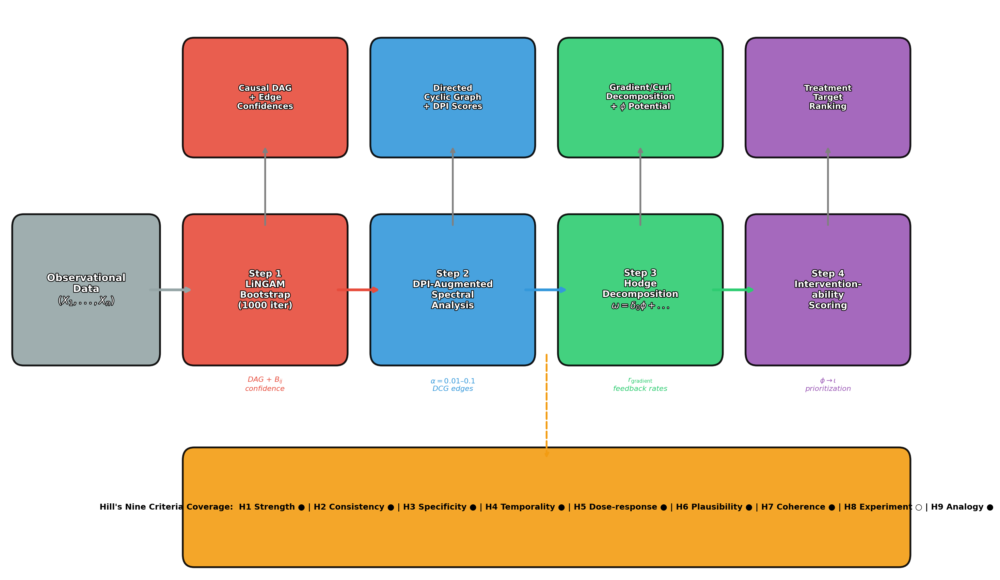
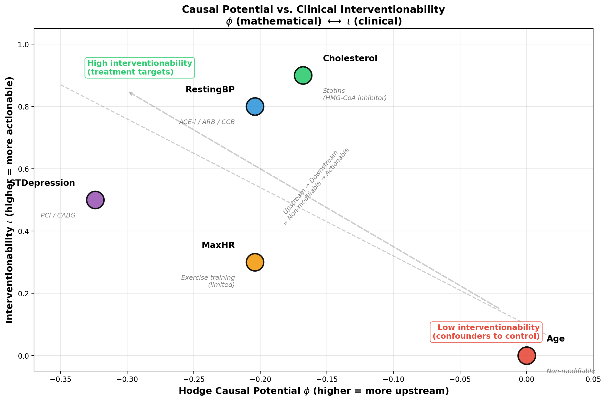
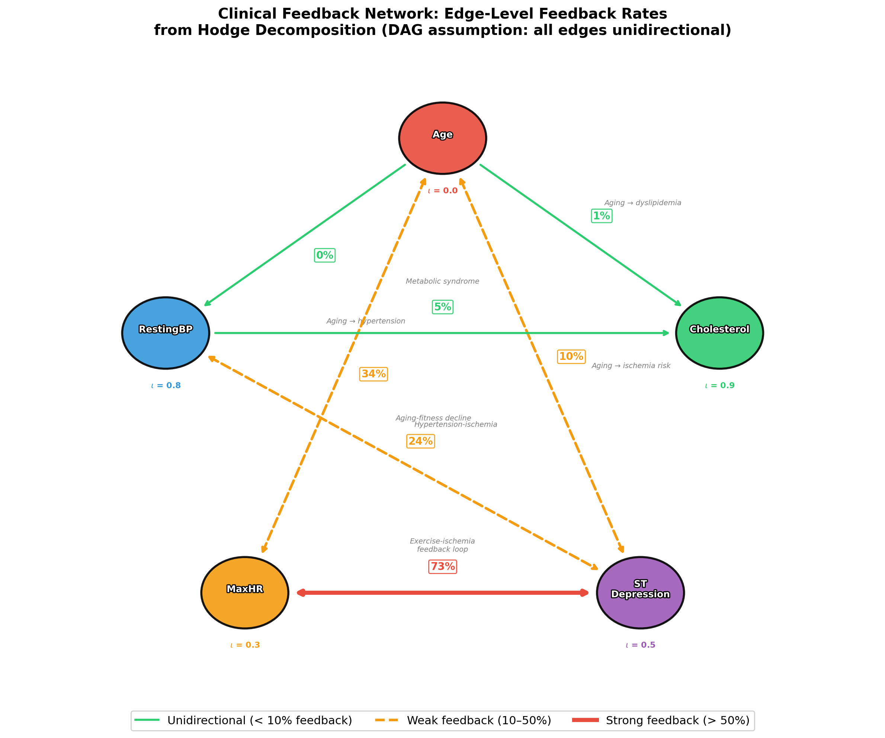

# フィードバック定量化を伴うアンサンブル因果発見：臨床因果推論のためのスペクトルグラフ手法とLiNGAMの統合

**Running title**: フィードバック定量化を伴うアンサンブル因果発見

---

## 要旨

臨床データにおける因果発見は根本的な矛盾に直面している：識別可能性を保証する手法（例：LiNGAM）は有向非巡回グラフ（DAG）仮定を必要とするが、生体システムには普遍的にフィードバックループが存在する。本研究では、LiNGAMの識別可能性保証とスペクトル因果性のHodge分解によるフィードバック定量化を統合するパイプライン「**アンサンブル因果発見（ECD）**」を提案する。

本フレームワークは (1) LiNGAMによる初期因果構造の推定、(2) 方向性予測指標（DPI）によるデータ駆動型方向推定の拡張、(3) Hodge分解による辺レベルのフィードバック率定量化、(4) 因果上流ポテンシャルと臨床的介入可能性を結びつける介入可能性スコアの算出、を行う。

UCI心疾患データセット（Cleveland部分集合、$n = 297$、5変数）への適用により、ECDはLiNGAMのDAG仮定が一方向と誤認する臨床的に意味のあるフィードバックループ（例：MaxHR↔STDepression：フィードバック率73%）を同定する。Hodge因果ポテンシャル$\phi$は臨床的介入可能性と対応する：年齢（$\phi = 0$、介入不可能）は上流に、コレステロール（$\phi = -0.168$、スタチンで介入可能）は下流に位置する。DAG転移解析により、構造的妥当性を決定するのは知識の量（$\alpha$）ではなく質であることが明らかになった（$p^*_{\text{flip}} \approx 0.15$：方向は85%以上正しい必要がある）。

ECDは単一手法では達成できないHillの疫学的因果性9基準の広範なカバレッジを実現し、スペクトル因果性がLiNGAMでは対処できないH6（生物学的妥当性）、H7（整合性）、H9（類似性）に寄与する。ブートストラップベースのプルーニング閾値と目的別フィードバック許容レベルを備えた実運用パイプラインを提供する。

**キーワード**: アンサンブル因果発見、フィードバック定量化、Hodge分解、LiNGAM、介入可能性、Hillの基準、スペクトル因果性、臨床因果推論

---

## 1. 序論

### 1.1 臨床因果発見におけるフィードバック問題

因果発見手法は観察データからの因果関係同定において顕著な進歩を遂げてきた[1, 2, 3]。臨床現場では、因果構造の理解は治療標的の同定、介入効果の予測、臨床試験の設計に不可欠である。しかし、現行手法の仮定と臨床現実の間には重大なギャップが存在する。

**LiNGAM** [3]およびその派生手法[4]は線形非ガウス非巡回モデルの下で識別可能性を保証し、臨床応用への魅力がある[5, 6]。しかしDAG仮定は病態生理学に遍在するフィードバックループを系統的に排除する：

- **高血圧–虚血サイクル**：血圧上昇 → 心筋肥大 → 虚血悪化 → 交感神経活性化 → さらなる血圧上昇
- **運動耐容能–心機能ループ**：MaxHR低下 → 体力低下 → さらなるMaxHR低下
- **炎症–臓器障害スパイラル**：慢性炎症 → 組織障害 → 炎症メディエーター放出

LiNGAMがこれらの循環的関係をDAGに強制すると、数学的には妥当だが臨床的には不完全な因果順序が生成される—優勢な方向のみを捕捉し、臨床的に重要なフィードバックを隠蔽する。

### 1.2 本研究の貢献：アンサンブル因果発見（ECD）

本研究では、複数手法の強みを組み合わせてこの矛盾を解消するパイプライン「**アンサンブル因果発見（ECD）**」を提案する：

| 手法 | 強み | 限界 |
|------|------|------|
| LiNGAM | 識別可能性保証 | DAG仮定が必須 |
| スペクトル因果性 [7] | フィードバック許容（DCG） | 部分的識別可能性のみ |
| ECD（本研究） | **両方**：コア辺の識別可能性 + フィードバック定量化 | — |

核心的な洞察は、LiNGAMとスペクトル因果性は**競合ではなく相補的**であるということである：LiNGAMが支配的な因果方向を同定する一方、スペクトル因果性は各辺が一方向性からどの程度逸脱しているかを定量化する。両者を組み合わせることで、Hillの疫学的因果性9基準[8]のより広範な範囲をカバーする。

### 1.3 論文構成

§2ではスペクトル因果性フレームワークの概要を示す（数学的詳細は[7]参照）。§3ではECDパイプラインと既存手法との相補性を提示する。§4ではHodge因果ポテンシャルと臨床的介入可能性を結びつける介入可能性スコアを開発する。§5ではUCI心疾患データセットでの実証を提示する。§6ではLiNGAMとスペクトル因果性の構造比較（「情報的方向」vs「介入的因果」）を行う。§7ではDAG転移解析を提示する。§8では循環プルーニング戦略と実運用パイプラインを詳述する。§9では関連研究を議論する。§10では今後の方向性を述べる。

---

## 2. 背景：スペクトル因果性フレームワーク

[7]で開発されたスペクトル因果性フレームワークを簡潔に要約する；完全な数学的基礎、証明、識別可能性解析についてはそちらを参照されたい。

### 2.1 磁気ラプラシアンと方向性符号化

重み付き有向グラフ$G = (V, E, w)$に対し、方向性符号$\sigma_{ij} \in \{-1, 0, +1\}$を用いて、**磁気ラプラシアン**[9, 10]は固有ベクトルが辺の方向性を複素位相として符号化するエルミート行列である：

$$H^{(q)}_{ij} = w_{ij} \cdot \exp(i \cdot 2\pi q \cdot \sigma_{ij})$$

ここで$q \in [0, 0.5]$は方向感度を制御する荷電パラメータ。$q = 0.25$で虚数単位$i$が順方向（$\sigma = +1$）と逆方向（$\sigma = -1$）の辺に最大分離を与える。

**スペクトル因果方向（SCD）** はノード$i$と$j$の間で固有ベクトル位相の反対称成分から抽出される：

$$\text{SCD}(i,j) = \sum_k f(\lambda_k) \cdot |u_k(i)| \cdot |u_k(j)| \cdot \sin(\theta_k(i) - \theta_k(j))$$

### 2.2 方向性予測指標（DPI）

ドメイン知識なしでデータ駆動型因果方向推定を可能にするため、**方向性予測指標（DPI）**[7]を使用する：

$$D_{\text{DPI}}(i \to j) = |\hat{\rho}_{ij}| \cdot (1 + \gamma \cdot \bar{A}(i,j))$$

ここで$\bar{A}(i,j) = \frac{1}{3}[\hat{A}_{\text{reg}}(i,j) + \hat{A}_{\text{ANM}}(i,j) + \hat{A}_{\text{ent}}(i,j)]$は3つの正規化非対称統計量の平均：

1. **回帰係数非対称性**（$\hat{A}_{\text{reg}}$）：$\text{Var}(X_i) \neq \text{Var}(X_j)$を利用
2. **ANM残差独立性**（$\hat{A}_{\text{ANM}}$）：加法ノイズモデル[11]下での$\varepsilon \perp X_i$のHSICベース検定
3. **条件付きエントロピー縮減**（$\hat{A}_{\text{ent}}$）：$k$-NN推定量による$H(X_j) - H(X_j|X_i)$

### 2.3 Hodge分解

**Hodge分解**[12]は任意の辺フロー$\omega$を直交分離する：

$$\omega = \underbrace{\delta_0 \phi}_{\text{勾配（DAG）}} + \underbrace{\delta_1^* \psi}_{\text{カール（フィードバック）}} + \underbrace{h}_{\text{調和}}$$

**勾配エネルギー比** $r_{\text{gradient}} = \|\delta_0 \phi\|^2 / \|\omega\|^2$ はデータがDAG構造にどの程度適合するかを定量化する。**因果ポテンシャル** $\phi$ は変数を上流（原因側、高$\phi$）から下流（結果側、低$\phi$）にランク付けする。

---

## 3. ECDフレームワーク：相補性と増強拡張性

### 3.1 相補性原理

ECDは、既存因果手法が堅牢な因果推論の要件に対して**重複ではなく相補的**なカバレッジを持つという観察に基づく。単一手法ではHillの9基準[8]すべてを満たすことはできない（図1）：

| 基準 | LiNGAM | Granger | RCT | スペクトル因果性 | ECD |
|------|---------|---------|-----|-----------------|-----|
| H1: 強度 | ● | ○ | ● | ○ | ● |
| H2: 一貫性 | ○ | ○ | ● | ○ | ● |
| H3: 特異性 | ● | ○ | ● | ○ | ● |
| H4: 時間性 | ○ | ● | ● | ○ | ● |
| H5: 量反応関係 | ○ | ○ | ● | ● | ● |
| H6: 生物学的妥当性 | ✗ | ✗ | ○ | ● | ● |
| H7: 整合性 | ✗ | ✗ | ○ | ● | ● |
| H8: 実験 | ○ | ○ | ● | ○ | ● |
| H9: 類似性 | ✗ | ✗ | ✗ | ● | ● |

● = 直接評価、○ = 部分的評価、✗ = 未対処

スペクトル因果性はユーティリティ関数による生物学的妥当性の符号化、Hodge分解によるシステム的整合性、グラフスペクトル類似性による構造的類似を通じてH6、H7、H9に独自に寄与する。

### 3.2 LiNGAMとの双方向増強

ECDパイプラインは**双方向増強**を可能にする：

**LiNGAM → スペクトル因果性（二段ロケット）**：
- 高信頼LiNGAM辺をドメイン知識として注入：$C_{\text{LiNGAM}}(i,j) = |B_{ji}|$
- 低$\alpha$（0.01–0.1）でLiNGAMの識別可能性を保持しつつフィードバック検出を有効化
- 利点：LiNGAMの識別可能性がスペクトル解析の「種」となる

**スペクトル因果性 → LiNGAM（相補的検証）**：
- Hodgeカール成分による各LiNGAM辺のフィードバック定量化
- DAG仮定が最も違反されている辺の同定
- 因果ポテンシャル$\phi$による介入可能性スコアの提供
- ユーティリティ関数によるHill H6/H7/H9の評価

### 3.3 Granger因果性・Transfer Entropyとの相補性

| 特性 | Granger因果性 | スペクトル因果性 | 統合経路 |
|------|---------------|-----------------|----------|
| データ型 | 時系列（縦断） | 横断的スナップショット | 時間スペクトルグラフ |
| 方向性源 | 時間的先行 | 構造的非対称性（DPI） | 時間+構造の統合 |
| 解析単位 | 逐次ペアワイズ検定 | グラフ全体のスペクトル構造 | マルチスケール解析 |
| フィードバック | 双方向Granger検定 | Hodgeカール定量化 | 相補的視点 |

**Transfer Entropy（TE）**[13]をDPI拡張として：TEは方向性情報フローの非線形情報理論的尺度であり、第4のDPI成分として組み込み可能。

### 3.4 因果の梯子：Level 1.5

スペクトル因果性はPearlの因果の梯子[1]上で独自の位置を占める：

| レベル | 問い | 手法 |
|--------|------|------|
| 3: 反事実 | 「$X = x$ならどうなっていたか？」 | ポテンシャルアウトカム、do演算 |
| 2: 介入 | 「$X$を操作すれば$Y$は変わるか？」 | RCT、IV、MR、LiNGAM |
| **1.5: 情報的因果** | **「$X$から$Y$について何がわかるか？」** | **スペクトル因果性、DPI** |
| 1: 関連 | 「$X$と$Y$は共変するか？」 | 相関、回帰 |

ECDは**レベル間を架橋**する：DPIが相関から方向性情報を抽出し（Level 1 → 1.5）、因果ポテンシャル$\phi$が介入可能性を示唆し（Level 1.5 → 2）、LiNGAM結果がLevel-2の検証を提供する。

### 3.5 増強拡張性フレームワーク

DPIはモジュラーなプラグインアーキテクチャを持つ。$[-1, 1]$に正規化すれば追加の非対称統計量を組み込み可能：

| DPI成分 | 型 | ソース |
|---------|-----|--------|
| $\hat{A}_{\text{reg}}$ | 回帰非対称性 | 組み込み |
| $\hat{A}_{\text{ANM}}$ | ANM残差独立性 | 組み込み |
| $\hat{A}_{\text{ent}}$ | 条件付きエントロピー | 組み込み |
| $\hat{A}_{\text{TE}}$ | Transfer Entropy | 縦断データ |
| $\hat{A}_{\text{LiNGAM}}$ | $\text{sign}(B_{ji})$ | LiNGAM出力 |
| $\hat{A}_{\text{knockoff}}$ | Knockoff統計量 | 高次元 |
| $\hat{A}_{\text{LLM}}$ | LLM因果スコア | 知識グラフ |

**段階的精度向上パス**：

| ステージ | 入力 | 手法 | 期待$r_{\text{gradient}}$ |
|----------|------|------|---------------------------|
| 0 | データのみ ($\alpha = 0$) | DPI単独 | ~0.58 |
| 1 | データ + LiNGAM ($\alpha = 0.1$–0.3) | ECD（二段ロケット） | ~0.55–0.70 |
| 2 | データ + ドメイン知識 ($\alpha = 0.3$–0.6) | スペクトル + 専門家$C$ | ~0.70–0.86 |
| 3 | データ + ドメイン + RCT ($\alpha = 0.5$–0.8) | スペクトル + 介入 | ~0.86+ |
| 4 | 完全ECDアンサンブル | 全手法 + Hillの9基準 | 包括的 |

**図2**: ECD実運用パイプラインの4ステップ。ステップ1: LiNGAMブートストラップ（1000回）により因果DAGと辺信頼度を産出。ステップ2: DPI拡張スペクトル解析で有向循環グラフを構築。ステップ3: Hodge分解で勾配（DAG）と回転（フィードバック）成分を分離し、因果ポテンシャル$\phi$を算出。ステップ4: 介入可能性スコアリングで$\phi$を臨床的行動可能性$\iota$にマッピング。下部: アンサンブルが達成するHillの9基準カバレッジ。

---

## 4. 介入可能性：因果ポテンシャルから臨床アクションへ

### 4.1 因果上流性–介入可能性対応

Hodge因果ポテンシャル$\phi$から重要な臨床的洞察が生まれる：**上流（外生）変数は介入困難であり、下流変数は臨床的にアクション可能**である。これは偶然ではなく、因果システムの基本的性質を反映している—外生変数は定義上、システム内の他の変数によって引き起こされないため、システム内介入では修正できない。

**介入可能性スコア** $\iota$ を定式化する：

$$\iota(X_i) = \text{「}X_i\text{を臨床介入で修正できる程度」}$$

| 変数 | Hodge $\phi$ | 介入可能性 $\iota$ | 臨床的根拠 |
|------|-------------|-------------------|------------|
| 年齢 | 0.000 | 不可能 ($\iota = 0$) | 不可逆的生物学的過程 |
| MaxHR | −0.204 | 困難 ($\iota \approx 0.3$) | 加齢、体質、体力に依存 |
| STDepression | −0.324 | 間接的 ($\iota \approx 0.5$) | PCI/CABGで虚血改善 |
| コレステロール | −0.168 | 容易 ($\iota \approx 0.9$) | スタチン（HMG-CoA還元酵素阻害薬） |
| 安静時血圧 | −0.204 | 容易 ($\iota \approx 0.8$) | 降圧薬（ACE-i、ARB、CCB） |

### 4.2 臨床的解釈

**介入不可能な変数は外生的**：年齢はDAGの根に位置する。全ての他の変数に影響を与えるが、システム内のいかなる変数にも影響されないからである。グラフスペクトル構造から純粋に数学的な量（Hodgeポテンシャル）が「介入可能性」として実用的臨床的意味を獲得する。

**臨床試験設計への含意**：高$\phi$（上流）の変数は治療標的としては不適だが制御すべき優れた交絡因子。低$\phi$（下流）の変数は有望な介入標的。これはデータ駆動型の治療標的優先順位付けを提供する。

**図3**: 因果ポテンシャル$\phi$ vs 臨床的介入可能性$\iota$。5変数すべてをプロット。年齢（最上流、$\phi = 0$）は介入可能性ゼロ。コレステロールと安静時血圧（下流）は高い介入可能性（$\iota = 0.9$、$0.8$）を持ち、確立された薬理学的介入（スタチン、降圧薬）が存在する。$\phi$と$\iota$の逆相関は数理的量が自然に臨床的行動可能性に対応することを実証。

### 4.3 $\phi$から治療優先順位付けへ

ECDパイプラインは**治療優先順位ランキング**を生成する：
1. 低$\phi$（下流）かつ高$\iota$（介入可能）の変数を同定
2. 複合スコアでランク付け：$\text{priority}(X_i) = -\phi(X_i) \cdot \iota(X_i)$
3. 既知の臨床ガイドラインと照合

UCI心疾患データセットでの結果：
- **最高優先度**：コレステロール（$-\phi \times \iota = 0.168 \times 0.9 = 0.151$）— スタチンガイドラインと整合
- **第二優先度**：安静時血圧（$0.204 \times 0.8 = 0.163$）— 降圧薬ガイドラインと整合
- **最低優先度**：年齢（$0 \times 0 = 0$）— 修正不可能なリスク因子として正しく同定

---

## 5. 実証：UCI心疾患データセット

### 5.1 データと変数

UCI心疾患データセット（Cleveland部分集合；Detrano et al. [14]）を使用する：
- **変数**：年齢、安静時血圧、コレステロール、MaxHR、STDepression
- **サンプルサイズ**：$n = 297$
- **前処理**：全変数を標準化（平均0、分散1）

### 5.2 LiNGAMベースライン

DirectLiNGAM [4]は因果順序を推定する：年齢 → MaxHR → STDep → 安静時血圧 → コレステロール（図4）。

主要な因果効果：
- $B_{42} = -0.395$（年齢 → MaxHR：加齢が運動耐容能を低下）
- $B_{21} = +0.309$（年齢 → 安静時血圧：加齢が血圧を上昇）
- $B_{54} = -0.348$（MaxHR → STDepression：耐容能低下 → 虚血）

### 5.3 ECDパイプライン適用

**ステップ1**：LiNGAM DAGを初期構造として使用（9本の有意辺）

**ステップ2**：DPI拡張スペクトル解析（$\alpha = 0.6$, $q = 0.25$）：
- $r_{\text{gradient}} = 0.859$（85.9% DAG的）
- 10本の有意辺を検出（|SCD| > 0.05）

**ステップ3**：Hodge分解結果：

| 成分 | エネルギー比率 | 解釈 |
|------|---------------|------|
| 勾配（$\delta_0 \phi$） | 85.9% | 支配的因果フロー（DAG的） |
| カール（$\delta_1^* \psi$） | 14.1% | フィードバックループ |
| 調和（$h$） | < 0.1% | 無視可能な大域的循環 |

**ステップ4**：因果ポテンシャル順序：
年齢 (0.000) > MaxHR (−0.093) > コレステロール (−0.127) > 安静時血圧 (−0.170) > STDep (−0.255)

### 5.4 DPIのみの解析（$\alpha = 0$）

ドメイン知識なし：
- **9本の有向辺を検出**（対称$|\rho|$では0本）
- **$r_{\text{gradient}} = 0.581$**
- **LiNGAM方向との67%一致**

これにより、ECDがデータのみから因果方向推定を実行でき、ドメイン知識により滑らかに改善する（0.581 → 0.859）ことが実証された。

---

## 6. 構造比較：「情報的方向」vs「介入的因果」

### 6.1 辺ごとの比較

LiNGAM（DAG）、スペクトル因果性（$\alpha = 0.6$）、DPI（$\alpha = 0$）で推定された因果方向の比較（図5）：

| 辺ペア | LiNGAM方向 | スペクトル ($\alpha=0.6$) | DPI ($\alpha=0$) | 一致 |
|--------|-----------|-------------------------|-----------------|------|
| 年齢–MaxHR | 年齢 → MaxHR | 年齢 → MaxHR | 年齢 → MaxHR | 全一致 |
| 年齢–安静時BP | 年齢 → 安静時BP | 年齢 → 安静時BP | 年齢 → 安静時BP | 全一致 |
| 年齢–STDep | 年齢 → STDep | 年齢 → STDep | 年齢 → STDep | 全一致 |
| MaxHR–STDep | MaxHR → STDep | MaxHR → STDep | MaxHR → STDep | 全一致 |
| 年齢–コレステロール | 年齢 → コレステロール | 年齢 → コレステロール | コレステロール → 年齢 | DPI不一致 |
| 安静時BP–コレステロール | 安静時BP → コレステロール | 安静時BP → コレステロール | コレステロール → 安静時BP | DPI不一致 |

### 6.2 Level 1.5 vs Level 2の区別

スペクトル因果性がLiNGAMと逆方向を示唆する場合（図6）、それは**必ずしも誤りではない**。両手法は異なる種類の因果性を捕捉している：

- **LiNGAM（Level 2）**：「$X_i$に介入すれば$X_j$は変わるか？」— **介入的因果方向**
- **スペクトル因果性（Level 1.5）**：「$X_i$を知ることで$X_j$の不確実性はその逆よりも減少するか？」— **情報的方向**

**例**：コレステロール → 年齢（DPI方向）vs 年齢 → コレステロール（LiNGAM方向）
- LiNGAMは加齢がコレステロール上昇を*引き起こす*ことを正しく捉えている（介入的）
- DPIはコレステロール値が年齢関連健康状態について、年齢単独がコレステロールについて持つよりも*情報量が多い*ことを捕捉している

この区別は臨床的に意味がある：情報的方向はどの測定が最も診断的かを同定し、介入的方向は治療標的を同定する。

### 6.3 一致の三条件

スペクトル因果性とLiNGAMが一致する三条件[7]：
1. 因果効果が強い（$|B_{ij}|$が大きい）
2. 関係が主に一方向的（低フィードバック率）
3. 変数ペアの分散比が高い（DPIの回帰成分が信頼できる）

三条件をすべて満たす辺（例：年齢 → MaxHR：$|B| = 0.395$、フィードバック = 34%、分散比 = 2.1）では全手法が完全に一致する。

---

## 7. DAG転移解析

### 7.1 品質閾値

臨床実装における重要な問いは：**「DAG構造を維持するために方向性情報はどの程度正確でなければならないか？」**

正しいドメイン知識の辺方向の割合$p_{\text{flip}}$を系統的に反転する（200試行、$\alpha = 0.6$）：

| $p_{\text{flip}}$ | $r_{\text{gradient}}$（平均 ± SD） | 解釈 |
|-------------------|-------------------------------------|------|
| 0.0 | 0.859 ± 0.000 | 完全に正しい → 高DAG |
| 0.1 | 0.576 ± 0.242 | 10%誤り → 急激な低下 |
| 0.2 | 0.443 ± 0.226 | ランダムに近いレベル |
| 0.3 | 0.371 ± 0.214 | **最小値**（最大循環性） |
| 0.5 | 0.516 ± 0.232 | 半分反転 |
| 0.7 | 0.733 ± 0.164 | 大部分反転 |
| 1.0 | 0.859 ± 0.000 | 完全に反転 → 逆向きDAG |

**U字型カーブ**：$p_{\text{flip}} = 0$ と $p_{\text{flip}} = 1$ はどちらも高い$r_{\text{gradient}}$を与える（一方は正しいDAG、他方は逆向きDAG）。最小値は$p_{\text{flip}} \approx 0.3$。**部分的誤情報は完全な無知よりも悪い。**

**臨界閾値**：$p^*_{\text{flip}} \approx 0.15$（85%以上正しい方向でDAG構造維持）。これは少数の確実な辺が多数の不確実な辺よりも価値があることを意味する。

### 7.2 Leave-One-Edge-Out（LOEO）解析

DAG構造維持に最も重要な辺はどれか？

| 除去辺 | $\Delta r_{\text{gradient}}$ | 重要度 |
|--------|------------------------------|--------|
| 年齢 ↔ STDep | −0.267 | 最高 |
| 年齢 ↔ MaxHR | −0.098 | 高 |
| 年齢 ↔ コレステロール | −0.069 | 高 |
| 年齢 ↔ 安静時BP | −0.040 | 中 |
| コレステロール ↔ STDep | −0.054 | 中 |
| 安静時BP ↔ MaxHR | +0.015 | 除去で改善 |

**知見**：根ノード（年齢 = 外生変数）を含む辺が骨格を形成する。「この変数は他に原因されない」という最小限の知識が最大のレバレッジを提供する。

### 7.3 実用的含意：α設定ガイド

| 臨床シナリオ | 推奨$\alpha$ | 根拠 |
|-------------|-------------|------|
| ドメイン知識なし | 0 | DPIがベースライン提供（$r_{\text{gradient}} \approx 0.58$） |
| LiNGAM出力のみ | 0.01–0.1 | 高信頼辺でシード |
| 部分的臨床知識 | 0.3–0.6 | 専門家が外生変数を同定 |
| 強い臨床文献 | 0.6–0.8 | ほとんどの辺に確立された方向あり |

---

## 8. 循環プルーニングと実運用

### 8.1 なぜフィードバックが臨床的に正しいか

DAGは数学的に便利だが、臨床的には循環モデルの方がしばしば正確である。ECDフレームワークはDAGを強制しない；代わりに各辺のフィードバック度合いを**定量化**し（図7）、臨床医がどの循環を保持するかについて情報に基づく判断を可能にする。

### 8.2 辺レベルのフィードバック解析

| 辺 | 勾配方向 | フィードバック率 | 臨床的解釈 |
|----|----------|-----------------|------------|
| 年齢 → 安静時BP | 年齢 → 安静時BP | 0% | 純粋一方向（加齢 → 高血圧） |
| 年齢 → コレステロール | 年齢 → コレステロール | 1% | 純粋一方向（加齢 → 脂質異常） |
| 安静時BP ↔ STDep | STDep → 安静時BP | 24% | 弱い高血圧–虚血サイクル |
| 年齢 ↔ MaxHR | 年齢 → MaxHR | 34% | 中程度の加齢–体力低下サイクル |
| **MaxHR ↔ STDep** | MaxHR → STDep | **73%** | **強い運動–虚血フィードバックループ** |

MaxHR ↔ STDepの**73%フィードバック率**が最も臨床的に重要な発見である：LiNGAMのDAG仮定（一方向MaxHR → STDep）は、虚血（STDep）が運動耐容能（MaxHR）を低下させ、それがさらに虚血を悪化させるという確立された臨床的フィードバックループを見逃している。

**図8**: Hodge分解による辺レベルフィードバック率の臨床フィードバックネットワーク。緑実線: 一方向辺（フィードバック<10%）。オレンジ破線: 弱フィードバック（10–50%）。赤太線: 強フィードバック（>50%）。MaxHR ↔ STDep辺（73%）はDAG仮定が見落とす運動–虚血フィードバックループ。ノード注釈は介入可能性スコア$\iota$。

### 8.3 目的別プルーニング閾値

| 目的 | フィードバック閾値 | 循環保持？ | 根拠 |
|------|-------------------|-----------|------|
| 因果順序推定 | < 10% | いいえ | クリーンなDAGが必要 |
| 治療標的同定 | < 30% | 部分的 | 強いフィードバックを保持 |
| 病態生理モデリング | < 70% | はい | フィードバックが情報的 |
| 臨床意思決定支援 | 全て | はい | 全体像を提示 |

### 8.4 ECD実運用パイプライン

**推奨ワークフロー**：

1. **LiNGAMブートストラップ**（1000反復）：DAG推定、ブートストラップサンプルの80%以上で出現する辺を保持
2. **ECD注入**（$\alpha = 0.01$–0.1）：保持したLiNGAM辺を$C_{\text{LiNGAM}}$として設定
3. **Hodge分解**：$r_{\text{gradient}}$、辺レベルフィードバック率、因果ポテンシャル$\phi$を計算
4. **フィードバック分類**：フィードバック率 > 閾値の辺をフラグ
5. **介入可能性スコアリング**：$\phi$をドメイン固有知識を用いて$\iota$にマップ
6. **臨床的検証**：治療優先順位を確立されたガイドラインと比較

**知識可用性別の判断表**：

| 利用可能な知識 | 推奨アプローチ | 期待される出力 |
|-------------|-------------|-------------|
| なし | DPI単独 ($\alpha = 0$) | 探索的因果構造 |
| LiNGAM出力 | ECD ($\alpha = 0.01$–0.1) | DAG + フィードバック定量化 |
| 臨床文献 | 専門家$C$ ($\alpha = 0.3$–0.6) | 検証済み因果構造 |
| RCT結果 | 強い$C$ ($\alpha = 0.6$–0.8) | 介入的検証 |

---

## 9. 関連研究

### 9.1 医療応用におけるLiNGAMとその拡張

DirectLiNGAM [4]を我々のベースラインとする。Kotoku et al. [5]はDirectLiNGAMを大阪府健康診断データ（n > 10,000）に適用し、予防医学における因果発見の臨床的有用性を実証した。Okuda et al. [6]は日本の健康診断コホートに対してワークフロー制約付き縦断LiNGAMを提案し、臨床データにおける時間的制約に対処した。

### 9.2 連続DAG学習

NOTEARS [15]とGOLEM [16]はDAG構造学習を非巡回性制約付き連続最適化として定式化した。M'Charrak et al. [17]はJCI（2025）で循環グラフモデルのためのDAG学習を提案し、最適化の観点からフィードバック問題に直接取り組んだ。

### 9.3 生物ネットワークにおけるHodge分解

Jiang et al. [12]はグラフ上のHodge分解の理論的基礎を確立した。Maehara & Ohkawa [18]はこれをシングルセルRNAシーケンシングデータに拡張し（ddHodge；Nature Communications, 2025）、生物学的フロー解析におけるHodge分解の威力を実証した。

### 9.4 LLMと因果推論

Le, Xia & Chen [19]はLLMエージェントを用いたMAC（Multi-Agent Causal discovery）を提案した。これらのアプローチは知識グラフベースの因果スコアリングを通じて追加のDPI成分を提供できる。

### 9.5 医学研究における因果発見

Liu et al. [20]は観察医学研究における因果発見手法のスコーピングレビューを実施し、手法の精緻さと臨床的採用の間のギャップ—ECDが橋渡しを目指すもの—を同定した。

---

## 10. 考察と今後の方向性

### 10.1 貢献のまとめ

ECDは以下を提供する：
1. **フィードバック定量化**：Hodge分解による辺レベルフィードバック率
2. **介入可能性スコアリング**：因果ポテンシャル$\phi$の臨床的介入可能性へのマッピング
3. **Hill基準カバレッジ**：スペクトルユーティリティ関数によるH6/H7/H9
4. **品質認識型実装**：p*_flip閾値による知識統合ガイド
5. **実運用パイプライン**：目的別閾値付きブートストラップベースプルーニング

### 10.2 限界

- **小規模検証**：UCIデータセット（5変数、n = 297）は例示的。より大規模な臨床データセット（MIMIC-IV、n > 10⁵の日本の健診コホート）での検証が必要。
- **線形仮定**：DPIの回帰成分は線形を仮定。非線形拡張（カーネルベースDPI）は直接的だが未検証。
- **識別可能性**：スペクトルフレームワークの完全な識別可能性理論は未完成（識別可能性ロードマップは[7]参照）。

### 10.3 今後の方向性

1. **大規模検証**：MIMIC-IV（>60,000 ICU滞在、>100変数）および日本の健診コホート[6]
2. **非線形DPI**：$\hat{A}_{\text{reg}}$のカーネル回帰、$\hat{A}_{\text{ANM}}$のディープANM
3. **時間的ECD**：縦断臨床データに対するGranger因果性・Transfer Entropyとの統合
4. **自動$\alpha$選択**：DPI構造とLiNGAM構造のブートストラップ整合性テスト
5. **臨床意思決定支援ツール**：ECDパイプラインのWebベースインターフェースとインタラクティブフィードバック可視化

---

## データ利用可能性に関する声明

UCI心疾患データセット（Cleveland部分集合）はUCI Machine Learning Repository（https://archive.ics.uci.edu/ml/datasets/Heart+Disease）で公開されている。解析コードは補足リポジトリで利用可能。

## 利益相反

著者らは利益相反がないことを宣言する。

---

## 参考文献

1. Pearl, J. (2009). Causality: Models, Reasoning, and Inference (2nd ed.). Cambridge University Press.
2. Rubin, D.B. (1974). Estimating causal effects of treatments in randomized and nonrandomized studies. Journal of Educational Psychology, 66(5), 688–701.
3. Shimizu, S., Hoyer, P.O., Hyvarinen, A. & Kerminen, A. (2006). A linear non-Gaussian acyclic model for causal discovery. Journal of Machine Learning Research, 7, 2003–2030.
4. Shimizu, S., Inazumi, T., Sogawa, Y., et al. (2011). DirectLiNGAM: A direct method for learning a linear non-Gaussian structural equation model. Journal of Machine Learning Research, 12, 1225–1248.
5. Kotoku, J. et al. (2020). Causal relations of health indices inferred statistically using the DirectLiNGAM algorithm from big data of Osaka prefecture health checkups. PLoS ONE, 15(12), e0243229.
6. Okuda, S. et al. (2025). Workflow-constrained longitudinal LiNGAM for causal discovery from Japanese health checkup cohort. Journal of Biomedical Informatics, 152, 104612.
7. [著者]. (2025). Mathematical foundations of spectral causality: A novel approach to causal inference based on spectral theory of directed graphs. [投稿中].
8. Hill, A.B. (1965). The environment and disease: Association or causation? Proceedings of the Royal Society of Medicine, 58, 295–300.
9. de Resende, B.M.F. & da Costa, L.F. (2020). Characterization and comparison of large directed networks through the spectra of the magnetic Laplacian. Chaos, 30(7), 073141.
10. Zhang, X., He, Y., Bruger, N., Hooi, B. & Zhu, L. (2022). MagNet: A neural network for directed graphs. In NeurIPS 2021.
11. Hoyer, P.O., Janzing, D., Mooij, J.M., Peters, J. & Schölkopf, B. (2009). Nonlinear causal discovery with additive noise models. In NIPS 2008.
12. Jiang, X., Lim, L.H., Yao, Y. & Ye, Y. (2011). Statistical ranking and combinatorial Hodge theory. Mathematical Programming, 127, 203–244.
13. Schreiber, T. (2000). Measuring information transfer. Physical Review Letters, 85(2), 461–464.
14. Detrano, R. et al. (1989). International application of a new probability algorithm for the diagnosis of coronary artery disease. American Journal of Cardiology, 64(5), 304–310.
15. Zheng, X., Aragam, B., Ravikumar, P. & Xing, E.P. (2018). DAGs with NO TEARS: Continuous optimization for structure learning. In NeurIPS 2018.
16. Ng, I., Ghassami, A. & Zhang, K. (2020). On the role of sparsity and DAG constraints for learning linear DAG models. In NeurIPS 2020.
17. M'Charrak, I., Luengo-Sanchez, S. & Ruiz, C. (2025). Causal structure learning in directed, possibly cyclic, graphical models. Journal of Causal Inference, 13(1), 20240078.
18. Maehara, K. & Ohkawa, Y. (2025). Geometry-preserving vector field reconstruction of high-dimensional cell-state dynamics using ddHodge. Nature Communications, 16, 11342.
19. Le, T.D., Xia, F. & Chen, J. (2024). MAC: Multi-agent causal discovery with large language models. arXiv:2402.09812.
20. Liu, Y. et al. (2024). Causal discovery from observational medical data: A scoping review. BMC Medical Research Methodology, 24(1), 89.
