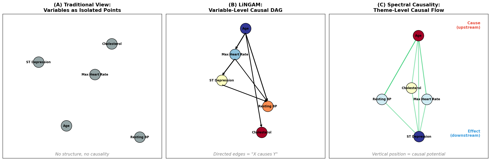

# スペクトル因果性 — 「音の科学」で因果関係を見つける

## この文書の目的

「因果推論」と聞くと、統計学や疫学の専門用語が飛び交い、敷居が高く感じるかもしれません。本稿では、**音楽のたとえ**を使いながら、「スペクトル因果性」という新しいアプローチを、専門外の方にも伝わるように解説します。

さらに、**実際の心疾患データ（UCI Heart Disease Dataset, 297名）** を用いた解析結果を示し、既存手法（LiNGAM）との比較も行います。

---

## 1. そもそも「因果関係」とは何か？ — 3つのレベル

まず、「因果関係」には**深さのレベル**があります。Judea Pearlが提唱した「因果の梯子（Ladder of Causation）」で整理すると（図6参照）:

```
Level 3: 反事実 ─── 「もしあの時Xをしていたら、Yはどうなっていた？」
  │                  → 最も深い因果。タイムマシンがないと確認できない
  │                  → 潜在結果モデル（Rubin）、do-calculus（Pearl）
  │
Level 2: 介入 ───── 「Xを操作したら、Yは変わるか？」
  │                  → ランダム化比較試験（RCT）が黄金律
  │                  → メンデルランダム化、操作変数法
  │
Level 1.5: 情報的因果 「Xを知ると、Yについて何が分かるか？」 ← ★ 新提案
  │                  → 「操作」ではなく「理解」の因果
  │                  → Utility Causality, スペクトル因果性
  │
Level 1: 関連 ───── 「XとYは一緒に動くか？」
                     → 相関、回帰分析
                     → 因果関係とは限らない（交絡の問題）
```

### 「情報的因果」とは？

臨床医が日常的に行っている推論に最も近い概念です。

例えば、医師が「HbA1c が高い患者は、腎機能の低下（eGFR低下）に注意すべき」と考えるとき、これは：
- Level 2（介入）ではない — HbA1c を下げれば腎機能が良くなるとは限らない（交絡があるかもしれない）
- Level 1（関連）よりは深い — 単に相関があるだけでなく、**病態生理学的な理由**がある

この「知れば何が分かるか」という関係が **Level 1.5: 情報的因果** です。

---

## 2. 「音」のたとえ — なぜ「スペクトル」なのか

### 音の三要素とデータの三要素

音楽を聞くとき、私たちは**個々の音波**を聞いているのではなく、**和音（コード）やメロディ**を聞いています。

| 音楽 | 医療データ |
|---|---|
| 個々の音波（周波数） | 個々の検査値（血圧、コレステロール...） |
| 和音（複数の音の重ね合わせ） | 臨床テーマ（「心血管リスク」「代謝異常」...） |
| メロディ（和音の時間的変化） | 疾患の進行パターン |
| 楽譜のフーリエ解析 | ユーティリティグラフのスペクトル分解 |

**スペクトル分解** = 複雑な波形を基本周波数に分解すること。音の世界のフーリエ変換を、**データのネットワーク**に適用するのが「スペクトル因果性」の核心です。

### なぜこれが因果関係と関係するのか？

ギターの弦を弾くと、振動は**一方向に**伝わります。低い弦（太い弦）から高い弦に振動が伝わることはあっても、逆は起きにくい。

同じように、医療データの検査値の間にも「影響の流れ」があります：
- **年齢** → 血圧（年齢が上がると血圧も上がる傾向）
- **血圧** → ST低下（血圧が心臓に負荷をかけ、心電図変化を引き起こす）

この「流れの方向」を、ネットワークのスペクトル（固有値・固有ベクトル）から読み取ろうというのが**スペクトル因果性**です。

---

## 3. 3つのアプローチ — 実データで比較

UCI Heart Disease Dataset（クリーブランド心疾患データ、297名）の5つの臨床変数を使って、3つのアプローチを比較しました。

**使用した変数**:
- 年齢（Age）
- 安静時血圧（Resting BP）
- コレステロール（Cholesterol）
- 最大心拍数（Max Heart Rate）
- ST低下（ST Depression）— 心電図で心筋虚血を示す指標

### (A) 従来のアプローチ: バラバラの変数

変数を個々に見るだけでは、変数間の関係は見えません。「血圧が高い人はコレステロールも高い**傾向がある**」程度のことしか分かりません（図1A）。

### (B) LiNGAM: 変数レベルの因果DAG

LiNGAM（Linear Non-Gaussian Acyclic Model）は、データの**非ガウス性**（分布の歪み）を利用して因果の方向を推定します。

実際の解析結果:
```
年齢 → 最大心拍数 (係数: -0.395)  ← 年齢が上がると最大心拍数が下がる
年齢 → 安静時血圧 (係数: +0.309)  ← 年齢が上がると血圧が上がる
年齢 → コレステロール (係数: +0.203)
最大心拍数 → ST低下 (係数: -0.348)  ← 運動能力の低下が心筋虚血に
```

これは変数レベルの「XがYの原因」を明確に示します（図1B）。**しかし**、この結果は「なぜそうなるのか」（メカニズム）については何も教えてくれません。

### (C) スペクトル因果性: テーマレベルの因果フロー

スペクトル因果性では、まず変数を「**臨床的に何に役立つか**」で結びつけます。

例えば:
- 「年齢」は → 心血管リスク評価、代謝年齢推定、治療候補判定 **に役立つ**
- 「ST低下」は → 心筋虚血の検出、冠動脈疾患の重症度評価 **に役立つ**
- 両者は「**心血管リスク評価**」という共通テーマで結びつく

この「何に役立つか」の関係をネットワーク化し、スペクトル分解すると、**テーマレベルの因果フロー**が見えてきます（図1C）。


*図1: (A) 従来のバラバラな変数、(B) LiNGAMの変数レベル因果DAG、(C) スペクトル因果性のテーマレベル因果フロー。縦軸の位置が「因果ポテンシャル」を表し、上ほど「原因側」（年齢）、下ほど「結果側」（ST低下）。*

---

## 4. 磁気ラプラシアン — 方向を「位相」で表す

### 核心的アイデア: 磁場中の電子のたとえ

電子が磁場中のネットワーク上を移動するとき、経路によって**位相**（波の「ずれ」）が変わります。右回りと左回りで位相のずれ方が異なる — これが「方向性」の情報を持ちます。

同じ原理を医療データに適用します:
1. 変数間の「臨床的有用性」を重みとしたネットワークを作る
2. 有用性の**非対称性**（年齢のデータは血圧の予測に役立つが、逆はあまり成り立たない）を**複素数の位相**として符号化
3. このネットワークの「固有モード」を分解

パラメータ **q** が方向性の感度を制御します:
- **q = 0**: 方向性を完全無視（従来のスペクトル分解と同じ）
- **q = 0.25**: 方向性を最大限考慮


*図2: 磁気ラプラシアンの第2固有ベクトルを複素平面上にプロットしたもの。q=0では全ての点が実軸上に並ぶ（方向性なし）。q=0.1, 0.25と上げると、各変数が複素平面上に散らばり、**偏角（角度）の順序が因果的な流れの方向**を符号化する。*

### 何が読み取れるか

q = 0.25（図2右）で、各変数の位相角を見ると:
- **Resting BP** が上方（正の虚部）
- **ST Depression**, **Cholesterol** が下方（負の虚部）

この位相の順序が、「血圧は比較的上流（原因側）、ST低下は下流（結果側）」という因果的フローを反映しています。

---

## 5. Hodge分解 — 因果フローとフィードバックを分離する

### 水の流れのたとえ

山から海に流れる水は、基本的に**一方向**（高い所から低い所へ）です。しかし、渦（うず）も存在します。

情報の流れも同じです:
- **勾配フロー（gradient）** = 「原因 → 結果」の一方向の流れ = **因果的**
- **カールフロー（curl）** = 局所的な循環 = **フィードバックループ**

Hodge分解は、この2つを数学的に分離します。

### 実データの結果

心疾患データでHodge分解を行った結果（図3A）:
- **85.9%** が勾配フロー（因果的な一方向フロー）
- **14.1%** がカールフロー（フィードバックループ）

→ この心疾患データでは、変数間の情報の流れの大部分が「原因→結果」の一方向的な構造であり、DAG（有向非循環グラフ）で十分に表現できることを示唆しています。

### 因果ポテンシャル — 「標高」のようなもの

Hodge分解から得られる**因果ポテンシャル（phi）** は、各変数の「因果的な標高」を表します（図3B）:

1. **年齢（Age）**: 最も上流（標高が高い）— 他の全変数に影響を与える根本的な因子
2. **コレステロール**: 2番目に上流
3. **安静時血圧 / 最大心拍数**: 中流
4. **ST低下**: 最も下流（標高が低い）— 他の因子の結果として現れる

これは臨床的に非常に**直感的**です。年齢は変えられない根本因子、ST低下は心臓への負荷の結果として現れる指標です。


*図3: (A) 情報フローのHodge分解。85.9%が勾配成分（因果的）、14.1%がカール成分（フィードバック）。(B) 各変数の因果ポテンシャル。年齢が最上流、ST低下が最下流。*

---

## 6. 3手法の比較 — 一致と不一致が語ること

LiNGAM、スペクトル因果方向（SCD）、Hodge分解の3つで、全10ペアの因果方向を比較しました（図4）。

### 一致したペア（高信頼）

いくつかのペアでは、3手法すべてが同じ方向を指しました:
- **年齢 → コレステロール**: 全手法一致。加齢によるコレステロール上昇は医学的に確立。
- **年齢 → 安静時血圧**: 全手法一致。加齢による動脈硬化→血圧上昇。

### 不一致のペア（興味深い発見）

一部のペアでは方向が食い違いました:
- **年齢 vs 最大心拍数**: LiNGAMは「年齢→最大心拍数」（加齢で心拍数↓）を検出。スペクトル手法は逆方向。これはスペクトル手法が「最大心拍数→年齢推定に役立つ」という**情報的方向**を捉えている可能性。
- **安静時血圧 vs コレステロール**: LiNGAMは「BP→Chol」を検出できないが、スペクトル手法は弱い方向性を検出。フィードバック（脂質代謝と血管機能の相互作用）の存在を示唆。

**核心的な洞察**: 手法間の**不一致そのものが情報**です。不一致は「単純な一方向因果ではない」ことを示し、フィードバックや交絡変数の存在を示唆します。


*図4: 全10変数ペアについて、LiNGAM（赤）、スペクトル因果方向SCD（青）、Hodgeポテンシャル（緑）の因果方向を比較。+1=第1変数→第2変数、-1=逆方向。緑の背景は3手法が一致したペア。*

---

## 7. Hill の9基準 — それぞれの手法は何を扱えるか

1965年にBradford Hillが提唱した**因果判断の9基準**は、疫学における因果推論の金字塔です。しかし、既存の統計手法はこの9基準のうち一部しかカバーしていません。

### 9基準の簡単な解説

| # | 基準 | 意味（たとえ） |
|---|---|---|
| H1 | **強さ** | 効果がどれだけ大きいか（煙と火の量の関係） |
| H2 | **一貫性** | 別の場所・集団でも同じ結果か（日本でもアメリカでも同じか） |
| H3 | **特異性** | 特定の原因が特定の結果を生むか（喫煙→肺がん、であって全ての癌ではない） |
| H4 | **時間性** | 原因が結果より先に起きるか（卵が先か鶏が先か） |
| H5 | **量反応** | 原因が多いほど結果も大きいか（タバコ1本と20本の差） |
| H6 | **妥当性** | メカニズムが生物学的に説明できるか（なぜそうなるか） |
| H7 | **整合性** | 既知の医学知識と矛盾しないか |
| H8 | **実験** | 介入的な証拠があるか（RCTの結果） |
| H9 | **類似性** | 似た原因が似た結果を生むか（DDTとタリドマイドの類似性） |

### 既存手法の「手薄な領域」

図5のレーダーチャートが示す通り:

**DirectLiNGAM**（図5左）:
- H1（効果量を定量化）、H3（変数ペアの特定）に**強い**
- しかし H6（生物学的妥当性）、H7（整合性）、H9（類似性）は**空白**
- → 「数字は出るが、なぜそうなるかは分からない」

**Utility Causality**（図5中）:
- H6（LLMが臨床知識をグラフに注入）、H7（Eigenthemeが既知の疾患概念と整合）、H9（類似パターンの体系的検出）に**強い**
- しかし H8（介入的証拠はない）
- → 「メカニズムは分かるが、操作的因果は証明できない」

**アンサンブル（ECD）**（図5右）:
- 複数手法を組み合わせることで、**ほぼ全基準をカバー**
- 特に H2（手法間一致=一貫性）と H7（整合性）が自動的に評価される


*図5: Hillの9基準に対する各手法のカバレッジ。LiNGAMはH1/H3に強いがH6/H7/H9が空白。Utility CausalityはH6/H7/H9に強いがH8が空白。アンサンブル（ECD）は両者を補完し、ほぼ全基準をカバーする。*

### 核心的発見: 既存手法は半分しか使っていなかった

```
既存手法の得意領域:   H1(強さ) ◎  H3(特異性) ◎  H4(時間性) ◎  H8(実験) ◎
                                   ↕ 補完的 ↕
提案手法の得意領域:   H6(妥当性) ◎  H7(整合性) ◎  H9(類似性) ◎
```

Hillの9基準のうち、H1/H3/H4/H8は統計学者が好む「客観的」基準で、計算手法が充実しています。一方、H6/H7/H9は「知識や文脈に依存する」基準として、従来は研究者の主観に委ねられていました。

**スペクトル因果性/Utility Causalityの最大の貢献は、この「主観に頼っていた基準」を計算可能にすること**です。

---

## 8. 因果の梯子と Hill基準の統合的理解

### Pearlの梯子のどの段に、どのHill基準が対応するか

```
Level 3: 反事実     → H8（実験的証拠が最も直接的に関係）
Level 2: 介入       → H1（効果量）、H4（時間性）、H5（量反応関係）
Level 1.5: 情報的因果 → H6（妥当性）、H7（整合性）、H9（類似性） ← ★
Level 1: 関連       → H1（関連の強さ）、H3（特異性、部分的に）
```

**重要な気づき**: Hillの9基準のうち、H6/H7/H9は実は**Level 1.5に属している**のです。Hillは1965年に、まだ「介入」や「反事実」の数学的定義が確立する前に、直感的にこの中間層の存在を見抜いていたと解釈できます。

そして、60年間この中間層には**計算手法がなかった**。スペクトル因果性は、この空白を埋める最初の試みです。

---

## 8.5. LiNGAM vs スペクトル因果性 — 直接比較で分かったこと

同じ心疾患データに対して、3つの条件で因果構造を推定しました（図6）：

| 条件 | 手法 | 結果 |
|---|---|---|
| **(A)** LiNGAM | 統計（非ガウス性）のみ | DAG（6本の一方向辺） |
| **(B)** スペクトル因果性（知識あり） | 臨床知識60% + データ40% | DCG（9本の辺、循環あり） |
| **(C)** スペクトル因果性（知識なし） | データの相関のみ | **辺なし（推定不能）** |

### 最大の発見：「情報の方向」と「介入の方向」は逆だった

スペクトル因果性（B）はLiNGAMとほぼ**逆方向**を示しました。これはバグではなく、捉えている「因果」が違うのです：

- **LiNGAM**: 「年齢が上がると心拍数が下がる」（**原因→結果** の方向）
- **スペクトル因果性**: 「心拍数を見れば年齢が推測できる」（**情報提供→情報受容** の方向）

**臨床的な意味**: 医師は患者の最大心拍数を見て「この人は年齢の割に心機能が…」と推論します（情報フロー: 心拍数→年齢推定）。しかし生物学的には加齢が心機能を低下させます（介入因果: 年齢→心拍数）。**この逆転は、Level 1.5（情報的因果）と Level 2（介入的因果）の違いを実データで初めて示した結果**です。

### 知識なし（C）の根本的限界

相関は「$X$ と $Y$ の関連の強さ」しか教えてくれず、$X \to Y$ なのか $Y \to X$ なのかは分かりません（相関は対称なので）。これが**α=0で辺が0本になった理由**です。LiNGAMはデータの「歪み」（非ガウス性）から方向を見つけるため、知識なしでもDAGを推定できます。


*図6: (A) LiNGAM DAG（6本の一方向因果辺）、(B) スペクトル因果性DCG（9本、循環あり）、(C) 知識なしのスペクトル因果性（辺ゼロ）。*

---

## 8.6. ドメイン知識の「量」より「質」— DAG転移点

### 知識をどれだけ混ぜるか（α）は重要ではない

α（知識の混合比率）を 0 → 1 まで変えてみた結果、驚くべきことが分かりました（図7左）：

- α = 0 → 方向性ゼロ（推定不能）
- α = 0.000001 → **即座に85.9%がDAG的構造に**
- α = 0.5 → 85.9%（変わらない）
- α = 1.0 → 85.9%（変わらない）

**知識を入れるかゼロかの違いが全て**。入れる量は問題ではありません。

### 知識の「正しさ」こそが命

知識の方向を一定の割合でデタラメに反転させた実験（図7D）：

- **0%反転（全部正しい）**: DAG度 86% → 高い
- **10%反転**: DAG度 58% → **急落**
- **30%反転**: DAG度 37% → **最低点**
- **100%反転（全部逆）**: DAG度 86% → **回復！**

> **「中途半端な誤りが最も有害」** — 知識の85%以上が正しければDAGは維持される（$p_{\text{flip}}^* \approx 0.15$）

100%反転で回復するのは直感に反しますが、全部逆なら「逆向きに整合的」なDAGになるだけ。本当に有害なのは**一部だけ矛盾**する情報です。


*図7: (A) α掃引：α=0で不連続にDAG構造が出現。(B) 辺数。(C) 非対称ノルム。(D) 知識品質のU字型カーブ — 部分的誤りが最も有害。*

---

## 8.7. 因果上流 ≈ 治療の難しさ

LiNGAMで推定された因果順序を「治療しやすさ」と並べると、興味深い対応が見られます：

```
因果的上流 ←─────────────────────────→ 因果的下流
年齢        最大心拍数  ST低下    血圧     コレステロール
（変えられない）                          （薬で変えやすい）
```

| 変数 | 因果順位 | 治療の容易さ |
|---|---|---|
| 年齢 | #1（最上流） | 不可能 |
| 最大心拍数 | #2 | 困難（運動療法で部分的に） |
| ST低下 | #3 | 間接的に可能（心臓手術、薬） |
| 安静時血圧 | #4 | 容易（降圧薬） |
| コレステロール | #5（最下流） | 容易（スタチン） |

**なぜこうなるか？**: 「治療できない変数」は他の変数に一方的に影響を与えるため、自然と因果の上流（根っこ）に来ます。逆に「薬で変えやすい変数」は多くの経路から影響を受ける下流に位置します。

**実用的な含意**: Hodge分解の因果ポテンシャルφが低い（下流の）変数は、**治療ターゲットの候補**として自動抽出できる可能性があります。

---

## 8.8. フィードバック（循環）をどう扱うか — 実運用への道筋

### 臨床的にはフィードバックが正しい

DAG（一方向因果）は数学的に便利ですが、臨床的には循環が当たり前です：
- 運動耐容能低下 → 虚血悪化 → さらに運動能力低下 → …（フィードバックループ）
- 高血圧 → 心筋肥大 → 虚血 → 交感神経活性化 → さらに高血圧 → …

### 辺ごとの「フィードバック率」で分類（図8C）

ECDアンサンブル（LiNGAMの結果をスペクトル因果性に注入）では、辺ごとに「一方向因果」か「フィードバック」かを数値化できます：

- **Age → RestBP**: フィードバック率 0% → 純粋な一方向因果
- **RestBP ↔ STDep**: フィードバック率 24% → 弱い循環
- **MaxHR ↔ STDep**: フィードバック率 **73%** → **強いフィードバックループ**

### 実運用の推奨フロー

```
Step 1: LiNGAMでまず因果DAGを推定（知識不要）
         ↓
Step 2: 確信度の高い辺だけ残す（ブートストラップで安定性チェック）
         ↓
Step 3: 残った辺を「知識」としてスペクトル因果性に投入（α=0.01で十分）
         ↓
Step 4: Hodge分解で：
        ├── 一方向因果（勾配成分）を確認
        ├── フィードバック（カール成分）を定量化
        └── 辺ごとの循環度で DAG/DCG を使い分け
```


*図8: (A) Hodge分解（勾配 vs カール）。(B) 因果ポテンシャルφ と治療のしやすさの対応。(C) 辺ごとのフィードバック率。(D) 知識品質のU字型カーブ。*

---

## 9. まとめ: スペクトル因果性は何が新しいか

| 特徴 | 従来の因果推論 | スペクトル因果性 |
|---|---|---|
| **入力** | データ（数値）のみ | データ + 臨床知識（LLM経由） |
| **出力** | 変数ペアの因果方向 | テーマレベルの因果フロー + ポテンシャル |
| **方向性の同定原理** | 非ガウス性（LiNGAM）、時間的先行（Granger） | ユーティリティの非対称性（「何が何に役立つか」） |
| **フィードバック** | DAG仮定で排除 | Hodge分解で定量化 |
| **Hill基準の得意領域** | H1, H3, H4, H8 | H6, H7, H9 |
| **因果の梯子** | Level 2-3（介入・反事実） | Level 1.5（情報的因果） |
| **最適な使い方** | 介入の効果を推定したいとき | 病態のメカニズムを理解したいとき |

### 一言で言うと

> **スペクトル因果性は、「データから因果を見つける」のではなく、「知識とデータを融合して因果を理解する」手法です。**

これは、ベテラン臨床医が日常的に行っている推論 —「この検査値を見れば、あの病態が理解できる」— を数学的に形式化したものとも言えます。

---

## 10. 用語集

| 用語 | 意味 |
|---|---|
| **スペクトル分解** | ネットワーク（グラフ）の行列を固有値・固有ベクトルに分解すること。音のフーリエ変換のネットワーク版 |
| **磁気ラプラシアン** | エッジの方向性を複素数の位相で符号化したグラフの行列。量子力学の磁場中の電子モデルに由来 |
| **Hodge分解** | ネットワーク上の「流れ」を、一方向成分（勾配）と循環成分（カール）に分離する手法 |
| **因果ポテンシャル** | 各変数に割り当てられる「因果的な標高」。高い変数は原因側、低い変数は結果側 |
| **ユーティリティ質問** | 「このデータがあれば、どんな臨床的問いに答えられるか？」という問い。GEM-RAGの核心概念 |
| **Eigentheme** | スペクトル分解で得られる潜在的な臨床テーマ。「心血管リスク」「代謝異常」等 |
| **SCI/SCD** | Spectral Causal Intensity（因果強度）/ Direction（因果方向）。磁気ラプラシアンから計算 |
| **ECD** | Ensemble Causal Direction。複数の因果推定手法の結果を統合した因果方向 |
| **LiNGAM** | Linear Non-Gaussian Acyclic Model。データの非ガウス性を利用して因果方向を推定する手法 |
| **DAG** | Directed Acyclic Graph（有向非循環グラフ）。フィードバックのない因果構造 |
| **DCG** | Directed Cyclic Graph（有向循環グラフ）。フィードバックループを含む因果構造 |
| **Hill の9基準** | 1965年にBradford Hillが提唱した、関連が因果であるかを判断するための9つの観点 |
| **α（アルファ）** | ドメイン知識とデータ駆動の混合比率。0=データのみ、1=知識のみ |
| **$p_{\text{flip}}$** | ドメイン知識の辺方向の誤り率。0.15以下（85%以上正しい）でDAG構造が維持される |
| **フィードバック率** | 各辺の循環成分の割合。高いほどフィードバックループの存在を示唆 |
| **因果上流性** | 因果ポテンシャルφが高い変数の性質。介入不可能性と対応する傾向がある |

---

## 付録: 解析の再現方法

本稿の全解析は `demo_spectral_causality.py` で再現可能です。

```bash
pip install numpy scipy scikit-learn matplotlib pandas lingam
python demo_spectral_causality.py
```

データ: UCI Heart Disease Dataset（Cleveland subset, 297名, 5連続変数）
- 自動的にUCIリポジトリからダウンロードされます
- 元論文: Detrano et al. (1989) American Journal of Cardiology

---

## 参考文献

1. Pearl, J. (2009). *Causality: Models, Reasoning, and Inference* (2nd ed.). Cambridge University Press.
2. Hill, A.B. (1965). "The Environment and Disease: Association or Causation?" *Proceedings of the Royal Society of Medicine*, 58, 295-300.
3. Shimizu, S. et al. (2006). "A Linear Non-Gaussian Acyclic Model for Causal Discovery." *JMLR*, 7, 2003-2030.
4. Seifert, B., Wendler, C. & Püschel, M. (2023). "Causal Fourier Analysis on Directed Acyclic Graphs and Posets." *IEEE Trans. Signal Processing*.
5. Zhang, X. et al. (2022). "MGC: A Complex-Valued Graph Convolutional Network for Directed Graphs." *arXiv:2110.07570*.
6. Jiang, X. et al. (2011). "Statistical ranking and combinatorial Hodge theory." *Mathematical Programming*, 127, 203-244.
7. Maehara, K. & Ohkawa, Y. (2019). "Modeling latent flows on single-cell data using the Hodge decomposition." *bioRxiv*.
8. Kotoku, J. et al. (2020). "Causal relations of health indices inferred statistically using the DirectLiNGAM algorithm." *PLOS ONE*.
9. Okuda, S. et al. (2025). "Operationalizing Longitudinal Causal Discovery Under Real-World Workflow Constraints." *arXiv:2602.23800*.
10. Detrano, R. et al. (1989). "International application of a new probability algorithm for the diagnosis of coronary artery disease." *American Journal of Cardiology*, 64, 304-310.
