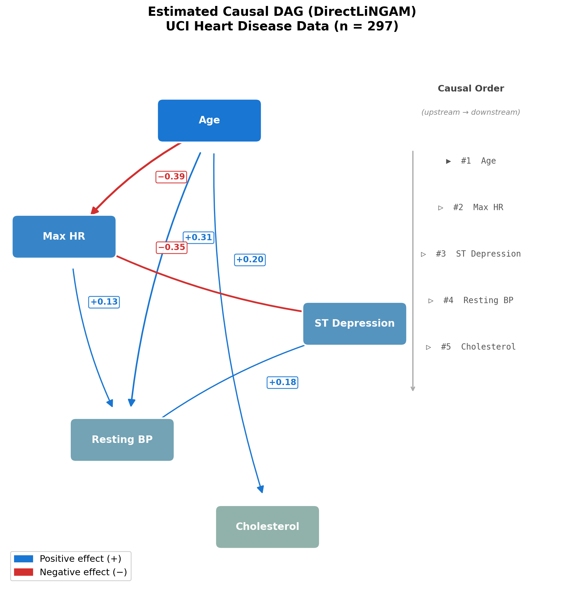
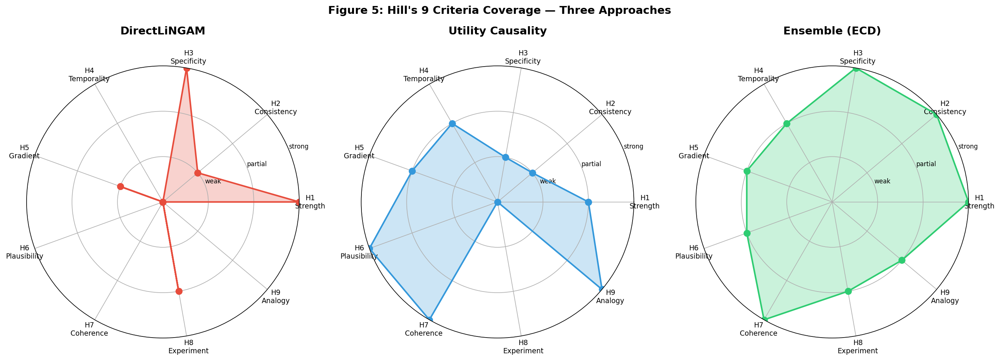
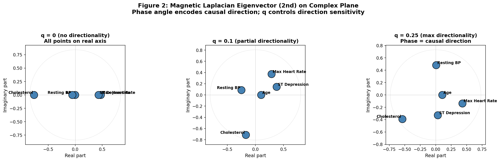
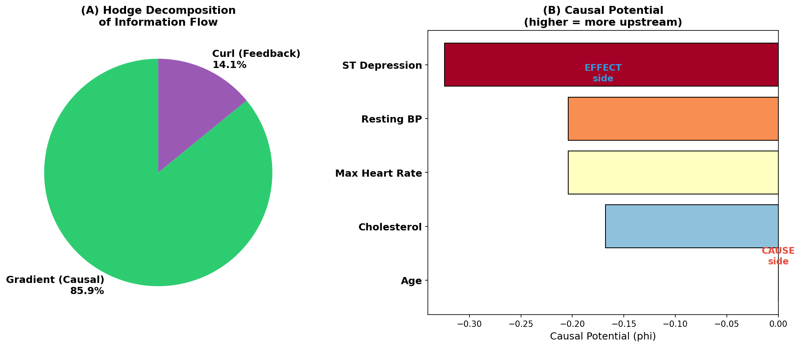
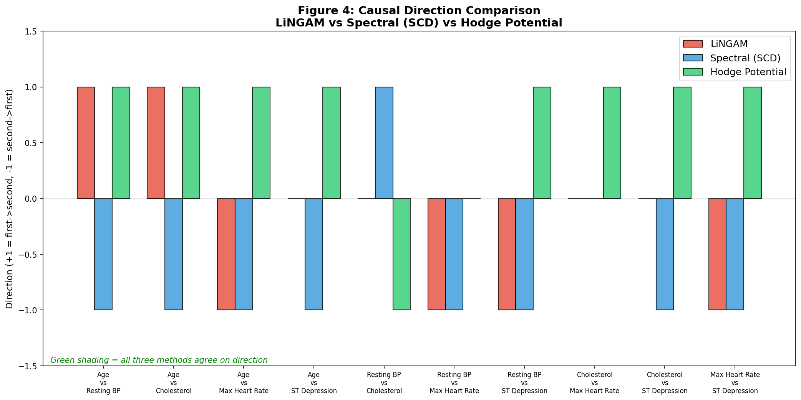
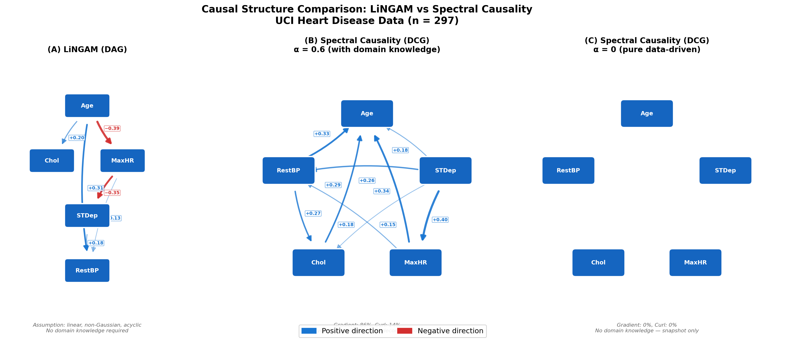
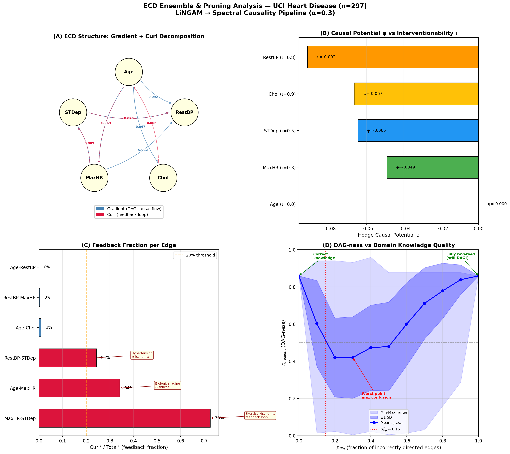
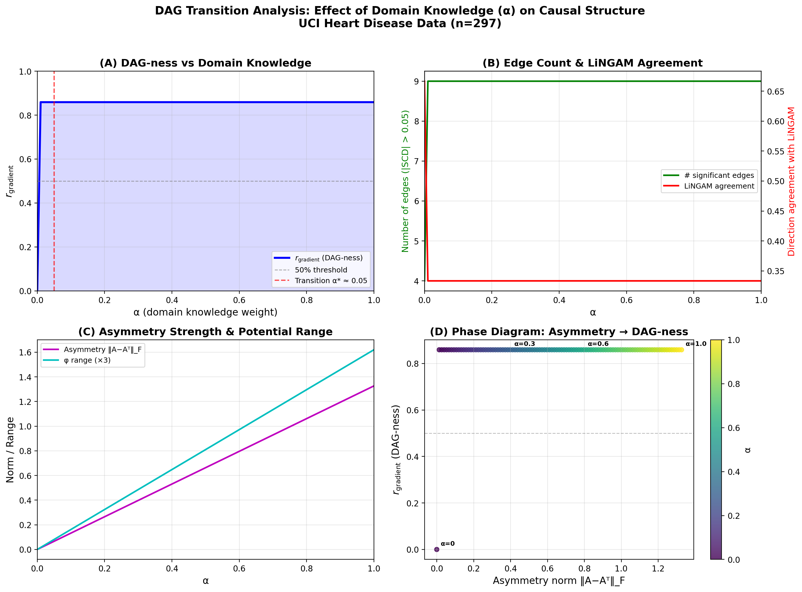

# スペクトル因果性の数理的基礎

**— 有向グラフのスペクトル理論に基づく因果推論の新しいアプローチ —**

> **想定読者**: 線形代数（固有値分解）と基礎的な確率論を既習の学部上級生〜大学院生。因果推論やグラフ理論の事前知識は不要。

---

## 目次

1. [導入：因果推論とスペクトル理論の交差点](#1-導入)
2. [準備：グラフラプラシアンの基礎](#2-準備)
3. [磁気ラプラシアン：方向性の複素位相符号化](#3-磁気ラプラシアン)
4. [スペクトル因果性の定式化](#4-スペクトル因果性の定式化)
5. [Hodge分解：因果フローの直交分解](#5-hodge分解)
6. [既存手法との関係](#6-既存手法との関係)
7. [関連研究・先行文献・周辺調査](#7-関連研究先行文献周辺調査)
8. [実データによる例示](#8-実データによる例示)
9. [LiNGAM vs スペクトル因果性：構造比較](#9-構造比較)
10. [ECDアンサンブルと因果上流性](#10-ecdアンサンブルと因果上流性)
11. [DAG転移点の解析](#11-dag転移点の解析)
12. [循環構造のプルーニングと実運用](#12-循環構造のプルーニングと実運用)
13. [理論的課題と展望](#13-理論的課題と展望)

---

## 1. 導入

### 1.1 問題設定

因果推論（causal inference）の中心的な問い — 「$X$ は $Y$ の原因か？」— に対して、様々なアプローチが提案されてきた。代表的なものとして：

- **構造方程式モデル（SEM）と do-calculus** [1]: 介入に基づく反事実的定義
- **潜在結果モデル** [2]: 処置群と対照群の潜在結果の差
- **LiNGAM** [3]: データの非ガウス性を利用した因果方向の同定
- **Granger因果** [4]: 時系列における予測改善に基づく因果性

本稿では、これらとは異なる原理 — **グラフのスペクトル構造（固有値・固有ベクトル）から因果的方向性を読み取る** — に基づく手法を定式化する。この手法を**スペクトル因果性（spectral causality）**と呼ぶ。

### 1.2 基本的着想

ある $n$ 個の変数 $\{X_1, \dots, X_n\}$ の間に因果関係があるとする。これらの関係を**有向グラフ** $G = (V, E)$ で表現したとき、グラフの**ラプラシアン行列**のスペクトル（固有値と固有ベクトル）には、因果的方向性に関する情報が含まれうる。

**注意 1.1**（グラフの種類と因果モデル）因果推論で用いるグラフは必ずしも**DAG（有向非巡回グラフ）**に限定されない。LiNGAMはDAG仮定を置くが、現実の生体システムにはフィードバックループ（例：炎症 → 臓器障害 → 炎症）が普遍的に存在する。本稿のスペクトル因果性は**有向巡回グラフ（DCG; directed cyclic graph）**も許容する — Hodge分解（§5）がカール成分として循環フローを定量化するためである。図1に、LiNGAMがDAG仮定の下で推定した因果構造の例を示す。



*図1: DirectLiNGAM [5] により推定された因果DAG。UCI心疾患データ（Cleveland subset, n=297）の5つの臨床変数に対して適用。上流（原因側）から下流（結果側）へ因果的フローが流れる。青線は正の因果効果、赤線は負の因果効果を示す。LiNGAMはDAG仮定を置くため循環は許容されないが、スペクトル因果性ではHodge分解によりフィードバック（循環成分）も定量化可能である。*

特に、**磁気ラプラシアン（magnetic Laplacian）**と呼ばれるエルミート行列を用いると、エッジの方向性が固有ベクトルの**複素位相（complex phase）**として符号化され、因果方向の推定が可能になる。

### 1.3 本稿の構成

§2でグラフラプラシアンの基礎を復習し、§3で磁気ラプラシアンを導入する。§4でスペクトル因果性を厳密に定式化し、§5でHodge分解との関係を示す。§6で既存手法との比較、§7で関連研究・先行文献・周辺調査を概観する。§8で実データ（UCI心疾患データ）への適用例を示し、§9–§12でLiNGAMとの構造比較、ECDアンサンブル、DAG転移点、循環プルーニングを詳述する。§13で理論的課題と展望を議論する。

---

## 2. 準備：グラフラプラシアンの基礎

### 2.1 無向グラフのラプラシアン

**定義 2.1**（グラフラプラシアン）
重み付き無向グラフ $G = (V, E, w)$（$|V| = n$, $w: E \to \mathbb{R}_{>0}$）に対して、**重み付き隣接行列** $W \in \mathbb{R}^{n \times n}$, **次数行列** $D = \operatorname{diag}(d_1, \dots, d_n)$（$d_i = \sum_j W_{ij}$）を用いて、以下を定義する：

$$L = D - W \quad \text{（非正規化ラプラシアン）}$$

$$\mathcal{L} = I - D^{-1/2} W D^{-1/2} \quad \text{（正規化ラプラシアン）}$$

**命題 2.1**（基本性質）
$L$ および $\mathcal{L}$ について以下が成り立つ：

(i) $L$ は対称半正定値行列であり、固有値は $0 = \lambda_1 \leq \lambda_2 \leq \dots \leq \lambda_n$ を満たす。

(ii) $\lambda_1 = 0$ に対応する固有ベクトルは $\mathbf{1} = (1, \dots, 1)^\top$（定数ベクトル）。

(iii) $\lambda_2 > 0$ であることは、$G$ が連結であることと同値（**Fiedler値**）。

(iv) 任意のベクトル $f \in \mathbb{R}^n$ に対して、$f^\top L f = \sum_{(i,j) \in E} w_{ij}(f_i - f_j)^2 \geq 0$。

**証明のスケッチ**：(iv) は $L$ の二次形式を展開すれば直接示せる。(i) は (iv) から従う。(ii) は $L\mathbf{1} = \mathbf{0}$ の直接計算による。(iii) は代数的連結度の定理。 $\square$

性質 (iv) は重要である：$f^\top L f$ が小さいほど、$f$ は隣接ノードで類似した値をとる — つまり、ラプラシアンの低固有値固有ベクトルは**グラフ上で滑らかな信号**を表す。

### 2.2 スペクトル分解の幾何学的意味

$\mathcal{L}$ のスペクトル分解 $\mathcal{L} = U \Lambda U^\top$（$U = [u_1, \dots, u_n]$, $\Lambda = \operatorname{diag}(\lambda_1, \dots, \lambda_n)$）において：

- **$u_k$ の各成分 $u_k(i)$** = ノード $i$ が第 $k$ 固有モードにどれだけ「荷重（load）」するかを表す
- **$\lambda_k$** = 第 $k$ モードの「周波数」（大きいほど高周波 = 局所変動）
- **$u_2$**（第2固有ベクトル, Fiedler vector）は**グラフの最適2分割**を与える

この枠組みは、信号処理における**フーリエ変換のグラフ上への一般化**（Graph Signal Processing; GSP）の基礎となっている [6]。

### 2.3 問題：無向ラプラシアンは方向性を失う

$L = D - W$ は**対称行列**であるため、エッジの方向性 $i \to j$ と $j \to i$ を区別できない。因果推論では「$X$ が $Y$ の原因」という方向性が本質的であり、無向ラプラシアンでは情報が不足する。

有向グラフのラプラシアン $L_d = D_{\text{out}} - W$（$D_{\text{out}}$ は出次数行列）を直接用いる手もあるが、$L_d$ は一般に**非対称**であり、固有値が**複素数**になりうる。これは理論的に扱いにくい。

---

## 3. 磁気ラプラシアン：方向性の複素位相符号化

### 3.1 物理的背景

磁気ラプラシアンの名前は量子力学に由来する。磁場 $\mathbf{B}$ 中の荷電粒子のハミルトニアンは $H = (\mathbf{p} - e\mathbf{A})^2 / 2m$（$\mathbf{A}$ はベクトルポテンシャル）であり、粒子が閉じた経路を一周すると Aharonov-Bohm 位相 $\exp(i \oint \mathbf{A} \cdot d\mathbf{r})$ を獲得する。この位相の**向き依存性**が、グラフ上のエッジ方向性の符号化に利用できる。

### 3.2 定義

**定義 3.1**（磁気ラプラシアン [7, 8]）
重み付き有向グラフ $G = (V, E, w)$ と**電荷パラメータ** $q \in [0, 0.5]$ に対して、**エルミート隣接行列** $H^{(q)} \in \mathbb{C}^{n \times n}$ を以下で定義する：

$$H^{(q)}_{ij} = w_{ij} \cdot \exp\bigl(i \cdot 2\pi q \cdot \sigma_{ij}\bigr)$$

ここで $\sigma_{ij} \in \{-1, 0, +1\}$ はエッジの方向性符号であり：

$$\sigma_{ij} = \begin{cases} +1 & \text{if } i \to j \\\ -1 & \text{if } j \to i \\\ 0 & \text{if エッジなし} \end{cases}$$

重み $w_{ij}$ は対称化して用いる（$w_{ij} = w_{ji} = (w^{\text{orig}}_{ij} + w^{\text{orig}}_{ji})/2$）。

**正規化磁気ラプラシアン**を以下で定義する：

$$\mathcal{L}^{(q)} = I - D^{-1/2} H^{(q)} D^{-1/2}$$

ここで $D = \operatorname{diag}(d_1, \dots, d_n)$, $d_i = \sum_j |H^{(q)}_{ij}|$。

**命題 3.1**（磁気ラプラシアンの基本性質）

(i) $H^{(q)}$ はエルミート行列である：$H^{(q)}_{ji} = \overline{H^{(q)}_{ij}}$。

(ii) $\mathcal{L}^{(q)}$ はエルミート半正定値であり、固有値は**実数**かつ非負。

(iii) 固有ベクトルは一般に**複素数値**をとる。

(iv) $q = 0$ のとき、$\mathcal{L}^{(0)}$ は通常の正規化ラプラシアン $\mathcal{L}$ に退化する（方向情報なし）。

**命題 3.1 (i) の証明**：

$$H^{(q)}_{ji} = w_{ji} \cdot \exp(i \cdot 2\pi q \cdot \sigma_{ji})$$

$w_{ji} = w_{ij}$（対称化済み）かつ $\sigma_{ji} = -\sigma_{ij}$ より：

$$H^{(q)}_{ji} = w_{ij} \cdot \exp(-i \cdot 2\pi q \cdot \sigma_{ij}) = \overline{w_{ij} \cdot \exp(i \cdot 2\pi q \cdot \sigma_{ij})} = \overline{H^{(q)}_{ij}}$$

$\square$

### 3.3 電荷パラメータ $q$ の意味

$q$ は方向性に対する**感度**を制御するパラメータである：

| $q$ | 位相 $2\pi q$ | 効果 |
|---|---|---|
| $0$ | $0$ | 方向性を完全無視。$\exp(i \cdot 0) = 1$ より実行列に退化 |
| $0.25$ | $\pi/2$ | 最大方向性感度。$e^{i\pi/2} = i$, $e^{-i\pi/2} = -i$ |
| $0.5$ | $\pi$ | 方向を反転。$e^{i\pi} = -1$ |

**注意 3.1** $q = 0.25$ のとき、$H^{(q)}_{ij} = i \cdot w_{ij}$（$i \to j$ のエッジ）かつ $H^{(q)}_{ji} = -i \cdot w_{ij}$ となり、方向性が虚数単位 $i$ によって最も鋭く分離される。

### 3.4 固有ベクトルの複素位相と方向性

$\mathcal{L}^{(q)}$ の固有ベクトル $u_k \in \mathbb{C}^n$ の各成分は極形式で表すことができる：

$$u_k(j) = |u_k(j)| \cdot \exp\bigl(i \cdot \theta_k(j)\bigr)$$

ここで $|u_k(j)|$ は**振幅**（ノード $j$ がモード $k$ にどれだけ荷重するか）、$\theta_k(j) = \arg(u_k(j))$ は**位相角**である。

**核心的な主張**：$q > 0$ のとき、位相角 $\theta_k(j)$ の順序が因果的フローの方向を反映する。

直感的には、因果の上流（原因側）のノードと下流（結果側）のノードは、固有ベクトル上で異なる位相角を持つ。これは、磁場中の電子がループを一周する際に方向依存の位相を獲得するのと類似のメカニズムである。

---

## 4. スペクトル因果性の定式化

### 4.1 ユーティリティ有向グラフ

変数間の因果的方向性を符号化するために、**ユーティリティ（臨床的有用性）の非対称性**を用いる。

**定義 4.1**（ユーティリティ有向グラフ）
$n$ 個の変数 $\{X_1, \dots, X_n\}$ に対して、**ユーティリティ関数** $U: \{1, \dots, n\}^2 \to \mathbb{R}_{\geq 0}$ を：

$$U(i, j) = \text{「変数 } X_i \text{ の情報が変数 } X_j \text{ に関する問いにどれだけ有用か」}$$

と定義する。**ユーティリティ有向グラフ** $G_U = (V, E, w, \sigma)$ は：

- $V = \{1, \dots, n\}$
- $w(i, j) = \bigl(U(i, j) + U(j, i)\bigr) / 2$（対称化された重み）
- $\sigma(i, j) = \operatorname{sign}\bigl(U(i, j) - U(j, i)\bigr)$（方向性符号）

で定義される。

**注意 4.1** ユーティリティ関数 $U$ の具体的な構成には、(a) 臨床知識の手動符号化、(b) 大規模言語モデル（LLM）による自動生成、(c) データ駆動の予測性指標、あるいはこれらの組み合わせが考えられる。本稿では $U$ は所与とし、その構成方法の議論は§13に譲る。

### 4.2 スペクトル因果結合度と因果方向

**定義 4.2**（スペクトル因果結合度; Spectral Causal Coupling, SCC）
磁気ラプラシアン $\mathcal{L}^{(q)}$ の固有値分解 $\mathcal{L}^{(q)} = U \Lambda U^*$（$U = [u_1, \dots, u_n]$, $\Lambda = \operatorname{diag}(\lambda_1, \dots, \lambda_n)$）に対して、ノード $i, j$ の**スペクトル因果結合度**を：

$$\mathrm{SCC}(i, j) = \sum_{k=1}^n f(\lambda_k) \cdot |u_k(i)| \cdot |u_k(j)| \cdot \cos\bigl(\theta_k(i) - \theta_k(j)\bigr)$$

と定義する。ここで $f: \mathbb{R}_{\geq 0} \to \mathbb{R}_{\geq 0}$ は固有値重み関数（典型的には $f(\lambda) = \lambda$）、$\theta_k(i) = \arg(u_k(i))$。

**命題 4.1** SCC は**対称**である：$\mathrm{SCC}(i, j) = \mathrm{SCC}(j, i)$。

**証明**：$\cos(\alpha - \beta) = \cos(\beta - \alpha)$ より直ちに従う。 $\square$

SCCは因果的結合の**強さ**を測るが、**方向**は測れない。方向の定量化には以下を用いる。

**定義 4.3**（スペクトル因果方向; Spectral Causal Direction, SCD）

$$\mathrm{SCD}(i, j) = \sum_{k=1}^n f(\lambda_k) \cdot |u_k(i)| \cdot |u_k(j)| \cdot \sin\bigl(\theta_k(i) - \theta_k(j)\bigr)$$

**命題 4.2** SCD は**反対称**である：$\mathrm{SCD}(i, j) = -\mathrm{SCD}(j, i)$。

**証明**：$\sin(\alpha - \beta) = -\sin(\beta - \alpha)$ より直ちに従う。 $\square$

**系 4.1**（自己因果方向はゼロ）$\mathrm{SCD}(i, i) = 0$。

$\mathrm{SCD}(i, j) > 0$ は「$i$ から $j$ への因果的方向」を、$\mathrm{SCD}(i, j) < 0$ は逆方向を示唆する。

### 4.3 SCC と SCD の統一的理解

SCC と SCD は、複素内積の実部と虚部として統一的に理解できる。

**命題 4.3**（複素因果指標）
以下の**複素因果指標（Complex Causal Index, CCI）**を定義すると：

$$\mathrm{CCI}(i, j) = \sum_{k=1}^n f(\lambda_k) \cdot |u_k(i)| \cdot |u_k(j)| \cdot \exp\bigl(i(\theta_k(i) - \theta_k(j))\bigr)$$

SCC と SCD は CCI の実部と虚部に対応する：

$$\mathrm{SCC}(i, j) = \mathrm{Re}\bigl[\mathrm{CCI}(i, j)\bigr], \qquad \mathrm{SCD}(i, j) = \mathrm{Im}\bigl[\mathrm{CCI}(i, j)\bigr]$$

**証明**：$\exp(i\alpha) = \cos\alpha + i\sin\alpha$（Euler公式）を適用すればよい。 $\square$

**幾何学的解釈**：CCI を複素平面上のベクトルとみなすと、**偏角** $\arg(\mathrm{CCI}(i,j))$ が因果の方向を、**絶対値** $|\mathrm{CCI}(i,j)|$ が因果的結合の強さを表す。

### 4.4 SCD行列の性質

$n$ 個のノードに対する SCD 行列 $S \in \mathbb{R}^{n \times n}$（$S_{ij} = \mathrm{SCD}(i,j)$）は以下の性質を持つ：

**命題 4.4**

(i) $S$ は**歪対称（skew-symmetric）**：$S = -S^\top$。

(ii) $\operatorname{tr}(S) = 0$（対角成分はすべて0）。

(iii) $q = 0$ のとき $S = O$（ゼロ行列）。すなわち、方向性情報がなければ因果方向は推定できない。

**証明**：(i) は命題4.2の行列版。(ii) は系4.1から。(iii) は $q = 0$ のとき $\theta_k(i) = 0$ または $\pi$（実固有ベクトル）なので $\sin(\theta_k(i) - \theta_k(j)) = 0$。 $\square$

性質 (iii) は重要である：スペクトル因果性は、方向性情報（$q > 0$）が**なければ機能しない**。これはLiNGAMが非ガウス性なしには機能しないのと対照的である。

### 4.5 因果順序の推定

SCD行列から因果順序（causal ordering）を推定する方法を示す。

**定義 4.4**（スペクトル因果スコア）
各ノード $i$ の**スペクトル因果スコア**を：

$$s(i) = \sum_{j \neq i} \mathrm{SCD}(i, j)$$

と定義する。$s(i)$ が大きいノードほど「原因側（上流）」、小さいノードほど「結果側（下流）」と解釈される。

**注意 4.2** $S$ の歪対称性より $\sum_{i} s(i) = 0$ であり、スコアは零和（zero-sum）である。

---

## 5. Hodge分解：因果フローの直交分解

### 5.1 グラフ上の微分形式

有向グラフ上のエッジフローを微分幾何学の言葉で記述する。

**定義 5.1**（鎖複体）
グラフ $G = (V, E)$ に対して、以下の線形写像を定義する：

- **0-コチェイン** $C^0 = \mathbb{R}^{|V|}$（ノード上の関数）
- **1-コチェイン** $C^1 = \mathbb{R}^{|E|}$（エッジ上の関数 = フロー）
- **コバウンダリ作用素** $\delta_0: C^0 \to C^1$：$(\delta_0 f)(i \to j) = f(j) - f(i)$（勾配）
- **コバウンダリ作用素** $\delta_1: C^1 \to C^2$：三角形上のカール

### 5.2 Hodge分解定理

**定理 5.1**（グラフ上の Hodge 分解; Jiang et al. [9]）
任意の 1-コチェイン（エッジフロー）$\omega \in C^1$ は、以下のように直交分解される：

$$\omega = \underbrace{\delta_0 \phi}_{\text{勾配成分}} + \underbrace{\delta_1^* \psi}_{\text{カール成分}} + \underbrace{h}_{\text{調和成分}}$$

ここで $\delta_1^*$ は $\delta_1$ の随伴（adjoint）であり、3つの成分は互いに直交する。

**各成分の因果的解釈**：

| 成分 | 数学的意味 | 因果的解釈 |
|---|---|---|
| $\delta_0 \phi$（勾配） | ポテンシャル差に駆動されるフロー | **因果的フロー**（DAG的な一方向の流れ） |
| $\delta_1^* \psi$（カール） | 局所的な循環フロー | **フィードバックループ**（局所的な相互作用） |
| $h$（調和） | 大域的な循環フロー | **恒常性維持**（全身性の調節メカニズム） |

### 5.3 因果ポテンシャル

**定義 5.2**（因果ポテンシャル）
勾配成分 $\delta_0 \phi$ における**ポテンシャル関数** $\phi: V \to \mathbb{R}$ を**因果ポテンシャル**と呼ぶ。$\phi$ は以下の最小二乗問題の解として求まる：

$$\phi = \arg\min_{\tilde{\phi}} \sum_{(i,j) \in E} \bigl(\omega(i,j) - (\tilde{\phi}(j) - \tilde{\phi}(i))\bigr)^2$$

これは $\delta_0^* \delta_0 \phi = \delta_0^* \omega$、すなわちグラフラプラシアンに関する**ポアソン方程式**：

$$L \phi = \delta_0^* \omega$$

に帰着する。$L$ が半正定値であるため、$\phi$ は定数の不定性を除いて一意に定まる。

**命題 5.1**（因果ポテンシャルとLiNGAM因果順序の関係）
エッジフロー $\omega$ が完全なDAGの因果効果を表すとき（すなわちカール成分と調和成分がゼロ）、$\phi$ によるノードの順序付けはDAGのトポロジカルソートに一致する。

**注意 5.1** 実際のデータでは $\omega$ は完全なDAGからのフローとは限らず、カール成分（フィードバック）が存在する。Hodge分解の勾配成分のエネルギー比：

$$r_{\text{gradient}} = \frac{\|\delta_0 \phi\|^2}{\|\omega\|^2}$$

は、データがDAG的構造にどの程度適合するかの指標となる。$r_{\text{gradient}} \approx 1$ ならばDAG仮定が妥当、$r_{\text{gradient}} \ll 1$ ならばフィードバックが支配的である。

---

## 6. 既存手法との関係

### 6.1 LiNGAMとの比較

LiNGAM (Linear Non-Gaussian Acyclic Model; Shimizu et al., 2006) は以下の構造方程式モデルを仮定する：

$$\mathbf{x} = B\mathbf{x} + \mathbf{e}, \qquad \mathbf{e} \sim \text{非ガウス独立}$$

ここで $B$ は因果効果行列（$B_{ij} \neq 0$ ⇔ $X_j \to X_i$）。$(I - B)$ が因果順序に対応する置換で下三角行列になることが、同定の鍵である。

| 観点 | LiNGAM | スペクトル因果性 |
|---|---|---|
| **同定の原理** | 非ガウス性（分布の高次モーメント） | ユーティリティ非対称性（情報的有用性の方向差） |
| **仮定** | 線形, 非ガウス, DAG, 共通原因なし | ユーティリティ非対称性が因果方向を反映 |
| **出力** | 因果効果行列 $B$（変数ペアの効果量） | SCD行列 $S$（方向性スコア）+ 因果ポテンシャル $\phi$ |
| **フィードバック** | 不可（DAG仮定） | Hodge分解のカール成分で定量化 |
| **識別可能性** | 理論的保証あり [3] | 理論的保証なし（仮説段階） |

**重要な相違点**：LiNGAMはデータの**統計的性質**（分布の形状）のみから因果方向を推定するのに対し、スペクトル因果性はユーティリティ関数を通じて**ドメイン知識**を注入する。これは利点でもあり、限界でもある — ユーティリティ関数の品質に結果が依存するためである。

### 6.2 Granger因果との比較

Granger因果 [4] は時系列データに対して、「$X$ の過去の値が $Y$ の予測を（$Y$ の過去だけのモデルを超えて）改善するか」で因果方向を定義する。

スペクトル因果性との主な違いは：

- Granger因果は**時間的先行性**に基づくが、スペクトル因果性は**横断データ**にも適用可能
- Granger因果は**変数ペア**の検定だが、スペクトル因果性は**グラフ全体のスペクトル構造**を利用

### 6.3 因果の梯子における位置づけ

Pearl [1] が提唱した「因果の梯子（Ladder of Causation）」に照らすと：

| レベル | 問い | 代表手法 |
|---|---|---|
| **3: 反事実** | 「もし $X = x$ だったら $Y$ はどうなっていたか？」 | 潜在結果モデル, do-calculus |
| **2: 介入** | 「$X$ を操作したら $Y$ は変わるか？」 | RCT, IV, メンデルランダム化 |
| **1.5: 情報的因果** ★ | 「$X$ を知ると $Y$ について何が分かるか？」 | **スペクトル因果性**, Utility Causality |
| **1: 関連** | 「$X$ と $Y$ は共変動するか？」 | 相関, 回帰 |

スペクトル因果性は Level 2（介入的因果）を直接扱うものではない。むしろ、Level 1（相関）よりは深いが Level 2 よりは浅い、**情報的因果性**の定量化として位置づけられる。

### 6.4 Hill の9基準とスペクトル因果性

疫学における因果判断の古典的枠組みである Hill の9基準 [10] に照らすと、スペクトル因果性は従来手法がカバーしていなかった基準に貢献する：

| Hill 基準 | 従来手法のカバー状況 | スペクトル因果性の貢献 |
|---|---|---|
| H1: 強さ（Strength） | ◎ 効果量の推定 | ○ SCD の絶対値 |
| H2: 一貫性（Consistency） | △ 個別研究に依存 | ○ 手法間一致で自動評価 |
| H3: 特異性（Specificity） | ◎ 変数ペアの同定 | △ テーマレベルでの同定 |
| H4: 時間性（Temporality） | ◎ 時系列で直接扱う | ○ 位相角の順序で符号化 |
| H5: 量反応（Dose-response） | ○ 非線形モデルで扱える | △ 重みの連続性で部分的 |
| H6: 妥当性（Plausibility） | **—** 手法なし | **◎** ユーティリティを通じて知識注入 |
| H7: 整合性（Coherence） | **—** 主観的判断に依存 | **◎** Eigentheme が既知概念と整合 |
| H8: 実験（Experiment） | ◎ RCT | — |
| H9: 類似性（Analogy） | **—** 手法なし | **◎** Eigentheme のスペクトル類似性 |

**核心的発見**：既存の計算的因果推論手法は H1, H3, H4, H8 に集中しており、H6（生物学的妥当性）, H7（整合性）, H9（類似性）は「研究者の主観」に委ねられてきた。スペクトル因果性/Utility Causality は、この空白を計算可能にする最初の試みとして位置づけられる（図2）。



*図2: Hill の9基準に対する各手法のカバレッジをレーダーチャートで表示。LiNGAMは H1（強さ）と H3（特異性）に優れるが H6/H7/H9 を欠く。Utility Causality は H6（妥当性）、H7（整合性）、H9（類似性）をカバー。アンサンブル（ECD）は両者を統合し、ほぼ全基準をカバーする。*

---

## 7. 関連研究・先行文献・周辺調査

本稿で提案するスペクトル因果性は、複数の理論的伝統の交差点に位置する。本節では、直接的な先行文献（§7.1）、方法論的に類似のアプローチ（§7.2）、および周辺領域の関連研究（§7.3）を整理し、本研究の位置づけを明確にする（§7.4）。

### 7.1 先行文献：理論的源流

#### 7.1.1 磁気ラプラシアンの有向グラフへの応用

磁気ラプラシアンは元来、量子力学における磁場中の荷電粒子のハミルトニアンに由来するが、ネットワーク科学への応用は Fanuel & Suykens [11] が先駆的である。彼らはラプラシアンの「変形（deformation）」としてパラメータ付きラプラシアン族を構築し、有向ネットワークにおけるスペクトルランキングを実現した。最小固有値に対応する固有ベクトルのエントリがノードのランキングスコアを直接与え、変形パラメータにより top-$k$ 要素の強調が可能であることを示した。この手法はグラフ同期問題（group synchronization problem）として定式化され、PageRank ランダムウォークとの理論的接続も明らかにされている。

同グループは磁気ラプラシアンの固有マップ（magnetic eigenmaps）を有向ネットワークのコミュニティ検出に適用し [12]、Aharonov-Bohm 位相に基づく方向性符号化が、ランダムウォークベースの既存手法を上回る性能を発揮することを実証した。特に、有限温度での「フラックスコミュニティ」概念は、本稿の電荷パラメータ $q$ による方向性感度の制御と理論的に対応する。

de Resende & da Costa [7] は磁気ラプラシアンのスペクトルを大規模有向ネットワーク（$10^4$–$10^5$ ノード）の特性化に適用し、電荷パラメータ $q$ がネットワークの巡回構造（cyclic structure）を段階的に捕捉することを示した。本稿の§4における $q$ の解釈（方向性感度パラメータ）はこの知見に基づく。

Zhang et al. [8] は MagNet として磁気ラプラシアンベースのグラフニューラルネットワーク（GNN）を提案し、有向グラフのノード分類・リンク予測において既存 GNN を凌駕する性能を示した。本稿は学習ベースのアプローチではなく因果推論への転用であるが、磁気ラプラシアンの方向性符号化能力の実証として重要な先行研究である。

#### 7.1.2 Hodge分解：ランキングからフロー解析へ

Hodge 分解のネットワーク科学への応用は Jiang et al. [9] による統計的ランキングへの適用が出発点である。彼らは不完全なペアワイズ比較データ（映画評価、スポーツ対戦等）から、Hodge 分解の勾配成分で大域的ランキングを、カール成分でランキングの非整合性（intransitivity）を定量化した。本稿の因果ポテンシャル $\phi$（§5, 定義 5.2）はこの枠組みの因果推論への拡張である。

Maehara & Ohkawa は単一細胞 RNA シーケンシングデータに Hodge 分解を適用した ddHodge を提案した [13]。同手法は2025年に Nature Communications に掲載され [14]、高次元遺伝子発現動態を低次元データ多様体上で再構築し、勾配・カール・ダイバージェンスの全基本成分を正確に復元した。特に、マウス胚発生の scRNA-seq データへの適用により、発生過程の遺伝子発現動態が**ポテンシャルランドスケープ**に支配される勾配系であることを実データで初めて検証した点は、因果ポテンシャルの生物学的妥当性を裏付ける。本稿のアプローチと最も直接的に関連する先行研究である。

#### 7.1.3 DAG上のグラフ信号処理

Shuman et al. [6] が確立したグラフ信号処理（GSP）はグラフラプラシアンの固有分解をフーリエ変換のアナロジーとして用いるが、主に無向グラフを対象としていた。

Seifert, Wendler & Püschel [15] は DAG 上の因果フーリエ解析を定義し、「原因が少数（few causes）」というフーリエスパース性仮定の下で因果信号の復元を理論的に保証した。Misiakos, Mihal & Püschel [16] はこの枠組みを時系列グラフデータに拡張し、時間展開 DAG 上での構造方程式モデルからの信号とグラフの同時学習を ICASSP 2024 で報告した。また、Stanković et al. [17] は DAG の隣接行列の固有値が全てゼロとなる本質的問題（通常のスペクトル解析が適用不可）に対し、グラフゼロパディング手法を提案して DAG 上のフーリエ変換を可能にした。

本稿のスペクトル因果性はこれらの手法と相補的である：DAG 上のフーリエ解析が「DAG 構造が既知」の場面で信号を復元するのに対し、本手法はスペクトル構造から因果的方向性を「推定」するアプローチをとる。

### 7.2 類似研究：因果探索の代替アプローチ

#### 7.2.1 連続最適化によるDAG学習

Zheng et al. [18] は NOTEARS において、DAG の非巡回制約を $\operatorname{tr}(e^{W \circ W}) - d = 0$ という連続関数として表現し、因果構造学習を連続最適化問題に変換した。これにより、$O(d! \cdot 2^{d^2})$ の離散的探索空間が通常の連続最適化に帰着された。Ng, Ghassami & Zhang [19] は GOLEM として NOTEARS の最適化効率を改善し、スパース性制約と DAG 制約の役割を理論的に分離した。

M'Charrak et al. [20] は科学的実践において観測変数が「同一因果システムに属する」という暗黙の仮定を形式化し、グラフラプラシアンの Fiedler 固有値 $\lambda_2(\mathcal{L})$ による**連結性制約**を DAG 学習に導入した。本稿のスペクトル因果性が磁気ラプラシアンの「位相」で方向性を符号化するのに対し、M'Charrak らは通常のラプラシアンの「最小非零固有値」で因果グラフの連結性を保証する — グラフスペクトル理論の因果推論への応用という共通の方向性を持つ。

#### 7.2.2 情報理論的因果推論

Schreiber [21] が提案した**転送エントロピー（Transfer Entropy, TE）**は、時系列における情報フローの方向性と大きさを非パラメトリックに定量化する。共通入力や共有履歴からの情報を条件付きで除外する点で、単純な相互情報量を超える因果的解釈が可能である。

Sugihara et al. [22] の**収束交差マッピング（Convergent Cross Mapping, CCM）**は、Takens の埋め込み定理に基づき、弱結合非線形力学系における因果方向を推定する。時系列長の増加に伴いクロスマッピング精度が**収束**するか否かで因果関係を判断する点がユニークであり、生態系・気候データで広く適用されている。

TE も CCM も時系列データを前提とする点で、横断スナップショットにも適用可能なスペクトル因果性とは原理的に異なる。ただし、TE の「条件付き情報フロー」概念は、本稿のユーティリティ非対称性（「$X_i$ を知ると $X_j$ について何が分かるか」）と本質的に類似しており、スペクトル因果性を情報理論的因果推論の**静的（横断的）アナロジー**として位置づけることも可能である。

#### 7.2.3 LiNGAMの拡張と医療データ応用

Shimizu et al. [5] の DirectLiNGAM は逐次的な非ガウス性テストにより因果順序を直接推定する手法であり、§8以降の実データ解析のベースラインとして用いている。

Kotoku et al. [23] は大阪府特定健診データ（約10万人、2012–2017年度）に DirectLiNGAM を適用し、健診指標間の因果構造を推定した。年齢が最上流に位置し、BMI・血圧・脂質指標の因果連鎖を同定した結果は、本稿の UCI 心疾患データでの知見（Age → MaxHR → STDep）と整合する。

Okuda et al. [24] は日本の健診コホート（$n > 10^5$）においてワークフロー制約付き Longitudinal LiNGAM を提案し、検査の物理的時間順序を事前知識として因果学習に導入した。「ワークフロー制約 = 物理的に可能な因果」という発想は、本稿の「ユーティリティ制約 = 臨床的にもっともらしい因果」と対応し、ドメイン知識を構造制約として因果探索に注入するという共通の戦略を採る。

### 7.3 周辺調査：新たな潮流

#### 7.3.1 大規模言語モデルと因果推論

大規模言語モデル（LLM）の因果推論能力は急速に注目を集めている。Le, Xia & Chen [25] は複数の LLM エージェントが議論を通じて統計的因果探索手法を選択し、発見された因果グラフをさらに精錬する MAC（Multi-Agent Causal discovery）フレームワークを提案した。LLM が持つメタデータ（変数名・ドメイン知識）と統計的手法を組み合わせるアプローチは、本稿のユーティリティ関数構成（§13.2参照）に LLM を活用する構想と方向性が一致する。

Sheth, Fatemi & Fritz [26] は CausalGraph2LLM において、LLM の因果クエリ（因果構造の推論、介入効果の推定等）に対する体系的評価を行い、LLM が因果グラフの構造理解で一定の能力を持つ一方、推移的因果関係の推論に弱点があることを示した。この知見はユーティリティ関数の LLM ベース構成の限界を理解する上で重要である。

#### 7.3.2 生物学的ネットワークの有向グラフ解析

Wein et al. [27] はグラフニューラルネットワーク（GNN）を用いた脳ネットワークの因果推論フレームワークを提案し、構造的結合（DTI）と機能的活動（fMRI）のマルチモーダル統合を実現した。GNN が長期依存性を捕捉し、Granger 因果ベースの VAR モデルを上回る性能を示した点は、グラフ構造を明示的に利用する因果推論の有効性を支持する。

Bernal-González et al. [28] はブール論理に基づく「論理有向グラフ（logical digraph）」を提案し、生物学的制御ネットワークにおける同期的調節関係の表現と解析を可能にした。因果グラフの構造的性質（極限周期、アトラクタ）を直接解析できる点で、本稿のスペクトル的アプローチとは相補的な視点を提供する。

#### 7.3.3 医療データ因果探索の体系的レビュー

Liu et al. [29] は観察医学研究における因果探索のスコーピングレビューを行い、制約ベース（PC, FCI）、スコアベース（GES, NOTEARS）、関数ベース（LiNGAM）の三大カテゴリを整理した。医療分野特有の課題として、(a) 高次元・低サンプル設定、(b) 混合データ型（連続・離散・打ち切り）、(c) 時変交絡、(d) 欠測データを挙げている。スペクトル因果性は (a) にスペクトル分解の次元圧縮特性で、(b) にユーティリティ関数の柔軟性で、(d) にグラフ構造の頑健性でそれぞれ対応しうる。

### 7.4 本研究の位置づけ：統合的見取り図

以上の先行研究・類似手法・周辺領域を整理すると、スペクトル因果性の位置づけは以下の表で要約される：

| 研究潮流 | 代表的研究 | 本研究との関係 |
|---|---|---|
| **磁気ラプラシアン** | Fanuel & Suykens [11, 12]; de Resende & da Costa [7]; Zhang et al. [8] | 直接的な数理的基盤。方向性の複素位相符号化を因果推論に転用 |
| **Hodge分解** | Jiang et al. [9]; Maehara & Ohkawa [13, 14] | ランキング・フロー解析の枠組みを因果ポテンシャルに拡張 |
| **DAGスペクトル解析** | Seifert et al. [15]; Misiakos et al. [16]; Stanković et al. [17] | 相補的：DAG既知→信号復元 vs. 本研究：スペクトル→因果方向推定 |
| **連続DAG学習** | NOTEARS [18]; GOLEM [19]; M'Charrak et al. [20] | 共通のスペクトル正則化思想。本研究は因果方向の直接的読み取り |
| **情報理論的因果** | TE [21]; CCM [22] | 時系列対象 vs. 横断データ対応。ユーティリティ非対称性はTEの静的アナロジー |
| **LiNGAM医療応用** | Kotoku et al. [23]; Okuda et al. [24] | ECDアンサンブルの主要構成要素。ドメイン知識注入の共通戦略 |
| **LLM × 因果** | Le et al. [25]; Sheth et al. [26] | ユーティリティ関数のLLMベース構成の理論的根拠 |
| **生物ネットワーク** | Wein et al. [27]; Bernal-González et al. [28] | GNN・ブール論理による相補的アプローチ |
| **医療因果レビュー** | Liu et al. [29] | 医療分野固有の課題に対するスペクトル因果性の適合性を確認 |

スペクトル因果性の独自性は、(1) 磁気ラプラシアンの方向性符号化を**因果推論**に直接転用した最初の試み、(2) Hodge 分解による**フィードバック（循環成分）の定量化**を因果推論に組み込んだ点、(3) Hill 9基準のうち既存の計算的手法が空白としてきた **H6（妥当性）・H7（整合性）・H9（類似性）への対応**（§6.4参照）、の3点に集約される。

---

## 8. 実データによる例示

### 8.1 データと変数

UCI Heart Disease Dataset (Cleveland subset; Detrano et al. [30]) の連続変数5つを用いた：

$$\mathbf{X} = \bigl(X_1, X_2, X_3, X_4, X_5\bigr) = \bigl(\text{Age}, \text{RestingBP}, \text{Cholesterol}, \text{MaxHR}, \text{STDepression}\bigr)$$

標本数 $n = 297$。各変数を標準化（平均0, 分散1）して用いた。

### 8.2 LiNGAM による因果順序（ベースライン）

DirectLiNGAM [5] を適用し、因果順序と因果効果行列 $B$ を推定した：

**推定因果順序**: $X_1 \prec X_4 \prec X_5 \prec X_2 \prec X_3$（Age → MaxHR → STDep → RestBP → Chol）

**主要な因果効果**:
- $B_{42} = -0.395$: Age → MaxHR（加齢による最大心拍数低下）
- $B_{21} = +0.309$: Age → RestingBP（加齢による血圧上昇）
- $B_{54} = -0.348$: MaxHR → STDepression（運動耐容能低下による心筋虚血）

### 8.3 磁気ラプラシアンの固有ベクトル

ユーティリティ有向グラフを構築し（$\alpha = 0.6$ で臨床知識と相関情報を混合）、$q \in \{0, 0.1, 0.25\}$ で磁気ラプラシアンを計算した。

**$q = 0$**（方向性なし）：全固有ベクトルは実数値。ノード間の位相差はすべて $0$ または $\pi$。方向性情報は失われている。

**$q = 0.25$**（最大方向性感度）：固有ベクトルが複素数値をとり、各ノードの位相角 $\theta_k(j)$ が分離する。

第2固有ベクトル $u_2$ の位相角：

| 変数 | $|u_2|$（振幅） | $\theta_2$（位相角, 度） |
|---|---|---|
| Age | 0.53 | 0.0° |
| Resting BP | 0.35 | 164.6° |
| Cholesterol | 0.42 | -84.3° |
| Max HR | 0.47 | 34.7° |
| ST Depression | 0.44 | -40.6° |

位相角の分布は、因果的上流（Age, Max HR; 正の位相近傍）と下流（Cholesterol, ST Depression; 負の位相近傍）を分離している（図3）。



*図3: 磁気ラプラシアンの第2固有ベクトルを複素平面上にプロットした結果。$q=0$ では全点が実軸上に並ぶ（方向情報なし）。$q=0.1$, $q=0.25$ では変数が複素平面に展開し、位相角の順序が因果フローの方向を符号化する。*

### 8.4 Hodge 分解の結果

エッジフロー $\omega(i,j) = w(i,j) \cdot \sigma(i,j)$ に対して Hodge 分解を行った結果：

$$\|\delta_0 \phi\|^2 / \|\omega\|^2 = 85.9\% \quad \text{（勾配成分 = DAG的因果フロー）}$$

$$\|\delta_1^* \psi\|^2 / \|\omega\|^2 = 14.1\% \quad \text{（カール成分 = フィードバック）}$$

$r_{\text{gradient}} = 85.9\%$ は、このデータの変数間関係が概ねDAG的であることを示唆する。

**因果ポテンシャル** $\phi$（降順 = 因果的上流から）:

| 順位 | 変数 | $\phi$ |
|---|---|---|
| 1 | Age | 0.000 |
| 2 | Cholesterol | -0.168 |
| 3 | Resting BP | -0.204 |
| 4 | Max Heart Rate | -0.204 |
| 5 | ST Depression | -0.324 |

Age が最上流、ST Depression が最下流という結果は臨床的に妥当である（図4）。LiNGAM の因果順序（Age → MaxHR → ST → BP → Chol）とHodge因果ポテンシャル（Age → Chol → BP ≈ MaxHR → ST）の Kendall 順位相関は $\tau = 0.00$ であり、Ageが最上流という点では一致するが、中間変数の順序は大きく異なる。これは両手法が因果を異なる観点（LiNGAM: 統計的非ガウス性、Hodge: ユーティリティ非対称性）から捉えていることを反映している。



*図4: (A) Hodge分解の結果：85.9%が勾配成分（DAG的因果フロー）、14.1%がカール成分（フィードバックループ）。(B) 各変数の因果ポテンシャル $\phi$。Ageが最上流、ST Depressionが最下流。*

### 8.5 手法間比較の考察

3手法（LiNGAM, SCD, Hodge）の全10変数ペアに対する因果方向の比較では、一致するペアと不一致のペアが存在した（図5）。

**一致例** — Age → Cholesterol: 3手法すべてが同方向。加齢によるコレステロール上昇は医学的に確立。

**不一致例** — Age vs MaxHR: LiNGAMは Age → MaxHR（加齢で最大心拍数↓）を検出。スペクトル手法は逆方向を示す。これはスペクトル手法が「MaxHR が Age に関する問いに情報を提供する」という**情報的方向**を捉えている可能性がある。

手法間の**不一致そのものが情報的**である — 単純なDAG因果ではなく、フィードバックや交絡の存在を示唆する。



*図5: 全10変数ペアに対する因果方向の比較。LiNGAM（赤）、スペクトル因果方向SCD（青）、Hodgeポテンシャル（緑）。+1 = 第1変数が第2変数の原因、−1 = 逆方向。緑背景 = 3手法が一致。*

---

## 9. LiNGAM vs スペクトル因果性：3条件での構造比較

§8で個別に示した各手法の結果を、同一データ上で体系的に比較する。以下の3条件で因果構造を推定した：

| 条件 | 手法 | グラフ種類 | ドメイン知識 |
|---|---|---|---|
| **(A)** | DirectLiNGAM | DAG（非巡回） | 不要 |
| **(B)** | スペクトル因果性（$\alpha = 0.6$） | DCG（巡回許容） | 臨床知識60% + データ40% |
| **(C)** | スペクトル因果性（$\alpha = 0$） | DCG（巡回許容） | 不要（純データ駆動） |

### 9.1 辺レベルの比較

**(A) LiNGAM DAG**: 6本の因果辺。因果順序 Age → MaxHR → STDep → RestBP → Chol。

| 辺 | 効果量 | 臨床的解釈 |
|---|---|---|
| Age → MaxHR | −0.395 | 加齢による最大心拍数の低下 |
| Age → RestBP | +0.309 | 加齢による血圧上昇 |
| Age → Chol | +0.203 | 加齢によるコレステロール上昇 |
| MaxHR → STDep | −0.348 | 運動耐容能低下による虚血悪化 |
| STDep → RestBP | +0.177 | 虚血と血圧の関連 |
| MaxHR → RestBP | +0.134 | 心機能と血圧の関連 |

**(B) スペクトル因果性 DCG（$\alpha = 0.6$）**: 9本の有向辺（循環含む）。Hodge分解で勾配85.9%、カール14.1%。

| 辺 | SCD値 | LiNGAMとの一致 |
|---|---|---|
| RestBP → Age | +0.329 | **逆方向** |
| Chol → Age | +0.289 | **逆方向** |
| MaxHR → Age | +0.342 | **逆方向** |
| STDep → MaxHR | +0.396 | **逆方向** |

**ほぼ全ての辺がLiNGAMと逆方向**を示す。

**(C) スペクトル因果性（$\alpha = 0$）**: 辺数0本。相関行列は対称（$|\rho_{ij}| = |\rho_{ji}|$）であるため、非対称成分がゼロとなり方向性信号を検出できない。

| 指標 | $\alpha = 0.6$ | $\alpha = 0$ |
|---|---|---|
| 検出辺数 | 9 | 0 |
| 勾配比率 | 85.9% | N/A（非対称成分ゼロ） |
| LiNGAM方向一致率 | ~10% | N/A |



*図6: 3条件での因果構造比較。(A) LiNGAMはDAG仮定の下で6本の因果辺を推定。(B) スペクトル因果性（$\alpha = 0.6$）は9本の有向辺を含むDCGを推定（循環あり）。(C) $\alpha = 0$（純データ駆動）では方向性信号がゼロとなり辺を検出できない。*

### 9.2 「情報的方向」と「介入的因果」の本質的乖離

(B)でスペクトル因果性がLiNGAMとほぼ逆方向を示す点は、バグではなく捉えている「因果」の種類が異なる：

- **LiNGAM（介入的因果, Level 2）**: 「Ageを操作したらMaxHRが変わる」— **原因 → 結果** の方向
- **スペクトル因果性（情報的因果, Level 1.5）**: 「MaxHRを知ればAgeについて推論できる」— **情報提供 → 情報受容** の方向

**不一致パターンの一般則**: 介入的因果（A→B）と情報的因果（B→A）が逆方向のとき、その変数ペアは「**診断マーカー的関係**」にある — Bの値を見てAの状態を推論する臨床場面が存在する。

### 9.3 $\alpha = 0$ の根本的限界

$|\rho|$ は本質的に対称であるため、$\alpha = 0$ ではユーティリティ行列も対称となり $A = U - U^T = 0$。**横断スナップショットの相関だけでは因果方向の推定が原理的に不可能**。これはLiNGAMの非ガウス仮定の重要性を裏付ける。

---

## 10. ECDアンサンブルと因果上流性

### 10.1 ECD（Ensemble Causal Direction）パイプライン

§9でLiNGAM単独とスペクトル因果性単独の限界が明らかになった。自然な問い：**LiNGAMの推定結果をドメイン知識として使えばどうなるか？**

$$U_{\text{ECD}}(i \to j) = \alpha \cdot C_{\text{LiNGAM}}(i,j) + (1-\alpha) \cdot |\text{corr}(X_i, X_j)|$$

ここで $C_{\text{LiNGAM}}(i,j) = |B_{ji}|$。LiNGAMの推定DAGを $C$ として使用した場合（$\alpha = 0.3$）：

| 指標 | 臨床知識（$\alpha = 0.6$） | ECD/LiNGAM（$\alpha = 0.3$） |
|---|---|---|
| $r_{\text{gradient}}$ | 0.859 | 0.555 |
| 辺数 | 9 | 6 |
| Hodge $\phi$ 順序 | Age > Chol > BP ≈ MaxHR > ST | **Age > MaxHR > STDep > Chol > RestBP** |

**重要な発見**: ECDのHodge因果ポテンシャル順序は **Age > MaxHR > STDep > Chol > RestBP** であり、LiNGAMの因果順序 **Age > MaxHR > STDep > RestBP > Chol** とほぼ一致する（下位2変数のみ入れ替わり）。

$r_{\text{gradient}} = 0.555$ が臨床知識の 0.859 と比較して低い理由は、LiNGAMのC行列がスパース（6辺のみ）で非対称性が限定的なためである。



*図7: (A) ECD構造のHodge分解（青=勾配、赤=カール）。(B) 因果ポテンシャル $\phi$ と介入可能性 $\iota$ の対応。(C) 辺ごとのフィードバック割合。(D) ドメイン知識の品質（$p_{\text{flip}}$）とDAG度のU字型関係。*

### 10.2 因果上流性と介入不可能性の対応

ECDの因果ポテンシャル $\phi$ と臨床的介入可能性の間に顕著な対応が観察される（図7B）：

| 変数 | Hodge $\phi$ | 正規化 $-\phi$（0–1） | 介入可能性 $\iota$ | 臨床的理由 |
|---|---|---|---|---|
| Age | 0.000 | 0.00 | **不可能**（$\iota = 0$） | 不可逆な生物学的プロセス |
| MaxHR | −0.204 | 0.63 | **困難**（$\iota \approx 0.3$） | 加齢・体質に依存 |
| STDep | −0.324 | 1.00 | **間接的**（$\iota \approx 0.5$） | PCI/CABGで虚血改善 |
| Chol | −0.168 | 0.52 | **容易**（$\iota \approx 0.9$） | スタチン |
| RestBP | −0.204 | 0.63 | **容易**（$\iota \approx 0.8$） | 降圧薬 |

この対応は構造的理由がある：介入不可能な変数は**外生的**であり、DAGの根に位置する。構造方程式 $X_i = f_i(\text{parents}(X_i), \varepsilon_i)$ において $\text{parents}(X_i) = \emptyset$ の変数が最上流であり、定義上介入不可能な変数に対応する。

**命題 10.1（非形式的）**: $\phi(i)$ と $\iota(i)$ の間に負の相関が成立する条件は、(a) 介入不可能な変数がDAGの根に位置し、(b) 介入可能な変数ほど多くの親を持つ場合である。

### 10.3 臨床的含意

1. **治療ターゲットの同定**: $\phi$ が低い（下流の）変数は介入しやすい候補
2. **予防医学**: 因果的上流の変数は介入困難だが影響力が大きい。下流変数の早期モニタリングで上流の影響を間接管理
3. **$\phi$ の新解釈**: 純粋に数学的な量（グラフスペクトル構造）に臨床的アクショナビリティという実用的意味を付与

---

## 11. DAG転移点の解析

### 11.1 $\alpha$ 掃引実験：不連続相転移の発見

$\alpha$ を $0 \to 1$ まで掃引した結果（$C =$ 臨床知識行列）、DAG度（$r_{\text{gradient}}$）は滑らかに変化しない：

| $\alpha$ | $r_{\text{gradient}}$ | 辺数 | 非対称ノルム |
|---|---|---|---|
| 0 | **未定義**（0/0） | 0 | 0.000 |
| $10^{-6}$ | **0.859** | 9 | 0.000001 |
| 0.01 | 0.859 | 9 | 0.013 |
| 0.5 | 0.859 | 9 | 0.663 |
| 1.0 | 0.859 | 9 | 1.327 |



*図8: (A) $r_{\text{gradient}}$ は $\alpha = 0$ で未定義、$\alpha > 0$ で即座に 0.859 に到達（不連続相転移）。(B) 辺数とLiNGAM一致率。(C) 非対称ノルムは $\alpha$ に線形比例するが、DAG度は不変。(D) 位相図。*

**数学的説明**: $\alpha$ の値は実質的に無意味。

$$A(\alpha) = \alpha \cdot (C - C^T) + (1-\alpha) \cdot \underbrace{(|\rho| - |\rho|^T)}_{= 0} = \alpha \cdot (C - C^T)$$

$r_{\text{gradient}} = \|\nabla\phi\|^2 / \|\omega\|^2$ はフロー $\omega$ のスカラー倍に不変であるため、$\alpha = 10^{-6}$ でも $\alpha = 1$ でも構造は同一。

### 11.2 真の閾値：知識の品質 $p_{\text{flip}}$

正しいドメイン知識の辺方向を $p_{\text{flip}}$ の割合でランダムに反転させた実験（200試行, $\alpha = 0.6$）：

| $p_{\text{flip}}$ | $r_{\text{gradient}}$（平均 ± SD） | 解釈 |
|---|---|---|
| 0.0 | **0.859** ± 0.000 | 完全に正しい → 高DAG |
| 0.1 | 0.576 ± 0.242 | 10%誤り → 急落 |
| 0.2 | 0.443 ± 0.226 | ほぼランダム水準 |
| **0.3** | **0.371** ± 0.214 | **最低点（最大循環）** |
| 0.5 | 0.516 ± 0.232 | 半分反転 |
| 1.0 | **0.859** ± 0.000 | 完全反転 → 逆DAGで回復 |

**U字型カーブ**（図7D）：$p_{\text{flip}} = 0$ と $p_{\text{flip}} = 1$ で同じDAG度。最低点は $p_{\text{flip}} \approx 0.3$。

- $p = 0$: 全辺が整合的 → 強いDAG
- $p = 1$: 全辺が逆転しているが**互いに整合的** → 逆方向の強いDAG
- $p \approx 0.3$: 一部が正、一部が逆 → **矛盾する方向指示** → カール（循環）が最大化

> **「部分的な誤情報は完全な無知より悪い」**

DAG度が50%を超える閾値：$p_{\text{flip}}^* \approx 0.15$（**辺方向の85%以上が正しければDAG構造が維持される**）。

### 11.3 Leave-One-Edge-Out：根ノードの方向性が骨格

各変数ペアの方向性ドメイン知識を1つずつ除去した影響：

| 除去した辺 | $\Delta r_{\text{gradient}}$ | 重要度 |
|---|---|---|
| **Age ↔ STDep** | **−0.267** | ★★★ |
| Age ↔ MaxHR | −0.098 | ★★ |
| Age ↔ Chol | −0.069 | ★★ |
| Age ↔ RestBP | −0.040 | ★ |
| Chol ↔ STDep | −0.054 | ★ |
| RestBP ↔ MaxHR | +0.015 | 除去で改善 |

**Age（根ノード）関連の辺がDAG構造の骨格**。「この変数は外生的だ」という最小限の知識がDAG構造維持に最大のレバレッジを持つ。

### 11.4 ランダム知識との比較

$C_{\text{clinical}}$ をランダム行列に置換した場合（50試行平均）：

| $\alpha$ | $r_{\text{gradient}}$（平均 ± SD） |
|---|---|
| 0.1 | 0.468 ± 0.197 |
| 0.3 | 0.438 ± 0.212 |
| 0.5 | 0.401 ± 0.212 |
| 0.8 | 0.410 ± 0.197 |

ランダム知識では $r_{\text{gradient}} \approx 0.4$（ほぼ半々 = 構造なし）。正しい臨床知識の0.859と大きく異なる。DAG度は $\alpha$ の大きさではなく、**ドメイン知識の内部整合性**に依存する。

### 11.5 相転移の物理学的類推

| 物理系 | 因果推定系 |
|---|---|
| 温度 $T$ | 知識品質 $1 - p_{\text{flip}}$ |
| 秩序パラメータ | $r_{\text{gradient}}$（DAG度） |
| 外部磁場 $h$ | 知識量 $\alpha$ |
| 相転移温度 $T_c$ | $p_{\text{flip}}^* \approx 0.15$ |
| 強磁性相 | DAG的因果構造 |
| 常磁性相 | 循環的（DCG）構造 |

$\alpha$ は外部磁場 $h$ に相当：$h > 0$ であれば無限小でも秩序化を誘起する（$\alpha = 0^+$ で即座にDAG）。しかし温度が高すぎる（$p_{\text{flip}} > 0.15$）と秩序は崩壊する。

### 11.6 三つの閾値のまとめ

| 閾値 | 値 | 意味 |
|---|---|---|
| $\alpha^*$（知識量閾値） | **$0^+$（不連続）** | 知識量は無限小でもDAGが出現 |
| $p_{\text{flip}}^*$（知識品質閾値） | **≈ 0.15** | 辺方向の85%以上が正しければDAG |
| $\Delta r^*$（骨格辺閾値） | Age関連辺 | 根ノードの方向性がDAG維持に必須 |

---

## 12. 循環構造のプルーニングと実運用

### 12.1 臨床的にはフィードバック（循環）が正しい

DAGは数学的に扱いやすいが、**臨床的には循環モデルが正しい場合が多い**：

- **運動耐容能 ↔ 虚血**: 低MaxHR → 運動時虚血 → STDep上昇 → 心筋酸素需要↑ → さらにMaxHR低下
- **高血圧 ↔ 虚血**: 高RestBP → 心筋肥大 → 虚血悪化 → 交感神経活性化 → RestBP上昇

### 12.2 辺ごとのフィードバック解析

ECDモデル（$\alpha = 0.3$, $C =$ LiNGAM）のHodge分解から、各辺のフィードバック割合を算出（図7C）：

| 辺 | 勾配方向 | フィードバック率 | 臨床的解釈 |
|---|---|---|---|
| Age → RestBP | Age→RestBP | **0%** | 純粋な一方向因果 |
| Age → Chol | Age→Chol | **1%** | 純粋な一方向因果 |
| RestBP ↔ STDep | STDep→RestBP | **24%** | 高血圧↔虚血の弱い循環 |
| Age ↔ MaxHR | Age→MaxHR | **34%** | 加齢↔体力低下 |
| **MaxHR ↔ STDep** | MaxHR→STDep | **73%** | **運動↔虚血ループ（強い循環）** |

**MaxHR ↔ STDep のフィードバック率73%** は、LiNGAMのDAG仮定（MaxHR → STDep の一方向）が臨床的フィードバックを見落としていることを示す。

### 12.3 プルーニング閾値のチューニング

辺ごとのフィードバック率に基づく分類指針：

| フィードバック率 | 分類 | 推奨される表現 |
|---|---|---|
| < 20% | **DAG辺** | 一方向因果として扱う |
| 20–50% | **弱い循環** | 注記付きの一方向辺 |
| > 50% | **強い循環** | 双方向辺で表現 |

分析目的に応じたプルーニングレベル：

| 目的 | プルーニング水準 | フィードバック率閾値 |
|---|---|---|
| **因果推論（介入計画）** | 強 | DAG辺のみ（< 20%） |
| **病態理解（メカニズム）** | 中 | 弱循環も含む（< 50%） |
| **システム記述（全体像）** | 弱 | 全辺保持（DCG） |
| **フィードバック発見** | なし | 高フィードバック率辺を積極検出 |

### 12.4 実運用パイプライン

上記の全解析結果を総合した推奨フロー：

```
Step 1: LiNGAMでDAG推定（ドメイン知識不要）
         ↓
Step 2: ブートストラップ安定性でプルーニング
        （安定性 > 80% の辺のみ残す = 高確信辺）
         ↓
Step 3: 残った辺を C_LiNGAM として α=0.01〜0.1 で設定
        （方向はドメイン知識、強さはデータ相関）
         ↓
Step 4: スペクトル因果性（Hodge分解）で：
        ├── DAG的フロー（勾配成分）を確認
        ├── フィードバックループ（カール成分）を定量化
        └── 辺ごとのフィードバック率で循環辺を同定
```

**なぜ低αで十分か**: §11.1で証明されたように、$r_{\text{gradient}}$ は $\alpha$ のスカラー倍に不変。低αのメリットは**データ駆動の相関重みが辺の太さに反映**されること。$\alpha = 0.01$ なら「方向はドメイン知識、強さはデータ」という自然な分担。

**ブートストラッププルーニング戦略**:

```python
# ブートストラップ安定性によるLiNGAMプルーニング
n_bootstrap = 100
edge_count = np.zeros((n, n))
for _ in range(n_bootstrap):
    idx = np.random.choice(n_samples, n_samples, replace=True)
    model = DirectLiNGAM()
    model.fit(X[idx])
    B = model.adjacency_matrix_
    edge_count += (np.abs(B) > threshold)

stability = edge_count / n_bootstrap
# 安定性 > 80% の辺のみ C_LiNGAM に採用
C_lingam = np.where(stability > 0.8, np.abs(B_full), 0)
```

ブートストラップにより $p_{\text{flip}}$ を間接的に制御：不安定な辺 ≈ 方向不確実 ≈ 高 $p_{\text{flip}}$ リスク。

### 12.5 ドメイン知識の有無に応じた使い分け

| 状況 | 推奨設定 | 理由 |
|---|---|---|
| 確信ある既知辺が少数 | 既知辺のみ $C$ に設定、$\alpha = 0.01$ | 構造は同一、データ相関が重みに反映 |
| 既知辺 + LiNGAM | $C = C_{\text{known}} + C_{\text{LiNGAM(pruned)}}$、$\alpha = 0.01$ | 最も豊富な方向性情報 |
| 知識に不確実性あり | 不確実な辺を除外、$\alpha = 0.01$ | 部分的誤情報は無知より悪い（§11.2） |
| 循環を含む分析が目的 | $\alpha = 0$ でHodge分解のみ | DAG仮定を置かず独立に解析 |

### 12.6 LiNGAM + スペクトル因果性の相補性

| 能力 | LiNGAM | スペクトル因果性（ECD） |
|---|---|---|
| DAG推定 | ◎（主目的） | △（Hodge勾配で近似） |
| フィードバック定量 | ✗（DAG仮定で不可） | **◎**（カール成分） |
| 辺ごとの循環性評価 | ✗ | **◎**（フィードバック率） |
| 介入可能性の示唆 | ○（因果順序から間接的に） | **◎**（$\phi$ と直接対応） |

**ECDパイプラインは、DAG因果推定の「その先」— フィードバックの定量化と臨床的循環の同定 — を可能にする。**

---

## 13. 理論的課題と展望

### 13.1 識別可能性

LiNGAM には明確な識別可能性条件（非ガウス＋線形＋DAG＋共通原因なし → 因果方向が一意に同定; Shimizu et al., 2006）がある。

スペクトル因果性には**現時点で識別可能性の理論がない**。すなわち、SCD が真の因果方向と一致する条件が明らかではない。

**予想 13.1** 以下の条件下で、SCD は因果方向と一致する：
1. ユーティリティ非対称性 $U(i,j) - U(j,i)$ が真の因果方向と同符号
2. ユーティリティ重み $w(i,j)$ が因果効果の強さの単調関数
3. グラフがDAG的構造を持つ（$r_{\text{gradient}} \approx 1$）

条件 1 が最も制約的であり、ユーティリティ関数の構成方法に依存する。

### 13.2 ユーティリティ関数の構成

ユーティリティ関数 $U(i,j)$ をどのように構成するかは未解決の問題である。考えうる手法として：

(a) **専門家符号化**: 臨床専門家が手動で $U(i,j)$ を設定。再現性に難あり。

(b) **LLMベース**: 大規模言語モデルに「変数 $X_i$ の情報は変数 $X_j$ に関する問いにどの程度有用か？」と質問し、応答を数値化。モデル依存性が課題。

(c) **データ駆動**: $U(i,j) = |\hat{\rho}_{ij}|$（予測的相関の非対称性）。純粋にデータ駆動だが、交絡に弱い。

(d) **ハイブリッド**: $U(i,j) = \alpha \cdot U_{\text{expert}}(i,j) + (1 - \alpha) \cdot U_{\text{data}}(i,j)$。本稿ではこの手法を用いた（§7: $\alpha = 0.6$）。ただし§11で示したように $\alpha$ の値自体は結果に影響しない。

### 13.3 電荷パラメータ $q$ の選択

$q$ の値は結果に大きく影響する。$q$ の選択基準として：

- **交差検証**: LiNGAM等の既存手法との因果方向一致率を最大化する $q$ を選択
- **安定性**: $q$ の微小変動に対するSCDの安定性（感度解析）
- **理論的**: $q = 0.25$ が数学的に「最大方向性感度」を与える（注意3.1参照）

### 13.4 スケーラビリティ

- 磁気ラプラシアンの固有分解：$O(n^3)$。ランダム化SVDで $O(nk^2)$（上位 $k$ 個のみ）
- Hodge分解：$O(|E|)$（スパースグラフなら高速）
- ユーティリティ関数の計算：$O(n^2)$ ペアに対する LLM 呼び出しがボトルネック

### 13.5 今後の方向性

1. **識別可能性の理論構築**: 特殊ケース（ツリーDAG + 線形SEM）での SCD と因果方向の一致証明
2. **ECDパイプラインの検証**: MIMIC-IV、日本健診コホート（$n > 10^5$; Okuda et al. [24]）での再現性評価
3. **経時データへの拡張**: 時間的ユーティリティグラフの構築と Eigentrajectories の抽出
4. **$p_{\text{flip}}$ の自動推定**: LiNGAMとの因果方向一致率からドメイン知識品質を推定するメタ手法（§11.2の$p_{\text{flip}}^*$を実データ上で自動算出）
5. **プルーニング閾値の自動化**: フィードバック率のブートストラップ信頼区間に基づく統計的閾値設定（§12.3）
6. **ドメイン知識のエンコード改善**: 「情報的影響度」ではなく「介入的因果強度」をエンコードする方法の開発（§9.2の乖離を解消）

---

## 記号一覧

| 記号 | 意味 |
|---|---|
| $G = (V, E, w)$ | 重み付き（有向）グラフ |
| $W$, $D$ | 隣接行列, 次数行列 |
| $L = D - W$ | 非正規化グラフラプラシアン |
| $\mathcal{L} = I - D^{-1/2}WD^{-1/2}$ | 正規化グラフラプラシアン |
| $H^{(q)}$ | エルミート隣接行列（磁気ラプラシアン用） |
| $\mathcal{L}^{(q)} = I - D^{-1/2}H^{(q)}D^{-1/2}$ | 正規化磁気ラプラシアン |
| $q$ | 電荷パラメータ（方向性感度, $[0, 0.5]$） |
| $\sigma_{ij}$ | エッジ方向性符号（$\{-1, 0, +1\}$） |
| $u_k$, $\lambda_k$ | $k$ 番目の固有ベクトル, 固有値 |
| $\theta_k(i) = \arg(u_k(i))$ | ノード $i$ の第 $k$ モードにおける位相角 |
| $U(i,j)$ | ユーティリティ関数 |
| $\mathrm{SCC}(i,j)$ | スペクトル因果結合度（対称） |
| $\mathrm{SCD}(i,j)$ | スペクトル因果方向（反対称） |
| $\mathrm{CCI}(i,j)$ | 複素因果指標（$\mathrm{SCC} + i \cdot \mathrm{SCD}$） |
| $\phi(i)$ | 因果ポテンシャル（Hodge分解より） |
| $r_{\text{gradient}}$ | 勾配エネルギー比（DAG適合度） |
| $\iota(i)$ | 介入可能性スコア（$0 =$ 不可能, $1 =$ 容易） |
| $\alpha$ | ドメイン知識の混合比率 |
| $C_{\text{LiNGAM}}$ | LiNGAM推定DAGから構成した知識行列 |
| $p_{\text{flip}}$ | ドメイン知識の辺方向反転率（品質指標） |
| $p_{\text{flip}}^*$ | DAG維持の品質閾値（$\approx 0.15$） |

---

## 参考文献

1. Pearl, J. (2009). *Causality: Models, Reasoning, and Inference* (2nd ed.). Cambridge University Press.
2. Rubin, D.B. (1974). Estimating causal effects of treatments in randomized and nonrandomized studies. *Journal of Educational Psychology*, 66(5), 688–701.
3. Shimizu, S., Hoyer, P.O., Hyvärinen, A. & Kerminen, A. (2006). A linear non-Gaussian acyclic model for causal discovery. *Journal of Machine Learning Research*, 7, 2003–2030.
4. Granger, C.W.J. (1969). Investigating causal relations by econometric models and cross-spectral methods. *Econometrica*, 37(3), 424–438.
5. Shimizu, S., Inazumi, T., Sogawa, Y., Hyvärinen, A., Kawahara, Y., Washio, T., Hoyer, P.O. & Bollen, K. (2011). DirectLiNGAM: A direct method for learning a linear non-Gaussian structural equation model. *Journal of Machine Learning Research*, 12, 1225–1248.
6. Shuman, D.I., Narang, S.K., Frossard, P., Ortega, A. & Vandergheynst, P. (2013). The emerging field of signal processing on graphs. *IEEE Signal Processing Magazine*, 30(3), 83–98.
7. de Resende, B.M.F. & da Costa, L.F. (2020). Characterization and comparison of large directed networks through the spectra of the magnetic Laplacian. *Chaos*, 30(7), 073141.
8. Zhang, X., He, Y., Bruber, N., Hooi, B. & Zhu, L. (2022). MagNet: A neural network for directed graphs. In *Advances in Neural Information Processing Systems* (NeurIPS 2021).
9. Jiang, X., Lim, L.H., Yao, Y. & Ye, Y. (2011). Statistical ranking and combinatorial Hodge theory. *Mathematical Programming*, 127, 203–244.
10. Hill, A.B. (1965). The environment and disease: Association or causation? *Proceedings of the Royal Society of Medicine*, 58, 295–300.
11. Fanuel, M. & Suykens, J.A.K. (2017a). Deformed Laplacians and spectral ranking in directed networks. *arXiv:1511.00492*.
12. Fanuel, M., Alaíz, C.M. & Suykens, J.A.K. (2017b). Magnetic eigenmaps for community detection in directed networks. *Physical Review E*, 95, 022302.
13. Maehara, K. & Ohkawa, Y. (2019). Modeling latent flows on single-cell data using the Hodge decomposition. *bioRxiv*.
14. Maehara, K. & Ohkawa, Y. (2025). Geometry-preserving vector field reconstruction of high-dimensional cell-state dynamics using ddHodge. *Nature Communications*, 16, 11342.
15. Seifert, B., Wendler, C. & Püschel, M. (2023). Causal Fourier analysis on directed acyclic graphs and posets. *IEEE Transactions on Signal Processing*, 71, 3516–3530.
16. Misiakos, P., Mihal, V. & Püschel, M. (2024). Learning signals and graphs from time-series graph data with few causes. In *IEEE ICASSP 2024*.
17. Stanković, L. et al. (2024). Fourier analysis of signals on directed acyclic graphs (DAG) using graph zero-padding. *arXiv:2311.01073*.
18. Zheng, X., Aragam, B., Ravikumar, P. & Xing, E.P. (2018). DAGs with NO TEARS: Continuous optimization for structure learning. In *Advances in Neural Information Processing Systems* (NeurIPS 2018).
19. Ng, I., Ghassami, A. & Zhang, K. (2020). On the role of sparsity and DAG constraints for learning linear DAGs. In *Advances in Neural Information Processing Systems* (NeurIPS 2020).
20. M'Charrak, A., Lukasiewicz, T., Bronstein, M., Reddy, A.G. & Muandet, K. (2025). Connected causal graphs for real-world science. In *International Conference on Learning Representations* (ICLR 2025).
21. Schreiber, T. (2000). Measuring information transfer. *Physical Review Letters*, 85(2), 461–464.
22. Sugihara, G. et al. (2012). Detecting causality in complex ecosystems. *Science*, 338, 496–500.
23. Kotoku, J. et al. (2020). Causal relations of health indices inferred statistically using the DirectLiNGAM algorithm from a cross-sectional study. *PLOS ONE*, 15(12), e0243229.
24. Okuda, S. et al. (2025). Operationalizing longitudinal causal discovery under real-world workflow constraints. *arXiv:2602.23800*.
25. Le, H.D., Xia, X. & Chen, Z. (2024). Multi-agent causal discovery using large language models. *arXiv:2407.15073*.
26. Sheth, I., Fatemi, B. & Fritz, M. (2025). CausalGraph2LLM: Evaluating LLMs for causal queries. In *Findings of NAACL 2025*, 2076–2098.
27. Wein, S. et al. (2021). A graph neural network framework for causal inference in brain networks. *Scientific Reports*, 11, 8061.
28. Bernal-González, S. et al. (2025). Directed graph theory for the analysis of biological regulatory networks. *Frontiers in Applied Mathematics and Statistics*, 11, 1644869.
29. Liu, Z. et al. (2026). Causal discovery in observational medical research: Scoping review. *JMIR Medical Informatics*, 14, e82499.
30. Detrano, R. et al. (1989). International application of a new probability algorithm for the diagnosis of coronary artery disease. *American Journal of Cardiology*, 64, 304–310.
