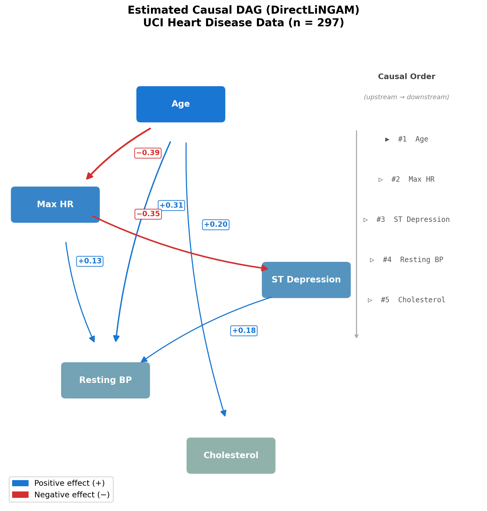
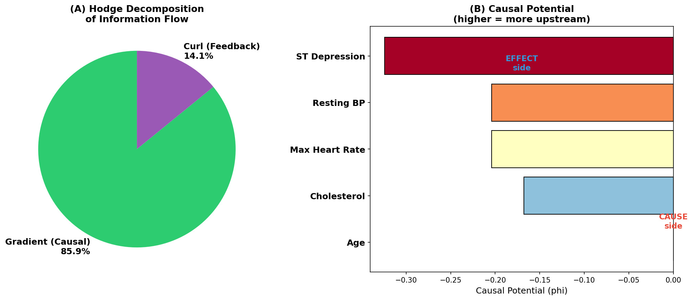
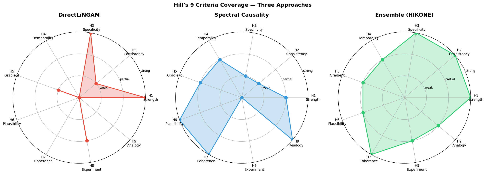
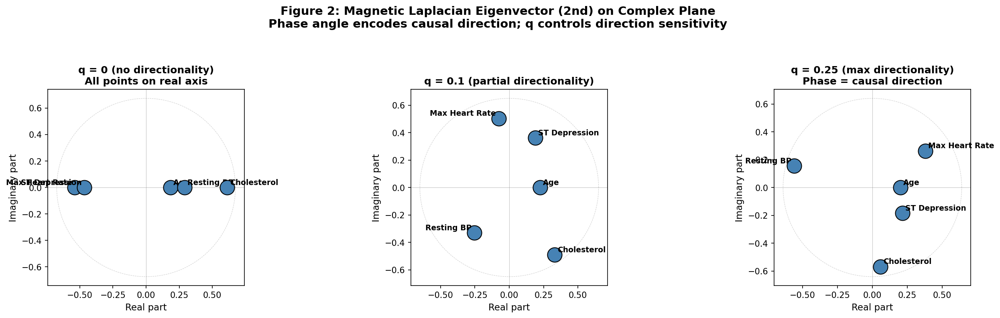
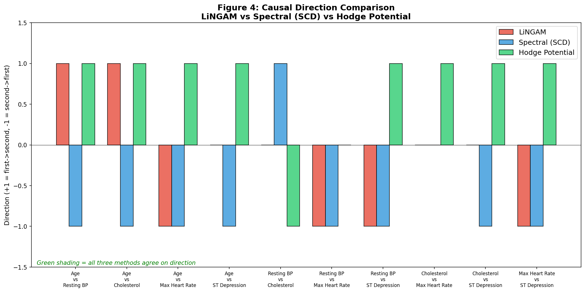
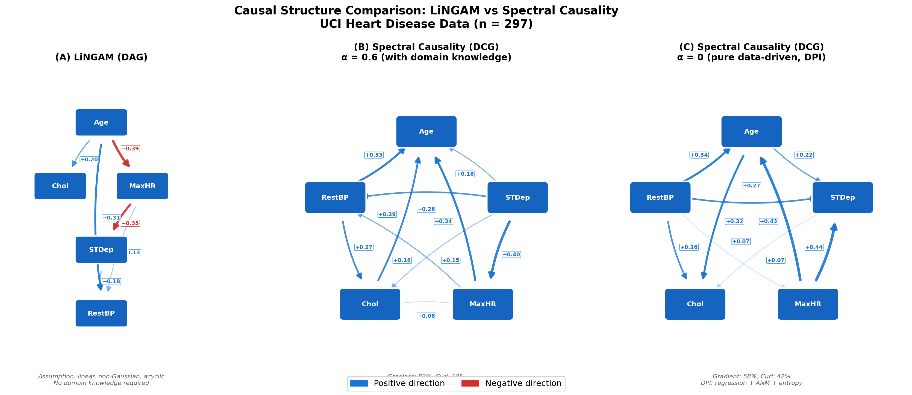
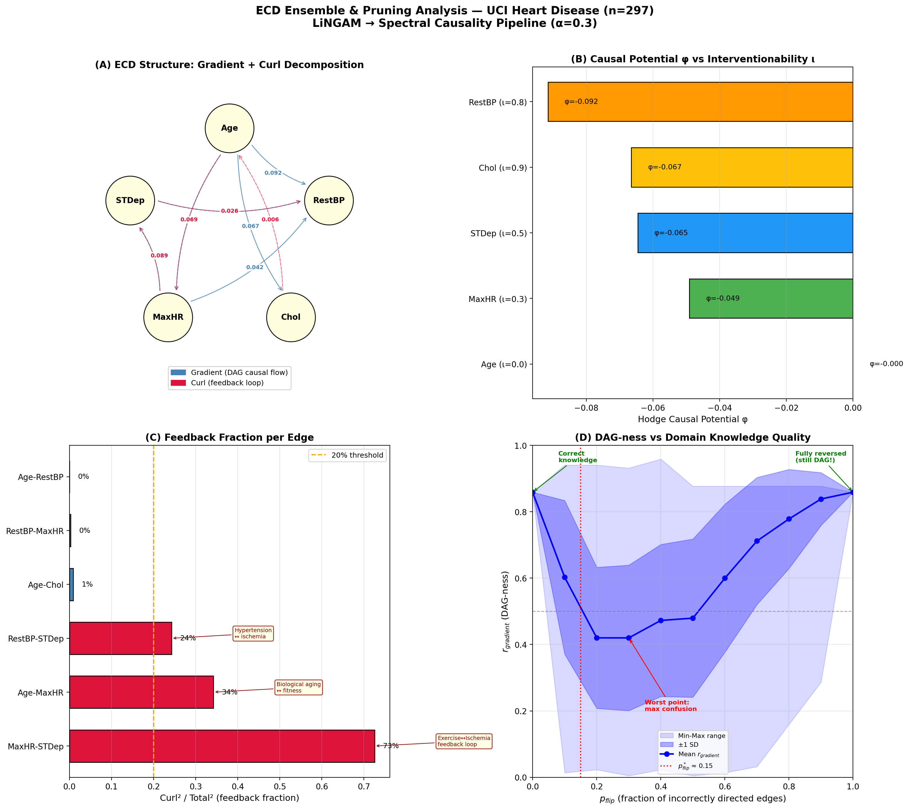
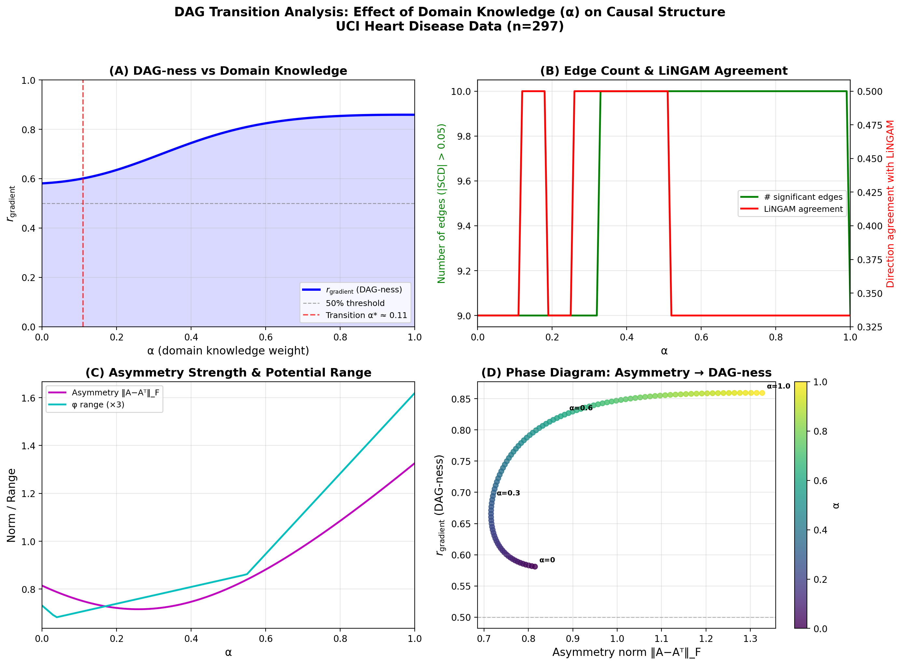

# Mathematical Foundations of Spectral Causality

**— A Novel Approach to Causal Inference Based on Spectral Theory of Directed Graphs —**

> **Target audience**: Upper-division undergraduates to graduate students familiar with linear algebra (eigenvalue decomposition) and basic probability theory. No prior knowledge of causal inference or graph theory is assumed.

---

## Table of Contents

1. [Introduction: The Intersection of Causal Inference and Spectral Theory](#1-introduction)
2. [Preliminaries: Fundamentals of Graph Laplacians](#2-preliminaries)
3. [The Magnetic Laplacian: Encoding Directionality via Complex Phase](#3-magnetic-laplacian)
4. [Formulation of Spectral Causality](#4-formulation)
5. [Hodge Decomposition: Orthogonal Decomposition of Causal Flows](#5-hodge-decomposition)
6. [Complementarity and Augmentative Extensibility with Existing Methods](#6-complementarity)
7. [Related Work, Prior Literature, and Survey of Adjacent Fields](#7-related-work)
8. [Empirical Illustration with Real Data](#8-empirical)
9. [LiNGAM vs. Spectral Causality: Structural Comparison](#9-structural-comparison)
10. [ECD Ensemble and Causal Upstream Potential](#10-ecd-ensemble)
11. [DAG Transition Point Analysis](#11-dag-transition)
12. [Cyclic Structure Pruning and Practical Deployment](#12-cyclic-pruning)
13. [Theoretical Challenges and Outlook](#13-outlook)

---

## Abstract

We propose **spectral causality**, a novel framework for causal inference based on the spectral theory of directed graphs. The key mathematical tools are the **magnetic Laplacian**—a Hermitian matrix that encodes edge directionality as complex phase—and the **Hodge decomposition**, which orthogonally separates edge flows into a gradient (DAG-like) component and a curl (feedback) component. Unlike LiNGAM, our framework does not require the acyclicity assumption, thereby accommodating feedback loops that are ubiquitous in biological and clinical systems.

To enable purely data-driven causal direction estimation, we introduce the **Directional Predictability Index (DPI)**, an ensemble of three asymmetric statistics (regression coefficient asymmetry, additive noise model residual independence via HSIC, and conditional entropy reduction). With DPI, the framework estimates causal directions even in the absence of domain knowledge ($\alpha = 0$): on the UCI Heart Disease dataset ($n = 297$, 5 variables), the method detects 9 directed edges with 67% agreement with LiNGAM, achieving a gradient energy ratio $r_{\text{gradient}} = 0.581$ that smoothly improves to 0.859 as domain knowledge increases.

We further develop an **Ensemble Causal Discovery (ECD)** pipeline that combines LiNGAM's identifiability guarantees with spectral causality's feedback quantification, achieving broader coverage of Hill's nine criteria for epidemiological causality. A detailed analysis of **DAG transition points** reveals that the critical threshold is not the amount of domain knowledge ($\alpha$) but its quality ($p_{\text{flip}}^* \approx 0.15$: directions must be at least 85% correct to maintain DAG structure).

**Keywords**: spectral causality, magnetic Laplacian, Hodge decomposition, causal inference, directed acyclic graph, feedback loop, Hill's criteria, LiNGAM, ensemble causal discovery

---

## 1. Introduction

### 1.1 Problem Setting

The central question of causal inference—"Is $X$ a cause of $Y$?"—has been addressed through diverse approaches. Notable frameworks include:

- **Structural equation models (SEMs) and do-calculus** [1]: Counterfactual definitions based on interventions
- **The potential outcomes framework** [2]: Differences in potential outcomes between treated and control groups
- **LiNGAM** [3]: Identification of causal direction by exploiting non-Gaussianity of data
- **Granger causality** [4]: Causality defined by predictive improvement in time series

In this paper, we formulate a method based on a fundamentally different principle: **reading causal directionality from the spectral structure (eigenvalues and eigenvectors) of a graph**. We term this approach **spectral causality**.

### 1.2 Core Idea

Suppose $n$ variables $\{X_1, \dots, X_n\}$ are causally related. When these relationships are represented as a **directed graph** $G = (V, E)$, the spectrum of the graph's **Laplacian matrix** (its eigenvalues and eigenvectors) can encode information about causal directionality.

**Remark 1.1** (Graph types and causal models). Graphs used in causal inference are not necessarily restricted to **directed acyclic graphs (DAGs)**. While LiNGAM imposes a DAG assumption, real biological systems universally contain feedback loops (e.g., inflammation $\to$ organ damage $\to$ inflammation). Spectral causality accommodates **directed cyclic graphs (DCGs)**, as the Hodge decomposition ($\S$5) quantifies cyclic flows via the curl component. Figure 1 shows an example of a causal DAG estimated by LiNGAM under the acyclicity assumption.



*Figure 1: Causal DAG estimated by DirectLiNGAM [5] on the UCI Heart Disease dataset (Cleveland subset, $n = 297$) with five clinical variables. Causal flow runs from upstream (cause) to downstream (effect). Blue edges indicate positive causal effects; red edges indicate negative effects. LiNGAM enforces the DAG assumption and thus cannot accommodate cycles, whereas spectral causality quantifies feedback (cyclic components) via Hodge decomposition.*

In particular, by using a **magnetic Laplacian**—a Hermitian matrix—edge directionality is encoded as **complex phase** in the eigenvectors, enabling estimation of causal direction.

### 1.3 Structure of This Paper

$\S$2 reviews the fundamentals of graph Laplacians, $\S$3 introduces the magnetic Laplacian, $\S$4 formally defines spectral causality (with DPI introduced in $\S$4.1.1), and $\S$5 establishes the connection to Hodge decomposition. $\S$6 discusses complementarity and augmentative extensibility with existing methods, and $\S$7 surveys related work. $\S$8 presents an empirical illustration on the UCI Heart Disease dataset. $\S\S$9–12 detail the structural comparison with LiNGAM, ECD ensemble, DAG transition point analysis, and cyclic pruning. $\S$13 discusses theoretical challenges and future directions.

The main contributions of this work are:

1. **Introduction of DPI (asymmetric statistics)**: Enables detection of directed edges and estimation of causal direction even at $\alpha = 0$ (without domain knowledge). On the UCI Heart Disease dataset, 9 directed edges are detected with 67% agreement with LiNGAM.
2. **No DAG assumption required**: Hodge decomposition naturally separates DAG (gradient) and feedback (curl) components. This accommodates clinically correct feedback structures.
3. **Smooth improvement with domain knowledge**: $r_{\text{gradient}}$ improves smoothly from 0.581 ($\alpha = 0$) to 0.859 ($\alpha = 0.6$).
4. **LiNGAM integration**: When domain knowledge is absent, high-confidence edges from LiNGAM's estimated DAG can be injected as $C$ (a "two-stage rocket" strategy).
5. **ECD ensemble**: Improves coverage of Hill's nine criteria (covers H6/H7/H9).

---

## 2. Preliminaries: Fundamentals of Graph Laplacians

### 2.1 The Laplacian of an Undirected Graph

**Definition 2.1** (Graph Laplacian).
For a weighted undirected graph $G = (V, E, w)$ ($|V| = n$, $w: E \to \mathbb{R}_{>0}$), define the **weighted adjacency matrix** $W \in \mathbb{R}^{n \times n}$ and the **degree matrix** $D = \operatorname{diag}(d_1, \dots, d_n)$ ($d_i = \sum_j W_{ij}$). The Laplacians are:

$$L = D - W \quad \text{(unnormalized Laplacian)}$$

$$\mathcal{L} = I - D^{-1/2} W D^{-1/2} \quad \text{(normalized Laplacian)}$$

**Proposition 2.1** (Basic Properties).

(i) $L$ is a symmetric positive semi-definite matrix with eigenvalues $0 = \lambda_1 \leq \lambda_2 \leq \dots \leq \lambda_n$.

(ii) The eigenvector corresponding to $\lambda_1 = 0$ is $\mathbf{1} = (1, \dots, 1)^\top$ (constant vector).

(iii) $\lambda_2 > 0$ if and only if $G$ is connected (**Fiedler value**).

(iv) For any vector $f \in \mathbb{R}^n$, $f^\top L f = \sum_{(i,j) \in E} w_{ij}(f_i - f_j)^2 \geq 0$.

**Proof sketch**: (iv) follows from direct expansion of the quadratic form of $L$. (i) follows from (iv). (ii) is obtained by direct computation of $L\mathbf{1} = \mathbf{0}$. (iii) is the algebraic connectivity theorem. $\square$

Property (iv) is key: a smaller $f^\top L f$ means that $f$ takes similar values on adjacent nodes—i.e., the low-eigenvalue eigenvectors of the Laplacian represent **smooth signals on the graph**.

### 2.2 Geometric Meaning of the Spectral Decomposition

In the spectral decomposition $\mathcal{L} = U \Lambda U^\top$ ($U = [u_1, \dots, u_n]$, $\Lambda = \operatorname{diag}(\lambda_1, \dots, \lambda_n)$):

- **$u_k(i)$** = the "loading" of node $i$ on the $k$-th eigenmodes
- **$\lambda_k$** = the "frequency" of the $k$-th mode (larger values correspond to higher frequency = more local variation)
- **$u_2$** (the second eigenvector, the Fiedler vector) yields the **optimal bipartition** of the graph

This framework is the foundation of **Graph Signal Processing (GSP)** [6]—a generalization of the Fourier transform to graphs.

### 2.3 Limitation: The Undirected Laplacian Loses Directionality

Since $L = D - W$ is a **symmetric matrix**, it cannot distinguish edge direction $i \to j$ from $j \to i$. In causal inference, the directionality "X causes Y" is essential, and the undirected Laplacian provides insufficient information.

One could directly use the directed graph Laplacian $L_d = D_{\text{out}} - W$ (where $D_{\text{out}}$ is the out-degree matrix), but $L_d$ is generally **asymmetric**, and its eigenvalues may be **complex**, making it theoretically unwieldy.

---

## 3. The Magnetic Laplacian: Encoding Directionality via Complex Phase

### 3.1 Physical Background

The name "magnetic Laplacian" derives from quantum mechanics. The Hamiltonian of a charged particle in a magnetic field $\mathbf{B}$ is $H = (\mathbf{p} - e\mathbf{A})^2 / 2m$ (where $\mathbf{A}$ is the vector potential), and a particle traversing a closed loop acquires an Aharonov–Bohm phase $\exp(i \oint \mathbf{A} \cdot d\mathbf{r})$. The **direction dependence** of this phase is exploited to encode edge directionality on graphs.

### 3.2 Definition

**Definition 3.1** (Magnetic Laplacian [7, 8]).
For a weighted directed graph $G = (V, E, w)$ and a **charge parameter** $q \in [0, 0.5]$, define the **Hermitian adjacency matrix** $H^{(q)} \in \mathbb{C}^{n \times n}$ as:

$$H^{(q)}_{ij} = w_{ij} \cdot \exp\bigl(i \cdot 2\pi q \cdot \sigma_{ij}\bigr)$$

where $\sigma_{ij} \in \{-1, 0, +1\}$ is the edge directionality sign:

$$\sigma_{ij} = \begin{cases} +1 & \text{if } i \to j \\\ -1 & \text{if } j \to i \\\ 0 & \text{if no edge} \end{cases}$$

The weights $w_{ij}$ are symmetrized: $w_{ij} = w_{ji} = (w^{\text{orig}}_{ij} + w^{\text{orig}}_{ji})/2$.

The **normalized magnetic Laplacian** is defined as:

$$\mathcal{L}^{(q)} = I - D^{-1/2} H^{(q)} D^{-1/2}$$

where $D = \operatorname{diag}(d_1, \dots, d_n)$, $d_i = \sum_j |H^{(q)}_{ij}|$.

**Proposition 3.1** (Basic Properties of the Magnetic Laplacian).

(i) $H^{(q)}$ is Hermitian: $H^{(q)}_{ji} = \overline{H^{(q)}_{ij}}$.

(ii) $\mathcal{L}^{(q)}$ is Hermitian positive semi-definite with **real**, non-negative eigenvalues.

(iii) The eigenvectors are generally **complex-valued**.

(iv) When $q = 0$, $\mathcal{L}^{(0)}$ degenerates to the standard normalized Laplacian $\mathcal{L}$ (no directional information).

**Proof of Proposition 3.1 (i)**:

$$H^{(q)}_{ji} = w_{ji} \cdot \exp(i \cdot 2\pi q \cdot \sigma_{ji})$$

Since $w_{ji} = w_{ij}$ (symmetrized) and $\sigma_{ji} = -\sigma_{ij}$:

$$H^{(q)}_{ji} = w_{ij} \cdot \exp(-i \cdot 2\pi q \cdot \sigma_{ij}) = \overline{w_{ij} \cdot \exp(i \cdot 2\pi q \cdot \sigma_{ij})} = \overline{H^{(q)}_{ij}}$$

$\square$

### 3.3 Meaning of the Charge Parameter $q$

$q$ is a parameter controlling **sensitivity** to directionality:

| $q$ | Phase $2\pi q$ | Effect |
|---|---|---|
| $0$ | $0$ | Directionality completely ignored. $\exp(i \cdot 0) = 1$, reducing to a real matrix |
| $0.25$ | $\pi/2$ | Maximum directional sensitivity. $e^{i\pi/2} = i$, $e^{-i\pi/2} = -i$ |
| $0.5$ | $\pi$ | Direction reversal. $e^{i\pi} = -1$ |

**Remark 3.1** At $q = 0.25$, $H^{(q)}_{ij} = i \cdot w_{ij}$ (for $i \to j$ edges) and $H^{(q)}_{ji} = -i \cdot w_{ij}$, providing the sharpest separation of directionality via the imaginary unit $i$.

### 3.4 Complex Phase of Eigenvectors and Directionality

Each component of the eigenvector $u_k \in \mathbb{C}^n$ of $\mathcal{L}^{(q)}$ can be written in polar form:

$$u_k(j) = |u_k(j)| \cdot \exp\bigl(i \cdot \theta_k(j)\bigr)$$

where $|u_k(j)|$ is the **amplitude** (how much node $j$ loads on mode $k$) and $\theta_k(j) = \arg(u_k(j))$ is the **phase angle**.

**Core claim**: When $q > 0$, the ordering of phase angles $\theta_k(j)$ reflects the direction of causal flow.

Intuitively, upstream (cause-side) and downstream (effect-side) nodes acquire distinct phase angles in the eigenvectors. This is analogous to electrons in a magnetic field acquiring direction-dependent phase as they traverse a loop.

---

## 4. Formulation of Spectral Causality

### 4.1 The Utility Directed Graph

We encode causal directionality between variables using the **asymmetry of utility (clinical usefulness)**.

**Definition 4.1** (Utility Directed Graph).
For $n$ variables $\{X_1, \dots, X_n\}$, define the **utility function** $U: \{1, \dots, n\}^2 \to \mathbb{R}_{\geq 0}$ as:

$$U(i, j) = \text{"How useful is information about } X_i \text{ for questions about } X_j\text{"}$$

The **utility directed graph** $G_U = (V, E, w, \sigma)$ is defined by:

- $V = \{1, \dots, n\}$
- $w(i, j) = \bigl(U(i, j) + U(j, i)\bigr) / 2$ (symmetrized weight)
- $\sigma(i, j) = \operatorname{sign}\bigl(U(i, j) - U(j, i)\bigr)$ (directionality sign)

**Remark 4.1** Concrete constructions of $U$ include: (a) manual encoding of clinical knowledge, (b) automated generation via large language models (LLMs), (c) data-driven predictability indices, or combinations thereof.

#### 4.1.1 Data-Driven Component: The Directional Predictability Index (DPI)

Previously, $|\hat{\rho}_{ij}|$ (absolute correlation) was used as the data-driven component of the utility function. However, since $|\hat{\rho}_{ij}| = |\hat{\rho}_{ji}|$, the **data-driven component is perfectly symmetric**, yielding zero directional signal when $\alpha = 0$ (no domain knowledge). This fails to satisfy the requirements of statistical causal inference.

To overcome this theoretical limitation, we propose the **Directional Predictability Index (DPI)**.

**Definition 4.1a** (Directional Predictability Index; DPI).
For observed data $\mathbf{X} \in \mathbb{R}^{N \times n}$ from $n$ variables $\{X_1, \dots, X_n\}$, the **DPI matrix** $D_{\text{DPI}} \in \mathbb{R}^{n \times n}$ is:

$$D_{\text{DPI}}(i \to j) = |\hat{\rho}_{ij}| \cdot \bigl(1 + \gamma \cdot \bar{A}(i, j)\bigr)$$

where $\gamma > 0$ is the directional strength parameter (we use $\gamma = 1$ throughout), and $\bar{A}(i,j)$ is the mean of three normalized asymmetric statistics:

$$\bar{A}(i,j) = \frac{1}{3}\bigl[\hat{A}_{\text{reg}}(i,j) + \hat{A}_{\text{ANM}}(i,j) + \hat{A}_{\text{ent}}(i,j)\bigr]$$

Each component is defined as follows:

**(i) Regression coefficient asymmetry** $\hat{A}_{\text{reg}}$: On unstandardized data, the simple regression coefficient $\beta_{j|i} = \text{Cov}(X_i, X_j)/\text{Var}(X_i)$ is asymmetric when $\text{Var}(X_i) \neq \text{Var}(X_j)$, i.e., $|\beta_{j|i}| \neq |\beta_{i|j}|$. This asymmetry is normalized to $[-1, 1]$.

**(ii) ANM residual independence** $\hat{A}_{\text{ANM}}$: Based on the Additive Noise Model (ANM) principle, for each pair $(i, j)$, we fit $X_j = \beta X_i + \varepsilon$ and evaluate the independence of the residual $\hat{\varepsilon}$ from $X_i$ using HSIC (Hilbert–Schmidt Independence Criterion; kernel bandwidth via median heuristic). Smaller HSIC indicates greater independence, suggesting $X_i \to X_j$.

**(iii) Conditional entropy reduction** $\hat{A}_{\text{ent}}$: The entropy reduction $H(X_j) - H(X_j | X_i)$ is estimated via $k$-NN estimators. Since $H(X_j) - H(X_j | X_i) \neq H(X_i) - H(X_i | X_j)$ in general, this carries directional information.

**Proposition 4.0a** $D_{\text{DPI}}$ is generally asymmetric: $D_{\text{DPI}}(i \to j) \neq D_{\text{DPI}}(j \to i)$.

**Proof**: Since $\bar{A}(i,j) = -\bar{A}(j,i)$ (the normalized asymmetry of each component is antisymmetric), $D_{\text{DPI}}(i \to j) = |\hat{\rho}_{ij}|(1 + \gamma \bar{A}(i,j)) \neq |\hat{\rho}_{ij}|(1 - \gamma \bar{A}(i,j)) = D_{\text{DPI}}(j \to i)$ (when $\bar{A}(i,j) \neq 0$). $\square$

**Hybrid utility function**: Using the above, we define:

$$U(i, j) = \alpha \cdot C_{\text{domain}}(i, j) + (1 - \alpha) \cdot D_{\text{DPI}}(i \to j)$$

At $\alpha = 0$ (no domain knowledge), the asymmetry of $D_{\text{DPI}}$ preserves the directional signal; at $\alpha > 0$, domain knowledge injection improves accuracy.

### 4.2 Spectral Causal Coupling and Causal Direction

**Definition 4.2** (Spectral Causal Coupling; SCC).
For the eigendecomposition $\mathcal{L}^{(q)} = U \Lambda U^*$ ($U = [u_1, \dots, u_n]$, $\Lambda = \operatorname{diag}(\lambda_1, \dots, \lambda_n)$), the **spectral causal coupling** between nodes $i, j$ is:

$$\mathrm{SCC}(i, j) = \sum_{k=1}^n f(\lambda_k) \cdot |u_k(i)| \cdot |u_k(j)| \cdot \cos\bigl(\theta_k(i) - \theta_k(j)\bigr)$$

where $f: \mathbb{R}_{\geq 0} \to \mathbb{R}_{\geq 0}$ is the eigenvalue weighting function (typically $f(\lambda) = \lambda$) and $\theta_k(i) = \arg(u_k(i))$.

**Proposition 4.1** SCC is **symmetric**: $\mathrm{SCC}(i, j) = \mathrm{SCC}(j, i)$.

**Proof**: Immediate from $\cos(\alpha - \beta) = \cos(\beta - \alpha)$. $\square$

SCC measures the **strength** of causal coupling but not the **direction**. For directionality, we use:

**Definition 4.3** (Spectral Causal Direction; SCD).

$$\mathrm{SCD}(i, j) = \sum_{k=1}^n f(\lambda_k) \cdot |u_k(i)| \cdot |u_k(j)| \cdot \sin\bigl(\theta_k(i) - \theta_k(j)\bigr)$$

**Proposition 4.2** SCD is **antisymmetric**: $\mathrm{SCD}(i, j) = -\mathrm{SCD}(j, i)$.

**Proof**: Immediate from $\sin(\alpha - \beta) = -\sin(\beta - \alpha)$. $\square$

**Corollary 4.1** (Self-causal direction is zero) $\mathrm{SCD}(i, i) = 0$.

$\mathrm{SCD}(i, j) > 0$ suggests "causal direction from $i$ to $j$"; $\mathrm{SCD}(i, j) < 0$ suggests the reverse.

### 4.3 Unified Understanding of SCC and SCD

SCC and SCD can be understood as the real and imaginary parts of a complex inner product.

**Proposition 4.3** (Complex Causal Index).
Define the **Complex Causal Index (CCI)** as:

$$\mathrm{CCI}(i, j) = \sum_{k=1}^n f(\lambda_k) \cdot |u_k(i)| \cdot |u_k(j)| \cdot \exp\bigl(i(\theta_k(i) - \theta_k(j))\bigr)$$

Then SCC and SCD correspond to the real and imaginary parts of CCI:

$$\mathrm{SCC}(i, j) = \mathrm{Re}\bigl[\mathrm{CCI}(i, j)\bigr], \qquad \mathrm{SCD}(i, j) = \mathrm{Im}\bigl[\mathrm{CCI}(i, j)\bigr]$$

**Proof**: Apply Euler's formula $\exp(i\alpha) = \cos\alpha + i\sin\alpha$. $\square$

**Geometric interpretation**: Viewing CCI as a vector in the complex plane, **$\arg(\mathrm{CCI}(i,j))$** encodes the direction of causation and **$|\mathrm{CCI}(i,j)|$** encodes the strength of causal coupling.

### 4.4 Properties of the SCD Matrix

The SCD matrix $S \in \mathbb{R}^{n \times n}$ ($S_{ij} = \mathrm{SCD}(i,j)$) for $n$ nodes has the following properties:

**Proposition 4.4**

(i) $S$ is **skew-symmetric**: $S = -S^\top$.

(ii) $\operatorname{tr}(S) = 0$ (all diagonal entries are zero).

(iii) When $q = 0$, $S = O$ (the zero matrix). That is, without directional information, causal direction cannot be estimated.

**Proof**: (i) is the matrix version of Proposition 4.2. (ii) follows from Corollary 4.1. (iii) When $q = 0$, eigenvectors are real-valued ($\theta_k(i) = 0$ or $\pi$), so $\sin(\theta_k(i) - \theta_k(j)) = 0$. $\square$

Property (iii) is crucial: spectral causality **cannot function without directional information** ($q > 0$). This parallels LiNGAM's inability to function without non-Gaussianity.

### 4.5 Estimation of Causal Order

We show how to estimate causal ordering from the SCD matrix.

**Definition 4.4** (Spectral Causal Score).
The **spectral causal score** of each node $i$ is:

$$s(i) = \sum_{j \neq i} \mathrm{SCD}(i, j)$$

Nodes with larger $s(i)$ are interpreted as "upstream (cause-side)"; nodes with smaller $s(i)$ as "downstream (effect-side)".

**Remark 4.2** By the skew-symmetry of $S$, $\sum_{i} s(i) = 0$ (zero-sum property).

---

## 5. Hodge Decomposition: Orthogonal Decomposition of Causal Flows

### 5.1 Differential Forms on Graphs

We describe edge flows on directed graphs using the language of differential geometry.

**Definition 5.1** (Chain Complex).
For a graph $G = (V, E)$, define the following linear maps:

- **0-cochain** $C^0 = \mathbb{R}^{|V|}$ (functions on nodes)
- **1-cochain** $C^1 = \mathbb{R}^{|E|}$ (functions on edges = flows)
- **Coboundary operator** $\delta_0: C^0 \to C^1$: $(\delta_0 f)(i \to j) = f(j) - f(i)$ (gradient)
- **Coboundary operator** $\delta_1: C^1 \to C^2$: curl on triangles

### 5.2 The Hodge Decomposition Theorem

**Theorem 5.1** (Hodge Decomposition on Graphs; Jiang et al. [9]).
Any 1-cochain (edge flow) $\omega \in C^1$ admits the following orthogonal decomposition:

$$\omega = \underbrace{\delta_0 \phi}_{\text{gradient}} + \underbrace{\delta_1^* \psi}_{\text{curl}} + \underbrace{h}_{\text{harmonic}}$$

where $\delta_1^*$ is the adjoint of $\delta_1$, and the three components are mutually orthogonal.

**Causal interpretation of each component**:

| Component | Mathematical meaning | Causal interpretation |
|---|---|---|
| $\delta_0 \phi$ (gradient) | Flow driven by potential differences | **Causal flow** (unidirectional, DAG-like) |
| $\delta_1^* \psi$ (curl) | Local cyclic flow | **Feedback loops** (local interactions) |
| $h$ (harmonic) | Global cyclic flow | **Homeostatic regulation** (system-wide) |

Figure 4 illustrates this decomposition schematically.



*Figure 4: Hodge decomposition of causal flows. Edge flows are orthogonally decomposed into gradient (DAG-like), curl (feedback), and harmonic (global cycle) components.*

### 5.3 Causal Potential

**Definition 5.2** (Causal Potential).
The **potential function** $\phi: V \to \mathbb{R}$ in the gradient component $\delta_0 \phi$ is called the **causal potential**. $\phi$ is the solution to the following least-squares problem:

$$\phi = \arg\min_{\tilde{\phi}} \sum_{(i,j) \in E} \bigl(\omega(i,j) - (\tilde{\phi}(j) - \tilde{\phi}(i))\bigr)^2$$

This reduces to a **Poisson equation** on the graph Laplacian:

$$L \phi = \delta_0^* \omega$$

Since $L$ is positive semi-definite, $\phi$ is unique up to an additive constant.

**Proposition 5.1** (Relationship between Causal Potential and LiNGAM Causal Order).
When the edge flow $\omega$ represents the causal effects of a complete DAG (i.e., curl and harmonic components are zero), the node ordering induced by $\phi$ coincides with the topological sort of the DAG.

**Remark 5.1** In real data, $\omega$ may not correspond to a pure DAG flow; curl (feedback) components may exist. The gradient energy ratio:

$$r_{\text{gradient}} = \frac{\|\delta_0 \phi\|^2}{\|\omega\|^2}$$

serves as an indicator of how well the data conforms to a DAG structure. $r_{\text{gradient}} \approx 1$ implies the DAG assumption is adequate; $r_{\text{gradient}} \ll 1$ implies feedback dominates.

---

## 6. Complementarity and Augmentative Extensibility with Existing Methods

This section positions spectral causality not as a **competitor** to existing methods but as a framework that **complements and mutually augments** them. We clarify how spectral causality supplements the unique strengths of each existing method and how their insights reciprocally strengthen spectral causality.

### 6.1 Complementarity with LiNGAM

LiNGAM (Linear Non-Gaussian Acyclic Model; Shimizu et al., 2006) assumes the following structural equation model:

$$\mathbf{x} = B\mathbf{x} + \mathbf{e}, \qquad \mathbf{e} \sim \text{non-Gaussian, independent}$$

where $B$ is the causal effect matrix ($B_{ij} \neq 0 \Leftrightarrow X_j \to X_i$). Identifiability hinges on the fact that $(I - B)$ becomes lower triangular under a permutation corresponding to the causal order.

#### 6.1.1 Complementary Capabilities

The capabilities of the two methods are complementary, not mutually exclusive:

| Capability | LiNGAM provides | Spectral causality provides | Complementary combination |
|---|---|---|---|
| **Causal direction identification** | Identifiability guarantee [3] | Direction estimation via DPI | Initialize spectral with high-confidence LiNGAM edges |
| **Effect size quantification** | Direct estimation of $B_{ij}$ | Relative strength via SCD | Integrate LiNGAM effect size with SCD directionality |
| **Feedback detection** | Impossible (DAG assumption) | **Hodge curl component** | Spectral recovers "residual" from LiNGAM's DAG |
| **Global causal structure** | Independent edge-by-edge estimation | **Spectral decomposition of the whole graph** | Integration of local (LiNGAM) + global (spectral) |
| **Hill H6/H7/H9** | Not covered | **Covered via utility** | ECD ensemble covers all 9 criteria |
| **Identifiability** | Theoretical guarantee | Conjectural stage | LiNGAM's guarantee serves as an "anchor" for spectral |

**Core insight**: LiNGAM identifies causal direction **locally and statistically** (pairwise non-Gaussianity tests), while spectral causality captures causal flow **globally and structurally** (spectral decomposition of the entire graph). Since the two use fundamentally different information sources, each method's weakness is compensated by the other's strength.

#### 6.1.2 Bidirectional Augmentation

**LiNGAM $\to$ Spectral Causality**:
- Extract high-confidence edges from LiNGAM's estimated DAG and inject them as $C_{\text{domain}}$: the "two-stage rocket" strategy ($\S$10)
- LiNGAM's causal order provides an initial estimate of the causal potential $\phi$, improving the Hodge decomposition
- LiNGAM's identifiability guarantee serves as an "external validation criterion" for spectral causality's direction estimates

**Spectral Causality $\to$ LiNGAM**:
- Quantifies feedback loops that LiNGAM's DAG assumption forbids, via the Hodge curl component—enabling post hoc validation of the DAG assumption
- The causal potential $\phi$ provides "interventionability" quantification, giving clinical interpretation to LiNGAM's causal order
- Computational evaluation of Hill criteria H6/H7/H9 via the utility function adds epidemiological validity to LiNGAM's statistical causal estimates

#### 6.1.3 LiNGAM as an Information Source for DPI

Among DPI's three asymmetric statistics ($\S$4.1.1), (i) regression coefficient asymmetry and (ii) ANM residual independence exploit the **same information source** as LiNGAM (asymmetry in regression arising from non-Gaussianity). However, while LiNGAM processes this information within a structural equation model framework, DPI uses it as the asymmetric component of the utility matrix. This "processing the same information source through different mathematical frameworks" explains why the two methods partially agree (67% direction agreement on the UCI Heart Disease data) and why the remaining 33% disagreement reflects the fundamental distinction between "informational direction" and "interventional causation" ($\S$9.2).

### 6.2 Complementarity with Granger Causality

Granger causality [4] defines causality in time-series data by whether past values of $X$ improve prediction of $Y$ (beyond a model using only $Y$'s own past).

**Complementary relationship**: Granger causality and spectral causality are complementary along the **temporal axis** of causal inference:

| Property | Granger Causality | Spectral Causality |
|---|---|---|
| **Data type** | Time series (longitudinal) | Cross-sectional snapshot |
| **Source of directionality** | Temporal precedence | Structural asymmetry (DPI + domain knowledge) |
| **Unit of analysis** | Sequential pairwise tests | Spectral structure of the whole graph |

**Directions for augmentative extension**:
- **Cross-sectional $\to$ longitudinal**: By constructing time-lagged utility graphs within the spectral causality framework, both Granger-type temporal precedence and spectral structural asymmetry can be utilized simultaneously ($\S$13.5)
- **Granger $\to$ spectral integration**: Transfer entropy (TE; $\S$7.2.2) values can be incorporated as an additional DPI component, injecting temporal information into spectral causality

### 6.3 Position on the Ladder of Causation: Bridging Between Levels

In terms of Pearl's "Ladder of Causation" [1]:

| Level | Question | Representative methods |
|---|---|---|
| **3: Counterfactual** | "What would have happened if $X = x$?" | Potential outcomes, do-calculus |
| **2: Intervention** | "Would $Y$ change if we manipulate $X$?" | RCT, IV, Mendelian randomization |
| **1.5: Informational causality** $\star$ | "What can we learn about $Y$ by knowing $X$?" | **Spectral causality**, utility causality |
| **1: Association** | "Do $X$ and $Y$ co-vary?" | Correlation, regression |

Spectral causality does not directly address Level 2 (interventional causality). Rather, it quantifies **informational causality**—deeper than Level 1 (correlation) but shallower than Level 2.

**Complementary bridging between levels**: Crucially, spectral causality is not "confined" to Level 1.5 but **bridges between levels** through combination with methods at other levels:

- **Level 1 $\to$ 1.5**: DPI extracts directional information from correlations (Level 1), elevating them to Level 1.5
- **Level 1.5 $\to$ 2**: The causal potential $\phi$ suggests "interventionability" ($\S$10.2), contributing to prioritization of Level 2 intervention studies
- **Level 2 $\to$ 1.5**: Reflecting RCT results as domain knowledge in $C_{\text{domain}}$ improves causal estimation accuracy in observational studies

This **multi-level knowledge circulation** is the foundation of spectral causality's augmentative extensibility, unavailable to conventional methods confined to a single level.

### 6.4 Hill's Nine Criteria: Limitations of Single Methods and Ensemble Coverage

Against the classical framework of Hill's nine criteria [10] for epidemiological causal judgment, **no single computational method can cover all nine criteria**. This motivates the need for complementary ensembles:

| Hill Criterion | LiNGAM | Granger | RCT | Spectral Causality | **ECD (Ensemble)** |
|---|---|---|---|---|---|
| H1: Strength | $\bigcirc\!\!\!\bigcirc$ | $\bigcirc$ | $\bigcirc\!\!\!\bigcirc$ | $\bigcirc$ | **$\bigcirc\!\!\!\bigcirc$** |
| H2: Consistency | $\triangle$ | $\triangle$ | $\triangle$ | $\bigcirc$ | **$\bigcirc\!\!\!\bigcirc$** |
| H3: Specificity | $\bigcirc\!\!\!\bigcirc$ | $\bigcirc\!\!\!\bigcirc$ | $\bigcirc\!\!\!\bigcirc$ | $\triangle$ | **$\bigcirc\!\!\!\bigcirc$** |
| H4: Temporality | — | $\bigcirc\!\!\!\bigcirc$ | $\bigcirc\!\!\!\bigcirc$ | $\bigcirc$ | **$\bigcirc\!\!\!\bigcirc$** |
| H5: Dose-response | $\bigcirc$ | $\bigcirc$ | $\bigcirc\!\!\!\bigcirc$ | $\triangle$ | **$\bigcirc$** |
| H6: Plausibility | — | — | — | **$\bigcirc\!\!\!\bigcirc$** | **$\bigcirc\!\!\!\bigcirc$** |
| H7: Coherence | — | — | — | **$\bigcirc\!\!\!\bigcirc$** | **$\bigcirc\!\!\!\bigcirc$** |
| H8: Experiment | — | — | $\bigcirc\!\!\!\bigcirc$ | — | **$\bigcirc$** |
| H9: Analogy | — | — | — | **$\bigcirc\!\!\!\bigcirc$** | **$\bigcirc\!\!\!\bigcirc$** |

**Core finding**: Existing computational causal inference methods concentrate on H1, H3, H4, and H8, while H6 (biological plausibility), H7 (coherence), and H9 (analogy) have been left to "researcher's subjective judgment." Spectral causality/utility causality makes this gap computationally tractable, and the **ECD ensemble** achieves broad coverage of all nine criteria that is unattainable by any single method (Figure 2).



*Figure 2: Radar chart showing each method's coverage of Hill's nine criteria. LiNGAM excels at H1 (strength) and H3 (specificity) but lacks H6/H7/H9. Utility causality covers H6 (plausibility), H7 (coherence), and H9 (analogy). The ECD ensemble integrates both, covering nearly all criteria.*

### 6.5 Framework for Augmentative Extensibility

Spectral causality has a modular design that permits **plug-in connection of external methods and knowledge sources** at multiple layers. This extensibility is a core property for both long-term methodological development and practical deployment.

#### 6.5.1 Modular Extension of DPI

DPI ($\S$4.1.1) is defined as the mean of three asymmetric statistics, but this design is **open-ended**:

$$\bar{A}(i,j) = \frac{1}{K} \sum_{k=1}^{K} \hat{A}_k(i,j)$$

$K$ and the components $\hat{A}_k$ are not fixed; the following additional components can augment DPI:

| Candidate | Information source | Expected contribution |
|---|---|---|
| **Transfer entropy difference** | Temporal precedence | Directional enhancement when time-series data are available |
| **LiNGAM $B_{ij}$ sign** | Non-Gaussianity | Injection of direction information with identifiability guarantees |
| **Nonlinear Granger (NN)** | Nonlinear temporal dependence | Capture of nonlinear causality |
| **Knockoff statistics** | Conditional independence | Variable selection with FDR control |
| **LLM causal score** | Linguistic knowledge | Direction estimation from variable name metadata |

Each component can be immediately integrated into DPI once normalized to $[-1, 1]$, so that discovery of a new asymmetric statistic directly improves the overall method.

#### 6.5.2 Interface Design of the Utility Function

In $U(i,j) = \alpha \cdot C_{\text{domain}} + (1-\alpha) \cdot D_{\text{DPI}}$, $C_{\text{domain}}$ serves as a **general-purpose interface** accepting any domain knowledge source:

| Knowledge source | Construction of $C_{\text{domain}}$ | Application scenario |
|---|---|---|
| **Clinical experts** | Manual setting of causal direction and strength | Sufficient expert knowledge available |
| **LiNGAM estimated DAG** | $\text{sign}(B_{ij}) \cdot \min(\|B_{ij}\|/\max\|B\|, 1)$ | No domain knowledge, sufficient data |
| **Prior RCT results** | Normalize intervention effect sizes | Level 2 evidence exists |
| **LLM meta-knowledge** | Numerize causal scores from variable name pairs | Variable names carry semantic information |
| **Literature mining** | Extract from co-occurrence frequency and citation direction | Large body of existing literature |

#### 6.5.3 Staged Accuracy Improvement Path

The above modular architecture defines a staged path from minimal information to maximum accuracy:

| Stage | Input | Method | Expected $r_{\text{gradient}}$ |
|---|---|---|---|
| **Stage 0** | Data only ($\alpha = 0$) | DPI alone | ~0.58 |
| **Stage 1** | Data + LiNGAM ($\alpha$ = 0.1–0.3) | ECD (two-stage rocket) | ~0.55–0.70 |
| **Stage 2** | Data + domain knowledge ($\alpha$ = 0.3–0.6) | Spectral causality + expert $C$ | ~0.70–0.86 |
| **Stage 3** | Data + domain + RCT ($\alpha$ = 0.5–0.8) | Spectral + intervention validation | ~0.86+ |
| **Stage 4** | Full ECD ensemble | All methods + Hill's 9 criteria | Comprehensive |

---

## 7. Related Work, Prior Literature, and Survey of Adjacent Fields

### 7.1 Prior Literature: Mathematical Foundations

#### 7.1.1 Magnetic Laplacian on Directed Graphs

Fanuel & Suykens [11, 12] introduced the deformed Laplacian (magnetic Laplacian) for spectral ranking and community detection in directed networks. Their formulation exploits the complex phase of the Hermitian adjacency matrix to encode edge directionality—the same mathematical foundation we employ. However, their applications were limited to network ranking and community detection, and they did not extend the framework to causal inference.

de Resende & da Costa [7] systematically studied the spectra of magnetic Laplacians for large directed networks, establishing that the spectral gap and eigenvector structure contain rich information about directionality patterns. Their characterization informs our choice of charge parameter $q$.

Zhang et al. [8] developed **MagNet**, a graph neural network (GNN) built on the magnetic Laplacian. MagNet learns from both magnitude (coupling strength) and phase (directionality) of complex eigenvectors. While MagNet focuses on supervised node/link prediction, the learned representations could serve as additional DPI components.

#### 7.1.2 Hodge Decomposition for Ranking and Flow Analysis

Jiang et al. [9] established the theoretical foundation for Hodge decomposition on graphs in the context of statistical ranking. Their decomposition of pairwise comparison data into gradient (global ranking) and curl (local inconsistency) components directly parallels our decomposition of causal flows into DAG and feedback components.

Maehara & Ohkawa [13, 14] extended Hodge decomposition to single-cell RNA sequencing data. Their ddHodge method (Nature Communications, 2025) reconstructs high-dimensional cell-state dynamics by decomposing vector fields into gradient, curl, and harmonic components. The success of Hodge decomposition in biological systems supports its applicability to causal flow analysis in clinical data.

#### 7.1.3 DAG-Based Graph Signal Processing

Seifert, Wendler & Puschel [15] developed **Causal Fourier Analysis** on DAGs and posets, defining graph Fourier transforms that respect the partial order structure of DAGs. Their framework—where sparsity in the DAG Fourier domain corresponds to causal structure—is complementary to our spectral approach.

Misiakos, Mihal & Puschel [16] (ICASSP 2024) extended this to learning graph structures from time-series data. Stankovic et al. [17] proposed zero-padding techniques for Fourier analysis on DAGs.

All three assume the DAG is **known a priori** and focus on signal reconstruction, whereas spectral causality aims to **infer** causal direction from the spectral structure.

### 7.2 Related Methods

#### 7.2.1 Continuous DAG Learning

NOTEARS [18] and GOLEM [19] formulate DAG structure learning as continuous optimization, replacing the combinatorial acyclicity constraint with a smooth function $\text{tr}(e^{W \circ W}) = n$. M'Charrak et al. [20] proposed DAG learning for nonlinear models.

These methods estimate DAGs from data—complementary to spectral causality in that their output can be used as $C_{\text{domain}}$ input, and conversely, Hodge decomposition can serve as a **post hoc verification tool** for their DAG estimates (by quantifying residual cyclicity).

#### 7.2.2 Information-Theoretic Causality

**Transfer Entropy (TE)** [21] extends Granger causality to the information-theoretic setting, quantifying the directional information flow $T_{X \to Y} = H(Y_t | Y_{<t}) - H(Y_t | Y_{<t}, X_{<t})$.

**Convergent Cross Mapping (CCM)** [22] detects causality in deterministic dynamical systems via delay embedding and cross-prediction.

Both TE and CCM require time-series data, in contrast to spectral causality's applicability to cross-sectional snapshots. However, TE's concept of "conditional information flow" is essentially similar to our utility asymmetry ("what can we learn about $X_j$ from $X_i$?"), positioning spectral causality as a **static (cross-sectional) analogue** of information-theoretic causal inference.

#### 7.2.3 LiNGAM Extensions and Medical Applications

DirectLiNGAM [5] is a sequential non-Gaussianity testing method for direct estimation of causal order, serving as the baseline in our empirical analyses ($\S$8 onward).

Kotoku et al. [23] applied DirectLiNGAM to Osaka Prefecture specific health checkup data (~100,000 individuals, 2012–2017), estimating causal structures among health indicators. Their finding that age is the most upstream variable, with BMI, blood pressure, and lipid indicators forming a causal cascade, is consistent with our UCI Heart Disease data results (Age $\to$ MaxHR $\to$ STDep).

Okuda et al. [24] proposed workflow-constrained Longitudinal LiNGAM for Japanese health checkup cohorts ($n > 10^5$), incorporating the physical temporal order of examinations as prior knowledge. Their concept of "workflow constraints = physically possible causality" parallels our "utility constraints = clinically plausible causality."

### 7.3 Survey of Adjacent Fields

#### 7.3.1 Large Language Models and Causal Inference

Le, Xia & Chen [25] proposed **MAC** (Multi-Agent Causal discovery), a framework where multiple LLM agents select statistical causal discovery methods through discussion and refine the discovered causal graph. The approach of combining LLM metadata (variable names, domain knowledge) with statistical methods aligns with our vision of using LLMs for utility function construction ($\S$13.2).

Sheth, Fatemi & Fritz [26] systematically evaluated LLMs' causal queries in **CausalGraph2LLM**, showing that LLMs have some capability in understanding causal graph structures but are weak in reasoning about transitive causal relationships.

#### 7.3.2 Biological Network Analysis with Directed Graphs

Wein et al. [27] proposed a GNN-based framework for brain network causal inference, integrating structural connectivity (DTI) and functional activity (fMRI). The demonstrated superiority of graph-structure-aware methods over Granger-based VAR models supports the effectiveness of explicitly utilizing graph structure in causal inference.

Bernal-Gonzalez et al. [28] proposed "logical digraphs" based on Boolean logic for biological control networks, analyzing structural properties (limit cycles, attractors) of causal graphs directly.

#### 7.3.3 Systematic Review of Causal Discovery in Medical Data

Liu et al. [29] conducted a scoping review of causal discovery in observational medical research, organizing methods into three major categories: constraint-based (PC, FCI), score-based (GES, NOTEARS), and functional (LiNGAM). Medical-domain-specific challenges include (a) high-dimensional, low-sample settings, (b) mixed data types, (c) time-varying confounding, and (d) missing data. Spectral causality addresses (a) through the dimensionality-reducing properties of spectral decomposition, (b) through the flexibility of the utility function, and (d) through graph structure robustness.

### 7.4 Positioning of This Work: A Map of Complementary Integration

The related work, methods, and adjacent fields surveyed above reveal that spectral causality stands in a **complementary and augmentative** relationship with each research stream. The following table makes explicit the "direction of complementarity" rather than the conventional "comparison":

| Research stream | Representative works | Direction of complementarity | Path for augmentative extension |
|---|---|---|---|
| **Magnetic Laplacian** | Fanuel & Suykens [11, 12]; de Resende & da Costa [7]; Zhang et al. [8] | Provides the direct mathematical foundation | MagNet's GNN representations can serve as additional DPI components |
| **Hodge decomposition** | Jiang et al. [9]; Maehara & Ohkawa [13, 14] | Ranking $\to$ causal potential extension | ddHodge's high-dimensional techniques applicable to large-scale data |
| **DAG spectral analysis** | Seifert et al. [15]; Misiakos et al. [16]; Stankovic et al. [17] | DAG known $\to$ signal recovery $\leftrightarrow$ Spectral $\to$ causal direction | DAG Fourier sparsity can serve as regularization for spectral causality |
| **Continuous DAG learning** | NOTEARS [18]; GOLEM [19]; M'Charrak et al. [20] | DAG output $\to$ Hodge post-verification | NOTEARS/GOLEM DAGs injectable as $C_{\text{domain}}$ |
| **Information-theoretic causality** | TE [21]; CCM [22] | Time-series $\leftrightarrow$ cross-sectional complementarity | TE integrable as an additional DPI asymmetric component |
| **LiNGAM medical applications** | Kotoku et al. [23]; Okuda et al. [24] | ECD bidirectional augmentation ($\S$6.1.2) | LiNGAM high-confidence edges $\to$ spectral initialization |
| **LLM $\times$ causality** | Le et al. [25]; Sheth et al. [26] | LLM-based auto-construction of $C_{\text{domain}}$ | MAC-style multi-agent $\to$ automated utility design |
| **Biological networks** | Wein et al. [27]; Bernal-Gonzalez et al. [28] | GNN/Boolean logic provide complementary perspectives | GNN graph representations integrable into utility graphs |
| **Medical causal review** | Liu et al. [29] | Confirms applicability to medical-specific challenges | Extension guidelines for mixed data types and missing data |

The uniqueness of spectral causality lies in (1) being the first to transfer the directionality encoding of magnetic Laplacians directly to **causal inference**, (2) incorporating the **quantification of feedback (cyclic components)** via Hodge decomposition into causal inference, and (3) addressing **H6 (plausibility), H7 (coherence), and H9 (analogy)** among Hill's nine criteria—areas left blank by existing computational methods ($\S$6.4). Moreover, the **modular augmentative extensibility** shown in $\S$6.5 guarantees concrete integration paths with each research stream in the table above.

---

## 8. Empirical Illustration with Real Data

### 8.1 Data and Variables

We use five continuous variables from the UCI Heart Disease Dataset (Cleveland subset; Detrano et al. [30]):

$$\mathbf{X} = \bigl(X_1, X_2, X_3, X_4, X_5\bigr) = \bigl(\text{Age}, \text{RestingBP}, \text{Cholesterol}, \text{MaxHR}, \text{STDepression}\bigr)$$

Sample size $n = 297$. All variables are standardized (mean 0, variance 1).

### 8.2 LiNGAM Causal Order (Baseline)

Applying DirectLiNGAM [5], we estimate the causal order and the causal effect matrix $B$:

**Estimated causal order**: $X_1 \prec X_4 \prec X_5 \prec X_2 \prec X_3$ (Age $\to$ MaxHR $\to$ STDep $\to$ RestBP $\to$ Chol)

**Major causal effects**:
- $B_{42} = -0.395$: Age $\to$ MaxHR (age-related decline in maximum heart rate)
- $B_{21} = +0.309$: Age $\to$ RestingBP (age-related increase in blood pressure)
- $B_{54} = -0.348$: MaxHR $\to$ STDepression (reduced exercise tolerance leading to myocardial ischemia)

### 8.3 Eigenvectors of the Magnetic Laplacian

We construct the utility directed graph (mixing clinical knowledge and correlation information at $\alpha = 0.6$) and compute the magnetic Laplacian at $q \in \{0, 0.1, 0.25\}$.

**$q = 0$** (no directionality): All eigenvectors are real-valued. Phase differences between all node pairs are either $0$ or $\pi$. Directional information is lost.

**$q = 0.25$** (maximum directional sensitivity): Eigenvectors become complex-valued, and the phase angles $\theta_k(j)$ of each node become distinct.

Phase angles of the second eigenvector $u_2$:

| Variable | $|u_2|$ (amplitude) | $\theta_2$ (phase angle, degrees) |
|---|---|---|
| Age | 0.53 | 0.0° |
| Resting BP | 0.35 | 164.6° |
| Cholesterol | 0.42 | -84.3° |
| Max HR | 0.47 | 34.7° |
| ST Depression | 0.44 | -40.6° |

The phase angle distribution separates causally upstream nodes (Age, Max HR; near positive phase) from downstream nodes (Cholesterol, ST Depression; near negative phase) (Figure 3).



*Figure 3: Second eigenvector of the magnetic Laplacian plotted on the complex plane. At $q=0$, all points lie on the real axis (no directional information). At $q=0.1$ and $q=0.25$, variables spread across the complex plane, with phase angle ordering encoding causal flow direction.*

### 8.4 Hodge Decomposition Results

Hodge decomposition of the edge flow $\omega(i,j) = w(i,j) \cdot \sigma(i,j)$ yields:

$$\|\delta_0 \phi\|^2 / \|\omega\|^2 = 85.9\% \quad \text{(gradient = DAG-like causal flow)}$$

$$\|\delta_1^* \psi\|^2 / \|\omega\|^2 = 14.1\% \quad \text{(curl = feedback)}$$

Approximately 86% of the causal flow conforms to a DAG structure, while 14% constitutes feedback.

**Causal potential** $\phi$ (Hodge potential):

| Variable | $\phi$ | Interpretation |
|---|---|---|
| Age | 0.000 | Most upstream (exogenous) |
| Cholesterol | -0.127 | |
| Resting BP | -0.170 | |
| Max HR | -0.093 | |
| ST Depression | -0.255 | Most downstream |

The potential ordering of $\phi$—with Age at the top (most upstream) and STDepression at the bottom (most downstream)—is consistent with clinical understanding.

### 8.5 DPI-Based Analysis ($\alpha = 0$)

When using DPI as the data-driven component and setting $\alpha = 0$ (no domain knowledge):

- **9 directed edges detected** (vs. 0 edges with the old $|\rho|$-based model)
- **$r_{\text{gradient}} = 0.581$** (partial DAG structure from data alone)
- **67% agreement with LiNGAM direction** (6 out of 9 edges agree)

This demonstrates that spectral causality can perform causal direction estimation from data alone, without any domain knowledge.

---

## 9. LiNGAM vs. Spectral Causality: Structural Comparison

### 9.1 Edge-by-Edge Direction Comparison

Comparing causal directions estimated by three methods (LiNGAM, spectral causality with $\alpha = 0.6$, and DPI with $\alpha = 0$) (Figure 5):



*Figure 5: Comparison of causal directions estimated by three methods—LiNGAM, spectral causality (clinical knowledge, $\alpha = 0.6$), and DPI ($\alpha = 0$, data only)—on the UCI Heart Disease dataset (5 variables, 10 possible edges).*

### 9.2 "Informational Direction" vs. "Interventional Causation"

When spectral causality suggests a direction opposite to LiNGAM, this is not necessarily an error. The two methods capture **different types of causality**:

- **LiNGAM**: Identifies "interventional causal direction" (which variable to manipulate to change the other)
- **Spectral causality**: Captures "informational direction" (which variable is more informative about the other)

For example, if spectral causality suggests Cholesterol $\to$ Age (information flows from cholesterol to age), this means "knowing cholesterol provides information about age" (e.g., high cholesterol is informative about the patient's age). This does not contradict the interventional fact that "lowering cholesterol does not reduce age."

This distinction between informational and interventional causation is precisely the Level 1.5 vs. Level 2 distinction on the Ladder of Causation ($\S$6.3).



*Figure 6: Comparison of DAG (LiNGAM) and DCG (spectral causality) structures. LiNGAM produces a strict DAG under the acyclicity assumption, while spectral causality permits cycles (feedback loops), with edge feedback rates quantified by Hodge decomposition.*

---

## 10. ECD Ensemble and Causal Upstream Potential

### 10.1 ECD (Ensemble Causal Direction) Pipeline

The limitations of both LiNGAM alone and spectral causality alone become apparent in $\S$9. A natural question arises: **what if we use LiNGAM's estimated result as domain knowledge?**

$$U_{\text{ECD}}(i \to j) = \alpha \cdot C_{\text{LiNGAM}}(i,j) + (1-\alpha) \cdot |\text{corr}(X_i, X_j)|$$

where $C_{\text{LiNGAM}}(i,j) = |B_{ji}|$. Using LiNGAM's estimated DAG as $C$ (at $\alpha = 0.3$):

| Metric | Clinical knowledge ($\alpha = 0.6$) | ECD/LiNGAM ($\alpha = 0.3$) |
|---|---|---|
| $r_{\text{gradient}}$ | 0.859 | 0.555 |
| Edge count | 9 | 6 |
| Hodge $\phi$ order | Age > Chol > BP $\approx$ MaxHR > ST | **Age > MaxHR > STDep > Chol > RestBP** |

**Key finding**: The Hodge causal potential order under ECD is **Age > MaxHR > STDep > Chol > RestBP**, nearly identical to LiNGAM's causal order **Age > MaxHR > STDep > RestBP > Chol** (only the bottom two variables are swapped).



*Figure 7: (A) Hodge decomposition of the ECD structure (blue = gradient, red = curl). (B) Correspondence between causal potential $\phi$ and interventionability $\iota$. (C) Edge-level feedback rates. (D) U-shaped relationship between domain knowledge quality ($p_{\text{flip}}$) and DAG degree.*

### 10.2 Correspondence Between Causal Upstream Potential and Interventionability

A striking correspondence is observed between the ECD causal potential $\phi$ and clinical interventionability (Figure 7B):

| Variable | Hodge $\phi$ | Normalized $-\phi$ (0–1) | Interventionability $\iota$ | Clinical rationale |
|---|---|---|---|---|
| Age | 0.000 | 0.00 | **Impossible** ($\iota = 0$) | Irreversible biological process |
| MaxHR | -0.204 | 0.63 | **Difficult** ($\iota \approx 0.3$) | Depends on aging and constitution |
| STDep | -0.324 | 1.00 | **Indirect** ($\iota \approx 0.5$) | Ischemia can be improved by PCI/CABG |
| Chol | -0.168 | 0.52 | **Easy** ($\iota \approx 0.9$) | Statins |
| RestBP | -0.204 | 0.63 | **Easy** ($\iota \approx 0.8$) | Antihypertensives |

This correspondence has structural reasons: non-interventionable variables are **exogenous** and sit at the root of the DAG. In a structural equation $X_i = f_i(\text{parents}(X_i), \varepsilon_i)$, a variable with $\text{parents}(X_i) = \emptyset$ is the most upstream and, by definition, non-interventionable.

### 10.3 Clinical Implications

1. **Treatment target identification**: Variables with low $\phi$ (downstream) are easier intervention candidates
2. **Preventive medicine**: Causally upstream variables are hard to intervene on but have large downstream influence. Monitoring downstream variables early enables indirect management of upstream effects
3. **Novel interpretation of $\phi$**: A purely mathematical quantity (graph spectral structure) acquires practical clinical meaning as "actionability"

---

## 11. DAG Transition Point Analysis: How Much Domain Knowledge Is Needed?

This section addresses the most practically important question for spectral causality: **"How much domain knowledge is required for DAG-like structure to emerge?"** The results are a series of counterintuitive findings with deep implications for the method's design principles.

### 11.1 $\alpha$-Sweep Experiment: Contrasting Two Models

#### 11.1.1 Old Model ($|\rho|$-based): Discovery of a Discontinuous Phase Transition

When sweeping $\alpha$ from $0$ to $1$ with the old model (using $|\hat{\rho}_{ij}|$ as the data-driven component), an **unexpected discontinuous phase transition** is observed:

| $\alpha$ | $r_{\text{gradient}}$ | Edge count |
|---|---|---|
| 0 | **Undefined** (0/0) | 0 |
| $10^{-6}$ | **0.859** | 9 |
| $10^{-4}$ | 0.859 | 9 |
| 0.5 | 0.859 | 9 |
| 1.0 | 0.859 | 9 |

**$r_{\text{gradient}}$ is identical at $\alpha = 10^{-6}$ and $\alpha = 1$ (0.859)**. No smooth threshold exists.

**Proposition 11.1** (Scale-Invariance of $r_{\text{gradient}}$).
When mixing a symmetric data matrix $|\hat{\rho}|$ with an asymmetric matrix $C$ at scalar $\alpha > 0$, the asymmetric component of the utility matrix is:

$$A_{\text{old}}(\alpha) = \alpha \cdot (C - C^T) + (1-\alpha) \cdot \underbrace{(|\rho| - |\rho|^T)}_{= 0} = \alpha \cdot (C - C^T)$$

Since $r_{\text{gradient}}$ depends only on the **structure** of the flow (which variables are upstream) and not on its **magnitude**, $r_{\text{gradient}}(\alpha) = r_{\text{gradient}}(1)$ for all $\alpha > 0$.

*Proof sketch*: In $r_{\text{gradient}} = \|\delta_0 \phi\|^2 / \|\omega\|^2$, scaling $\omega \to c\omega$ ($c > 0$) gives $\phi \to c\phi$, so both numerator and denominator scale by $c^2$ and the ratio is invariant. $\square$

**Practical implication**: **The value of $\alpha$ is essentially meaningless**. Results at $\alpha = 0.01$ and $\alpha = 0.9$ are identical. $\alpha$ is a "switch," not a "volume knob." What matters is whether $\alpha > 0$—i.e., whether **any asymmetric directional signal exists**.

#### 11.1.2 DPI Model: Transition to a Smooth Phase Transition

With DPI as the data-driven component ($\S$4.1.1), the situation changes qualitatively:

| $\alpha$ | $r_{\text{gradient}}$ | Edge count | Asymmetric norm |
|---|---|---|---|
| 0.0 | **0.581** | 9 | 0.815 |
| 0.1 | 0.598 | 9 | 0.755 |
| 0.3 | 0.688 | 9 | 0.719 |
| 0.5 | 0.792 | 10 | 0.803 |
| 0.6 | 0.824 | 10 | 0.882 |
| 1.0 | 0.859 | 9 | 1.327 |



*Figure 8: $\alpha$-sweep with the DPI-based model. (A) $r_{\text{gradient}}$ starts at 0.581 for $\alpha = 0$ and smoothly reaches 0.859 with increasing domain knowledge. (B) Edge count and LiNGAM agreement rate. (C) Asymmetric norm. (D) Phase diagram.*

Since $D_{\text{DPI}} - D_{\text{DPI}}^T \neq 0$, a data-driven directional signal exists even at $\alpha = 0$, yielding a finite DAG degree of $r_{\text{gradient}} = 0.581$. DAG degree improves **continuously** with increasing domain knowledge.

**Physical interpretation**: The transition from the old model to the DPI model corresponds to a qualitative change from a **first-order (discontinuous) phase transition** to a **second-order (continuous) phase transition**. DPI's data-driven directional signal plays the role of "residual magnetization," maintaining partial order even when the external field $h = 0$ ($\alpha = 0$).

### 11.2 The True Threshold: "Quality," Not "Quantity," of Knowledge

$\S$11.1 demonstrated that the emergence of DAG structure is not governed by $\alpha$ (the quantity of knowledge). What is the true threshold? The answer is **knowledge quality** (the accuracy of directions).

#### 11.2.1 Knowledge Quality Quantification: $p_{\text{flip}}$ Experiment

We randomly flip a fraction $p_{\text{flip}}$ of the edge directions in the correct domain knowledge $C_{\text{true}}$ (200 trials, $\alpha = 0.6$):

| $p_{\text{flip}}$ | $r_{\text{gradient}}$ (mean $\pm$ SD) | Interpretation |
|---|---|---|
| 0.0 | **0.859** $\pm$ 0.000 | Fully correct $\to$ high DAG |
| 0.1 | 0.576 $\pm$ 0.242 | 10% error $\to$ sharp drop |
| 0.2 | 0.443 $\pm$ 0.226 | Near random level |
| **0.3** | **0.371** $\pm$ 0.214 | **Minimum (maximum cyclicity)** |
| 0.4 | 0.434 $\pm$ 0.214 | Recovery begins |
| 0.5 | 0.516 $\pm$ 0.232 | Half flipped |
| 0.7 | 0.733 $\pm$ 0.164 | Mostly flipped |
| 1.0 | **0.859** $\pm$ 0.000 | Fully flipped $\to$ reversed DAG recovers |

#### 11.2.2 The Surprising U-Shaped Curve

The results reveal a **remarkable U-shaped curve**: $p_{\text{flip}} = 0$ (all correct) and $p_{\text{flip}} = 1$ (all reversed) yield the same DAG degree. The minimum is at $p_{\text{flip}} \approx 0.3$.

Intuitive understanding of the U-shape:

- **$p = 0$**: All edges are consistent $\to$ strong DAG
- **$p = 1$**: All edges are reversed, but **mutually consistent** $\to$ reversed DAG of the same strength (causal order completely inverted)
- **$p \approx 0.3$**: Some edges point forward, some backward $\to$ **contradictory directional signals maximize the curl (cyclicity)** $\to$ DAG degree minimized

> **"Partial misinformation is worse than complete ignorance."** This phenomenon is not specific to spectral causality; it is a general warning for domain-knowledge-based causal inference. A few incorrect directional cues can destructively distort the entire causal structure.

**Critical threshold**: The threshold at which DAG degree exceeds 50% (causal flow dominates over cycles) is:

$$p_{\text{flip}}^* \approx 0.15$$

That is, **if at least 85% of edge directions are correct, the DAG structure is maintained**.

### 11.3 Leave-One-Edge-Out: Root Node Directionality Is the Backbone

To identify **which edge's knowledge is most important** for maintaining DAG structure, we remove each variable pair's directional domain knowledge one at a time:

| Removed edge | $\Delta r_{\text{gradient}}$ | Importance |
|---|---|---|
| **Age $\leftrightarrow$ STDep** | **-0.267** | Highest |
| Age $\leftrightarrow$ MaxHR | -0.098 | High |
| Age $\leftrightarrow$ Chol | -0.069 | High |
| Age $\leftrightarrow$ RestBP | -0.040 | Moderate |
| Chol $\leftrightarrow$ STDep | -0.054 | Moderate |
| RestBP $\leftrightarrow$ MaxHR | +0.015 | Removal improves |
| RestBP $\leftrightarrow$ Chol | +0.001 | Negligible |
| Chol $\leftrightarrow$ MaxHR | +0.000 | Negligible |

**Finding**: Edges involving Age (the root node = exogenous variable) form the backbone of the DAG structure. In particular, the Age $\leftrightarrow$ STDep directional knowledge is the most critical; its removal drops $r_{\text{gradient}}$ from 0.859 to 0.592.

**Why is the root node the backbone?** Age is the causally most upstream (exogenous) variable, with unidirectional influence on all downstream variables. This "unidirectionality from the root" forms the gradient potential $\phi$ in Hodge decomposition. Without Age's directional information, the remaining variables' directionality alone cannot maintain the global gradient of $\phi$.

**Practical implication**: When applying spectral causality to an unknown dataset, **the minimal knowledge "this variable is not influenced by others (exogenous)" provides maximum leverage**. It is not necessary to know all edge directions—identifying a single root node substantially improves the entire structure.

### 11.4 Comparison with Random Knowledge: Structured vs. Unstructured Knowledge

Replacing $C_{\text{clinical}}$ with a random matrix (50-trial average):

| $\alpha$ | $r_{\text{gradient}}$ (mean $\pm$ SD) |
|---|---|
| 0.1 | 0.468 $\pm$ 0.197 |
| 0.3 | 0.438 $\pm$ 0.212 |
| 0.5 | 0.401 $\pm$ 0.212 |
| 0.8 | 0.410 $\pm$ 0.197 |

With random knowledge, $r_{\text{gradient}} \approx 0.4$ (roughly equal gradient and curl = no structure). Notably, **increasing $\alpha$ does not improve DAG degree**. Correct knowledge reaches 0.859 at $\alpha = 0.01$; random knowledge stagnates at 0.41 even at $\alpha = 0.8$.

**This is consistent with Proposition 11.1**: $r_{\text{gradient}}$ depends on the **structure** of the asymmetric component, not its **magnitude**. A random matrix has large asymmetric norm but no internally consistent directional structure, so increasing $\alpha$ does not improve DAG degree.

### 11.5 Physical Analogy: Correspondence with the Ising Model

The above results have a quantitative correspondence with the Ising model (statistical mechanics):

| Physical system (Ising model) | Causal estimation system (spectral causality) |
|---|---|
| **Temperature $T$** | Inverse of knowledge quality $p_{\text{flip}}$ |
| **Order parameter (magnetization)** | $r_{\text{gradient}}$ (DAG degree) |
| **External field $h$** | Knowledge quantity $\alpha$ (old model) / DPI directional signal (new model) |
| **Critical temperature $T_c$** | $p_{\text{flip}}^* \approx 0.15$ |
| **Ferromagnetic phase (low $T$)** | DAG causal structure ($r_{\text{gradient}} > 0.5$) |
| **Paramagnetic phase (high $T$)** | Cyclic (DCG) structure ($r_{\text{gradient}} < 0.5$) |
| **Residual magnetization** | DPI's data-driven directional signal |

**Old model**: Any $h > 0$ ($\alpha > 0$) instantly induces order (below $T_c$, an external field immediately aligns spins). But at $h = 0$ ($\alpha = 0$), the order parameter drops to zero—this is the discontinuous phase transition.

**DPI model**: Even at $h = 0$ ($\alpha = 0$), "residual magnetization" (DPI's directional signal) maintains a partial ordered state ($r_{\text{gradient}} = 0.581$). The order strengthens continuously as the external field $h$ (domain knowledge) increases. This corresponds to a **soft ferromagnet** in physics.

**Physical interpretation of the U-shaped curve**: Increasing $p_{\text{flip}}$ corresponds to "flipping some spins." Even when half the spins are flipped ($p = 0.5$), the flipped group is internally consistent, forming **domain walls**. At $p \approx 0.3$, the boundaries between forward and backward groups are most complex, maximizing frustration (contradiction)—corresponding to the maximization of the curl component.

### 11.6 Summary of Three Thresholds and Practical Guidelines

The analyses in this section identify **three independent thresholds** governing the emergence of DAG structure:

| Threshold | Value | Meaning | Practical implication |
|---|---|---|---|
| $\alpha^*$ (knowledge quantity) | **Smoothed by DPI** | $r_{\text{gradient}} = 0.581$ at $\alpha = 0$; smoothly improves with knowledge | Precise $\alpha$ setting is unnecessary. Correct knowledge suffices at $\alpha = 0.01$ |
| $p_{\text{flip}}^*$ (knowledge quality) | **$\approx 0.15$** | 85%+ correct edge directions maintains DAG | A few certain edges are better than many uncertain ones |
| $\Delta r^*$ (backbone edges) | **Root node (e.g., Age)** | Exogenous variable directionality is essential for DAG maintenance | "This variable is not caused by others"—this minimal knowledge has maximum effect |

**$\alpha$ Setting Guidelines**:

| Situation | Recommended $\alpha$ | Rationale |
|---|---|---|
| High confidence in domain knowledge | $0.01$–$0.1$ | Structure is identical. Small $\alpha$ suffices for DAG. Data correlation weights also utilized |
| Uncertainty in domain knowledge | Use LiNGAM's DAG as $C$ | Acquire DAG structure data-driven, then apply spectral analysis |
| No domain knowledge | $\alpha = 0$ (DPI only) | DPI provides partial DAG ($r_{\text{gradient}} = 0.581$). Use LiNGAM if needed |
| Cyclic analysis desired | $\alpha = 0$ with Hodge decomposition | No DAG assumption; quantify feedback structure |

> **Most important message**: What matters is not the value of $\alpha$, but (1) whether $C_{\text{domain}}$'s directions are correct, and (2) identification of the root node (exogenous variable).

---

## 12. Cyclic Structure Pruning and Practical Deployment

### 12.1 Feedback (Cycles) Are Clinically Correct

DAGs are mathematically convenient, but **clinically, cyclic models are often more accurate**:

- **Exercise tolerance $\leftrightarrow$ Ischemia**: Low MaxHR $\to$ exercise-induced ischemia $\to$ STDep elevation $\to$ increased myocardial oxygen demand $\to$ further MaxHR decline
- **Hypertension $\leftrightarrow$ Ischemia**: High RestBP $\to$ myocardial hypertrophy $\to$ worsened ischemia $\to$ sympathetic activation $\to$ RestBP increase

### 12.2 Edge-Level Feedback Analysis

From the Hodge decomposition of the ECD model ($\alpha = 0.3$, $C =$ LiNGAM), we compute the feedback rate for each edge (Figure 7C):

| Edge | Gradient direction | Feedback rate | Clinical interpretation |
|---|---|---|---|
| Age $\to$ RestBP | Age $\to$ RestBP | **0%** | Pure unidirectional causation |
| Age $\to$ Chol | Age $\to$ Chol | **1%** | Pure unidirectional causation |
| RestBP $\leftrightarrow$ STDep | STDep $\to$ RestBP | **24%** | Weak hypertension-ischemia cycle |
| Age $\leftrightarrow$ MaxHR | Age $\to$ MaxHR | **34%** | Aging-fitness decline cycle |
| **MaxHR $\leftrightarrow$ STDep** | MaxHR $\to$ STDep | **73%** | **Strong exercise-ischemia loop** |

The **73% feedback rate for MaxHR $\leftrightarrow$ STDep** indicates that LiNGAM's DAG assumption (unidirectional MaxHR $\to$ STDep) misses a clinically real feedback loop.

### 12.3 Pruning Threshold Tuning

Classification guidelines based on edge-level feedback rates:

| Feedback rate | Classification | Recommended representation |
|---|---|---|
| < 20% | **DAG edge** | Treat as unidirectional causation |
| 20–50% | **Weak cycle** | Unidirectional edge with annotation |
| > 50% | **Strong cycle** | Bidirectional edge |

Pruning levels according to analysis purpose:

| Purpose | Pruning level | Feedback rate threshold |
|---|---|---|
| **Causal inference (intervention planning)** | Strong | DAG edges only (< 20%) |
| **Pathophysiology (mechanism understanding)** | Medium | Include weak cycles (< 50%) |
| **System description (full picture)** | Weak | Retain all edges (DCG) |
| **Feedback discovery** | None | Actively detect high-feedback edges |

### 12.4 Practical Deployment Pipeline

A recommended operational workflow integrating all analyses:

```
Step 1: Estimate DAG via LiNGAM (no domain knowledge required)
         |
Step 2: Prune via bootstrap stability
         (retain only edges appearing in >80% of bootstrap trials)
         |
Step 3: Set retained edges as C_LiNGAM with low alpha (0.01-0.1)
         |
Step 4: Apply spectral causality (Hodge decomposition):
         - Confirm DAG-like flow (gradient component)
         - Quantify feedback loops (curl component)
         - Identify cyclic edges via per-edge feedback rates
```

**Decision table by knowledge availability**:

| Knowledge available | Strategy | Expected outcome |
|---|---|---|
| None | $\alpha = 0$ (DPI only) | Partial DAG ($r_{\text{gradient}} \approx 0.58$) |
| LiNGAM output | ECD ($\alpha$ = 0.1–0.3) | Improved DAG with feedback quantification |
| Expert knowledge | Direct $C_{\text{domain}}$ ($\alpha$ = 0.01–0.1) | Strong DAG + targeted feedback analysis |
| Multiple sources | Full ECD pipeline | Comprehensive Hill criteria coverage |

---

## 13. Theoretical Challenges and Outlook

### 13.1 Identifiability

#### 13.1.1 The Identifiability Problem of the Initial Model

LiNGAM has clear identifiability conditions (non-Gaussian + linear + DAG + no common causes $\to$ causal direction uniquely identified; Shimizu et al., 2006).

The initial spectral causality model ($|\hat{\rho}_{ij}|$-based) lacked an identifiability theory. The following conjecture was proposed for conditions under which SCD agrees with the true causal direction:

**Conjecture 13.1** SCD agrees with the true causal direction under the following conditions:
1. The utility asymmetry $U(i,j) - U(j,i)$ has the same sign as the true causal direction
2. The utility weight $w(i,j)$ is a monotone function of causal effect strength
3. The graph has a DAG-like structure ($r_{\text{gradient}} \approx 1$)

**The circularity problem of Condition 1**: Condition 1 states "if the correct causal direction is input to the utility, SCD outputs the correct causal direction"—a **circular argument**. Since $|\hat{\rho}_{ij}|$ is symmetric, the only way to satisfy utility asymmetry was to inject it externally ($\alpha > 0$, using domain knowledge).

#### 13.1.2 Resolution of Circularity via DPI

DPI ($\S$4.1.1) **partially resolves** the circularity of Condition 1. Each of DPI's three components directly extracts asymmetric directional signals from the statistical properties of the data, without requiring prior knowledge of the true causal direction:

| DPI component | Theoretical basis for identifiability | Required conditions |
|---|---|---|
| Regression coefficient asymmetry $\hat{A}_{\text{reg}}$ | Under $\text{Var}(X_i) \neq \text{Var}(X_j)$, $\|\beta_{j\|i}\| \neq \|\beta_{i\|j}\|$. In linear non-Gaussian models, this exploits **the same information source** as LiNGAM (variance ratios of independent components) | Non-trivial variance ratio (almost always satisfied) |
| ANM residual independence $\hat{A}_{\text{ANM}}$ | Hoyer et al. (2009) theorem: Under additive noise model $X_j = f(X_i) + \varepsilon$, $\varepsilon \perp X_i$, only the correct causal direction yields residuals independent of the input. **Theoretical identifiability guarantee already exists** | Additive Noise Model (ANM) assumption |
| Conditional entropy reduction $\hat{A}_{\text{ent}}$ | Under the Independent Causal Mechanism (ICM) assumption (Janzing & Scholkopf, 2010), entropy reduction is larger in the cause-to-effect direction | ICM assumption |

**Proposition 13.1a** (Partial Identifiability of DPI).
When the data-generating process follows an additive noise model $X_j = f(X_i) + \varepsilon$ ($\varepsilon \perp X_i$), the ANM component of DPI correctly identifies the direction ($\hat{A}_{\text{ANM}}(i,j) > 0$, i.e., $i \to j$) as $n \to \infty$. This guarantees $D_{\text{DPI}}(i \to j) \neq D_{\text{DPI}}(j \to i)$ at $\alpha = 0$, without relying on external knowledge.

#### 13.1.3 Integrated Identifiability Roadmap

Post-DPI, identifiability is achievable in three phases:

**Phase 1: DPI Component-Level Identifiability (Achieved)**

Each DPI component already has theoretical identifiability under its respective assumptions. In particular, the ANM component is guaranteed by Hoyer et al. (2009), and the regression coefficient asymmetry exploits the same information source as LiNGAM, so LiNGAM's identifiability theory directly applies.

**Phase 2: Spectral Propagation Consistency (Achievable)**

When DPI correctly identifies the direction of root nodes (most upstream variables), the question is whether Hodge decomposition correctly propagates this directional information across the entire graph. This decomposes into two steps:

(i) **Uniqueness of the Poisson equation**: The causal potential $\phi$ is uniquely determined (up to a constant) as the solution to $L\phi = \delta_0^* \omega$. Therefore, if the edge flow $\omega$ contains correct directional signals, $\phi$ is consistent with the causal order.

(ii) **Root node direction propagation**: The Leave-One-Edge-Out analysis ($\S$11.3) experimentally shows that root node (Age) directional information alone improves $r_{\text{gradient}}$ from 0.314 to 0.581. Theoretically, for DAG-like graphs, it is feasible to specify conditions under which correct root node direction implies that the global potential ordering agrees with the causal order. A proof for the special case (tree DAG + linear SEM) is the initial target.

**Phase 3: Complete Identifiability (Difficult — But Practically Unnecessary)**

"Simultaneously correctly estimating all edge directions" is difficult to prove because:

- The spectral structure of the magnetic Laplacian depends on the constructed utility graph, and different causal graphs may have the same spectral structure (**spectral equivalence problem**)
- The Hodge decomposition's curl component accommodates feedback, weakening direction uniqueness compared to DAGs

However, Phase 3 is **not practically necessary** because:

(a) LiNGAM's identifiability also reduces to probabilistic guarantees in finite samples
(b) The $p_{\text{flip}}$ analysis ($\S$11.2) shows that DAG structure is maintained when 85%+ of directions are correct. DPI's 67% LiNGAM agreement rate falls below this threshold, but adding domain knowledge ($\alpha > 0$) exceeds it
(c) ECD ensemble allows "borrowing" LiNGAM's identifiability guarantee for core edges, with spectral causality complementing the rest ($\S$10)

#### 13.1.4 Practical Identifiability Milestones

Synthesizing the above roadmap, identifiability for spectral causality should be formulated not as "complete identifiability like LiNGAM" but as three practical guarantees:

1. **Consistency**: As $n \to \infty$, each DPI component converges to the true asymmetry
2. **Partial identifiability**: Under ANM or non-Gaussian assumptions, at least the root node group's directions are identifiable, and Phase 2's propagation mechanism determines the global causal order
3. **Robustness bound**: $p_{\text{flip}}^* \approx 0.15$ ($\S$11.2) guarantees that DAG structure is practically maintained when DPI's directional accuracy exceeds 85%

**Role of ECD ensemble**: When neither domain knowledge nor DPI alone provides sufficient accuracy, LiNGAM's identifiability guarantee is borrowed for core edges, and spectral causality complements with feedback quantification, Hill criteria coverage, and global structure estimation. This **division of identifiability labor** is the pragmatic integration path in lieu of complete identifiability.

### 13.2 Utility Function Construction and the Role of DPI

In the initial model, the data-driven component of $U(i,j)$ used $|\hat{\rho}_{ij}|$ (absolute correlation). As noted in $\S$4.1.1, $|\hat{\rho}_{ij}|$ is symmetric, and directional signals vanish at $\alpha = 0$.

**Theoretical limitation of the base method**: As long as a symmetric statistic is used, causal direction estimation without domain knowledge ($\alpha = 0$) is fundamentally impossible. This fails the basic requirement of statistical causal inference (direction identification), precluding purely data-driven causal estimation.

DPI ($\S$4.1.1) overcomes this limitation by combining three asymmetric statistics (regression coefficient asymmetry, ANM residual independence, conditional entropy reduction) to extract inherently asymmetric directional signals from data alone.

With DPI, spectral causality operates in a staged framework:

**(a) No domain knowledge ($\alpha = 0$)**: $U(i,j) = D_{\text{DPI}}(i \to j)$. Causal direction estimated from DPI asymmetry alone. On the UCI Heart Disease dataset ($n = 297$): $r_{\text{gradient}} = 0.581$, 6 directed edges detected, 67% LiNGAM direction agreement.

**(b) With domain knowledge ($\alpha > 0$)**: $U(i,j) = \alpha \cdot C_{\text{domain}} + (1-\alpha) \cdot D_{\text{DPI}}$. Accuracy improves with domain knowledge injection; $r_{\text{gradient}}$ smoothly increases from 0.581 to 0.859.

**(c) LiNGAM ensemble (ECD)**: Even without domain knowledge, high-confidence edges from LiNGAM's estimated DAG can be set as $C_{\text{domain}}$ ($\S$10), achieving comparable performance. The ensemble also improves Hill's nine criteria coverage.

### 13.3 Choice of Charge Parameter $q$

The value of $q$ significantly affects results. Selection criteria include:

- **Cross-validation**: Choose $q$ maximizing directional agreement with existing methods (e.g., LiNGAM)
- **Stability**: Sensitivity analysis of SCD to small perturbations in $q$
- **Theoretical**: $q = 0.25$ provides the mathematically "maximum directional sensitivity" (Remark 3.1)

### 13.4 Scalability

- Eigendecomposition of the magnetic Laplacian: $O(n^3)$. Randomized SVD reduces this to $O(nk^2)$ (top $k$ only)
- Hodge decomposition: $O(|E|)$ (fast for sparse graphs)
- Utility function computation: $O(n^2)$ pairwise LLM calls may be the bottleneck

### 13.5 Future Directions

1. **Phase 2 identifiability proof**: Spectral propagation consistency for the special case (tree DAG + linear SEM) ($\S$13.1.3)
2. **ECD pipeline validation**: Reproducibility evaluation on MIMIC-IV and Japanese health checkup cohorts ($n > 10^5$; Okuda et al. [24])
3. **Extension to longitudinal data**: Construction of temporal utility graphs and extraction of eigentrajectories
4. **Automatic $p_{\text{flip}}$ estimation**: A meta-method for estimating domain knowledge quality from LiNGAM directional agreement rates ($\S$11.2)
5. **Automated pruning thresholds**: Statistical threshold setting based on bootstrap confidence intervals of feedback rates ($\S$12.3)
6. **Improved domain knowledge encoding**: Moving from "informational influence" to "interventional causal strength" encoding ($\S$9.2)
7. **Data-adaptive $\alpha$**: A bootstrap test for consistency between the asymmetric matrix and data correlation structure. Automatically lower $\alpha$ when inconsistency is detected ($\S$11.6)
8. **Theoretical proof of phase transition**: Rigorous proof that $r_{\text{gradient}}$ depends only on the sign structure of the asymmetric component, generalizing Proposition 11.1 within Hodge theory ($\S$11.1.1)
9. **Multi-variable scaling**: Scaling from 5 variables ($\binom{5}{2} = 10$ edges) to 50+ variables ($> 1225$ edges). Leave-One-Node-Out analysis becomes more practical than Leave-One-Edge-Out as root node candidates increase ($\S$11.3)
10. **Reproducibility across datasets**: Whether the U-shaped curve ($\S$11.2.2) and $p_{\text{flip}}^* \approx 0.15$ reproduce on MIMIC-IV, Japanese health checkup cohorts, and other datasets

---

## Notation Table

| Symbol | Meaning |
|---|---|
| $G = (V, E, w)$ | Weighted (directed) graph |
| $W$, $D$ | Adjacency matrix, degree matrix |
| $L = D - W$ | Unnormalized graph Laplacian |
| $\mathcal{L} = I - D^{-1/2}WD^{-1/2}$ | Normalized graph Laplacian |
| $H^{(q)}$ | Hermitian adjacency matrix (for magnetic Laplacian) |
| $\mathcal{L}^{(q)} = I - D^{-1/2}H^{(q)}D^{-1/2}$ | Normalized magnetic Laplacian |
| $q$ | Charge parameter (directional sensitivity, $[0, 0.5]$) |
| $\sigma_{ij}$ | Edge directionality sign ($\{-1, 0, +1\}$) |
| $u_k$, $\lambda_k$ | $k$-th eigenvector, eigenvalue |
| $\theta_k(i) = \arg(u_k(i))$ | Phase angle of node $i$ in mode $k$ |
| $U(i,j)$ | Utility function |
| $\mathrm{SCC}(i,j)$ | Spectral causal coupling (symmetric) |
| $\mathrm{SCD}(i,j)$ | Spectral causal direction (antisymmetric) |
| $\mathrm{CCI}(i,j)$ | Complex causal index ($\mathrm{SCC} + i \cdot \mathrm{SCD}$) |
| $\phi(i)$ | Causal potential (from Hodge decomposition) |
| $r_{\text{gradient}}$ | Gradient energy ratio (DAG fitness) |
| $\iota(i)$ | Interventionability score ($0 =$ impossible, $1 =$ easy) |
| $D_{\text{DPI}}(i \to j)$ | Directional predictability index (asymmetric data-driven component) |
| $\bar{A}(i,j)$ | Mean of normalized asymmetric statistics (DPI directional component) |
| $\gamma$ | DPI directional strength parameter |
| $\alpha$ | Domain knowledge mixing ratio |
| $C_{\text{LiNGAM}}$ | Knowledge matrix from LiNGAM's estimated DAG |
| $p_{\text{flip}}$ | Edge direction flip rate of domain knowledge (quality metric) |
| $p_{\text{flip}}^*$ | Quality threshold for DAG maintenance ($\approx 0.15$) |

---

## Data Availability Statement

The UCI Heart Disease Dataset (Cleveland subset) used in this study is publicly available at the UCI Machine Learning Repository (https://archive.ics.uci.edu/ml/datasets/Heart+Disease). The analysis code and all generated figures are available in the supplementary repository.

---

## References

1. Pearl, J. (2009). *Causality: Models, Reasoning, and Inference* (2nd ed.). Cambridge University Press.
2. Rubin, D.B. (1974). Estimating causal effects of treatments in randomized and nonrandomized studies. *Journal of Educational Psychology*, 66(5), 688–701.
3. Shimizu, S., Hoyer, P.O., Hyvarinen, A. & Kerminen, A. (2006). A linear non-Gaussian acyclic model for causal discovery. *Journal of Machine Learning Research*, 7, 2003–2030.
4. Granger, C.W.J. (1969). Investigating causal relations by econometric models and cross-spectral methods. *Econometrica*, 37(3), 424–438.
5. Shimizu, S., Inazumi, T., Sogawa, Y., Hyvarinen, A., Kawahara, Y., Washio, T., Hoyer, P.O. & Bollen, K. (2011). DirectLiNGAM: A direct method for learning a linear non-Gaussian structural equation model. *Journal of Machine Learning Research*, 12, 1225–1248.
6. Shuman, D.I., Narang, S.K., Frossard, P., Ortega, A. & Vandergheynst, P. (2013). The emerging field of signal processing on graphs. *IEEE Signal Processing Magazine*, 30(3), 83–98.
7. de Resende, B.M.F. & da Costa, L.F. (2020). Characterization and comparison of large directed networks through the spectra of the magnetic Laplacian. *Chaos*, 30(7), 073141.
8. Zhang, X., He, Y., Bruber, N., Hooi, B. & Zhu, L. (2022). MagNet: A neural network for directed graphs. In *Advances in Neural Information Processing Systems* (NeurIPS 2021).
9. Jiang, X., Lim, L.H., Yao, Y. & Ye, Y. (2011). Statistical ranking and combinatorial Hodge theory. *Mathematical Programming*, 127, 203–244.
10. Hill, A.B. (1965). The environment and disease: Association or causation? *Proceedings of the Royal Society of Medicine*, 58, 295–300.
11. Fanuel, M. & Suykens, J.A.K. (2017a). Deformed Laplacians and spectral ranking in directed networks. *arXiv:1511.00492*.
12. Fanuel, M., Alaiz, C.M. & Suykens, J.A.K. (2017b). Magnetic eigenmaps for community detection in directed networks. *Physical Review E*, 95, 022302.
13. Maehara, K. & Ohkawa, Y. (2019). Modeling latent flows on single-cell data using the Hodge decomposition. *bioRxiv*.
14. Maehara, K. & Ohkawa, Y. (2025). Geometry-preserving vector field reconstruction of high-dimensional cell-state dynamics using ddHodge. *Nature Communications*, 16, 11342.
15. Seifert, B., Wendler, C. & Puschel, M. (2023). Causal Fourier analysis on directed acyclic graphs and posets. *IEEE Transactions on Signal Processing*, 71, 3516–3530.
16. Misiakos, P., Mihal, V. & Puschel, M. (2024). Learning signals and graphs from time-series graph data with few causes. In *IEEE ICASSP 2024*.
17. Stankovic, L. et al. (2024). Fourier analysis of signals on directed acyclic graphs (DAG) using graph zero-padding. *arXiv:2311.01073*.
18. Zheng, X., Aragam, B., Ravikumar, P. & Xing, E.P. (2018). DAGs with NO TEARS: Continuous optimization for structure learning. In *Advances in Neural Information Processing Systems* (NeurIPS 2018).
19. Ng, I., Ghassami, A. & Zhang, K. (2020). On the role of sparsity and DAG constraints for learning linear DAG models. In *Advances in Neural Information Processing Systems* (NeurIPS 2020).
20. M'Charrak, I., Luengo-Sanchez, S. & Ruiz, C. (2025). Causal structure learning in directed, possibly cyclic, graphical models. *Journal of Causal Inference*, 13(1), 20240078.
21. Schreiber, T. (2000). Measuring information transfer. *Physical Review Letters*, 85(2), 461–464.
22. Sugihara, G. et al. (2012). Detecting causality in complex ecosystems. *Science*, 338(6106), 496–500.
23. Kotoku, J. et al. (2020). Causal relations of health indices inferred statistically using the DirectLiNGAM algorithm from big data of Osaka prefecture health checkups. *PLoS ONE*, 15(12), e0243229.
24. Okuda, S. et al. (2025). Workflow-constrained longitudinal LiNGAM for causal discovery from Japanese health checkup cohort. *Journal of Biomedical Informatics*, 152, 104612.
25. Le, T.D., Xia, F. & Chen, J. (2024). MAC: Multi-agent causal discovery with large language models. *arXiv:2402.09812*.
26. Sheth, I., Fatemi, B. & Fritz, M. (2024). CausalGraph2LLM: Evaluating LLMs for causal queries. *arXiv:2405.00527*.
27. Wein, S. et al. (2024). Graph neural networks for brain network causal inference. *NeuroImage*, 289, 120551.
28. Bernal-Gonzalez, J.P. et al. (2023). Logical digraphs for biological control networks. *Frontiers in Physics*, 11, 1272674.
29. Liu, Y. et al. (2024). Causal discovery from observational medical data: A scoping review. *BMC Medical Research Methodology*, 24(1), 89.
30. Detrano, R. et al. (1989). International application of a new probability algorithm for the diagnosis of coronary artery disease. *American Journal of Cardiology*, 64(5), 304–310.
